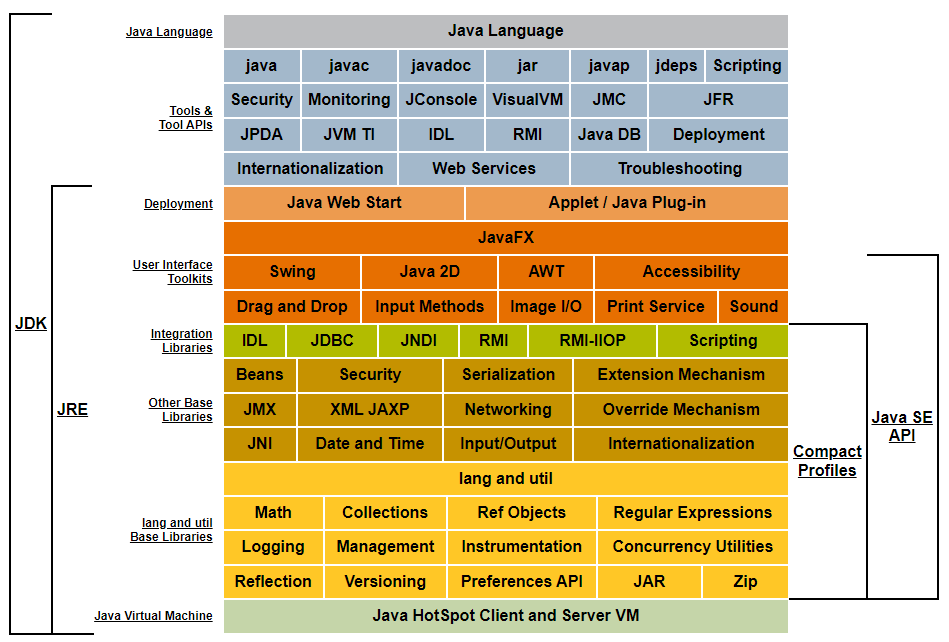
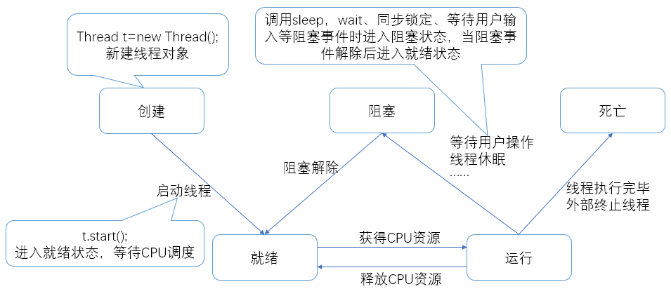

## 概述

**jdk 和 jre**


### Java 跨平台的原理

- 编译之后会生成与平台无关的字节码文件
- 依赖不同平台的虚拟机（JVM）

### 配置环境

- JAVA_HOME = D:\Java\jdk1.7.0
- PATH = %JAVA_HOME%\bin

### Hello World

```java
public class HelloWorld {
  public static void main(String[] args) {
    System.out.println("Hello World!");
  }
}
```

### javac 命令

- `javac [-d <目录>] HelloWorld.java`：编译 Java 源文件，并指定放置生成的字节码文件的位置，一点（ . ）表示当前路径（会自动生成相应的包目录）

### java 命令

- `java [-options] class [args…]`：执行类
- `java [-options] -jar jarfile [args…]`：执行 jar 文件
- 常见 options
  - `java -version`
  - `java -classpath <目录> com.demo.hello.HelloWorld`：运行指定目录下的字节码文件
  - `java -cp .;myClass.jar com.demo.hello.HelloWorld`：指定各个 JAR 文件具体的存放路径（用 ; 分隔）
  - `java -D<名称>=<值> com.demo.hello.HelloWorld`： 设置系统属性（Java system property）

### Java 基本语法

- Java 语言严格区分大小写
- 一个 Java 源文件（ .java ）里可以定义多个 Java 类，但其中最多**只能有一个**类被定义成 public 类；若源文件中包含 public 类定义，则该源文件的文件名必须与该 public 类的类名相同
- 一个源文件中包含 N 个 Java 类时，成功编译后会生成 N 份字节码文件（ .class），即每个类都会生成一份单独的 class 文件，且字节码文件名和其对应的类名相同
- 若一个类必须运行，则必须拥有 main 方法，因为 main 方法是程序的入口

## 数据类型

### 基本数据类型

| 类型    | 占位（byte） | 数据范围                                                         |
| ------- | ------------ | ---------------------------------------------------------------- |
| byte    | 1            | [-128, 127]                                                      |
| short   | 2            | [-32768,32767]                                                   |
| int     | 4            | [-2^31, 2^31-1]                                                  |
| long    | 8            | [-2^63, 2^63-1]                                                  |
| float   | 4            | [2<sup>-149</sup>,(2-2<sup>-23</sup>)&middot;2<sup>127</sup>]    |
| double  | 8            | [2<sup>-1074</sup>.,(2-2<sup>-52</sup>)&middot;2<sup>1023</sup>] |
| char    | 2            | [\u0000,\uFFFF]                                                  |
| boolean | 1            | true,false                                                       |

#### boolean 类型

- 常量值只能是 true 或 false

#### 整数类型

- byte, short, int, long
- 二进制（补码） 以 0B 或 0b 开头，0B0110
- 八进制 以 0 开头，056
- 十进制 17
- 十六进制 以 0X 或 0x 开头，0XFF

#### 浮点数类型

- float, double

```java
double pi = 3.14;  // 浮点数常量默认是 double 类型float  pi = 3.14F; // float 类型常量需在浮点数后添加 f 或 F 后缀float  pi = 3.14; // 错误: 不兼容的类型: 从 double 转换到 float 可能会有损失3.14 == 3.14F; // false3.14 == 3.14D; // truefloat a = 1.0f - 0.9f;float b = 0.9f - 0.8f;a == b; // false
```

- 注意：浮点数采用“尾数+阶码”的编码方式，所以 float, double 都**不能表示精确的浮点数**，需用 BigDecimal 类型

#### 字符类型

- char 16 位 Unicode 字符集，编码方式为 UTF-16BE
- UTF-16 使用 2 或者 4 字节表示一个字符，在 65536 以内的占两个字节，而基本上所有汉字的 Unicode 编码[在 19968 到 40869 之间](http://www.chi2ko.com/tool/CJK.htm)，所以一个 char 类型可以存储一个汉字
- 使用`''`括起来的单个字符

### 最常用的引用类型 String

- 字符串常量使用`""`引起来的，连接字符串使用 “+” 符号
- 字符串拼接：字符串可以和**任何基本类型的值或 Java 对象**进行连接运算，结果都是**字符串类型**（基本类型的值将自动类型转换为字符串类型，系统自动调用 Java 对象 toString() 方法）

### 基本类型的类型转换


- boolean 不属于数值类型，不参与转换

#### 自动类型转换 / 隐式类型转换

- 如果直接将一个**较小的整数常量**（在 byte 或 short 类型的表数范围内）赋给一个 byte 或 short 变量，系统会自动把这个整型常量当成 byte 或 short 类型来处理

#### 强制类型转换

- 语法格式：(targetType)value

#### 表达式类型的自动提升

- 所有的 `byte`、`short`、`char` 类型被自动提升到 `int` 类型
- 整个算术表达式最终结果的数据类型被提升到**表达式中操作数类型最高的类型**

## 运算符

### 算术运算符

#### 加号 +

- 加号在操作数值、 字符 、字符串时，其结果是不同的
  - 当两个**字符**相加得到的是 **ASCII 码表值**
  - 作为**字符串连接运算符**

#### 除号 /

- 如果除法运算符的两个操作数都是整数类型，则计算结果也是**整数**（截断小数部分取整），此时除数不能是 0，否则将引发**除以零异常** ArithmeticException: / by zero
- 如果除法运算符的两个操作数有 1 个是浮点数，或者 2 个都是浮点数，则计算结果也是浮点数，此时允许除数是 0，或者 0.0，得到结果是正无穷大或负无穷大

#### 取模（求余数）%

- 被模数 % 模数
- 模数的符号忽略不计，结果的正负取决于**被模数**
- 如果求余运算的两个操作数都是整数类型，则求余运算的第二个运算数不能是 0，否则将引发**除以零异常**

```java
'A' + 'B'  // 131"A" + "B"  // AB10 / 3  // 3System.out.println(10 / 0) // ArithmeticException: / by zeroSystem.out.println(10.0 / 0) // 输出正无穷大：Infinity System.out.println(-10.0 / 0) // 输出负无穷大：-Infinity System.out.println(0 / 0.0) // 输出非数(Not a Number)：NaN/*注意：无穷大和 NaN 都属于 double 浮点类型但是所有正无穷大数值都是相等的，所有负无穷大数值也是相等的NaN 不与任何数值相等，也不等于自己*/
```

#### 自增 ++ 自减 —

- 自增、自减操作都是直接修改变量的值（读、改、写），不经过操作数栈
- 前置 ( ++i )：**局部变量表**中的 i 先自增，再把 i 的值压入**操作数栈**
- 后置 ( i++ )：先把局部变量表中的 i 压入操作数栈，再自增

### 赋值运算符

- += 隐式的将加操作的结果类型强制转换为持有结果的类型

### 比较运算符

- 比较运算符的结果是 boolean 类型
- == != < > <= >= instanceof
- 使用 == 判断两个两个变量是否相等
  - 基本类型变量：只要两个变量的**值相等**（ 不一定要求数据类型严格相同），就返回 true
  - 引用类型变量：只有两个变量**指向同一个对象**时，返回 true（不可用于比较类型上没有**继承关系**的两个对象，否则编译报错）

### 三元运算符 / 三目运算符

- boolean 表达式 ? 表达式 1 : 表达式 2

### 逻辑运算符

- 用于操作两个 boolean 类型的变量或常量，结果也是 boolean 类型
- & ：与，**都为 true**，结果才为 true，否则结果是 false
- && ：短路与，如果左边的操作数是 false，结果一定为 false，且不再计算右边的操作数
- | ：或，**都为 false**，结果才为 false，只要有一个是 true，结果就是 true
- || ：短路或，如果左边的操作数是 true，结果一定为 true，且不再计算右边的操作数
- ^ ：异或，判断两个操作数是否**不同**，不同则为 true，相同则为 false
- ! ：取反，!true 结果是 false，!fasle 结果是 true

### 位运算符

- 操作的是**数**的**补码**的二进制位
- 位运算符只能操作**整数类型**的变量或值
- & ：按位与，当两位同时为 1 时才返回 1
- | ：按位或，只要有一位为 1 即可返回 1
- ~ ：按位非，单目运算符，将操作数的每个位（包括符号位）全部取反
- ^ ：按位异或，当两位相同时返回 0，不同时返回 1
- << ：左移运算符
- \>> ：右移运算符
- \>>>：无符号右移运算符

```java
// 左移 n 位相当于乘以 2 的 n 次方
// 右移 n 位相当于除以 2 的 n 次方
4 >> 1; // 效率高的除以 2，等价于 4 / 2
1 << 10; // 等于 2 的 10 次方
// 交换两个变量的值
int a = 10;
int b = 12;
// 第一种方法，使用临时变量
int temp = a;
a = b;
b = temp;
// 第二种方法// 把 a、b 看做数轴上的点，围绕两点间的距离来进行计算（可能会越界）
a = b - a;
b = b - a;
a = b + a;
// 第三种方法
// 任意一个数与任意一个给定的值连续异或两次，值不变
a = a ^ b;
b = a ^ b;
a = a ^ b;
```

## 表达式

- 表达式不是完整的语句！

## 代理

### 静态代理

- 代理对象和目标对象实现同一个接口
- 代理对象代理目标对象

#### 优点

- 代理对象可以做目标对象无法做的事
- 目标对象专注自己的事

### 动态代理

## 多线程

### 线程状态



### 实现方法

#### 继承 Thread 类

- 没有返回值
- 重写 run 方法
- 启动：通过 start()执行
- 单继承带有局限性

#### 实现 Runnable 接口

- 没有返回值
- 重写 run 方法
- 启动：通过 new Thread(对象).start()执行
- 便于一个对象被多个线程使用

#### 实现 Callable 接口

- 需要返回值
- 重写 call 方法
- 启动：通过 Executors.newFixedThreadPool(int nThreads)创建执行服务，然后通过 submit 执行
- 获取执行结果：get()
- 通过服务的 shutdownNow 关闭服务

> 注意：run()和 start()区别
>
> - 通过 run()，主线程会等待子线程执行完毕再继续
> - 通过 start()，主线程和子线程同时并行执行

### 方法

| 方法                         | 说明                       |
| ---------------------------- | -------------------------- |
| setPriority(int newPriority) | 更改线程优先级             |
| join()                       | 等待当前线程终止           |
| interrupt()                  | 中断线程（不建议）         |
| isAlive()                    | 测试线程是否处于活动状态   |
| Thread.sleep(long millis)    | 线程休眠 millis 毫秒       |
| Thread.yield()               | 暂停当前线程并执行其他线程 |

### 停止线程

- 通过执行次数
- 通过标志位

### 线程休眠 sleep

- 指定当前线程阻塞的毫秒数
- 存在异常 InterruptedException
- 时间到达后线程进入就绪状态
- 可以模拟网络延时、倒计时等
- sleep 不会释放锁

### 线程礼让 yield

- 让当前线程暂停，但不阻塞
- 将线程从运行状态转为就绪状态
- 让 CPU 重新调度
- 礼让不一定成功

111

## 注解

- 不是程序本身，可对程序作出解释
- 可被其他程序读取
- 格式为`@注解名`，还可以添加参数
- 可以在 package，class，method，field 等地方使用，通过反射读取注解的数据
- 本质为继承了`java.lang.annotation.Annotation`的接口
- 注解中的方法名就是参数名
- 返回值的类型就是参数的类型（类型包括基本类型、Class、String、enum）
- 可通过 default 声明参数的默认值
- 如果只有一个参数成员，一般参数名为 value，此时可以赋值时省略
- 注解元素必须要有值，通常使用空字符串、0 作为默认值
- 注解格式 `public @interface 注解名`
- 注解参数格式 `参数类型 参数名()`;

### 内置注解

- `@Override`重写
- `@Deprecated`已过时
- `@SuppressWarnings`抑制警告

### 元注解

- `@Target` 注解范围
- `@Retention` 注解生命周期（SOURCE<CLASS<RUNTIME）
- `@Documented` 注解将包含在 javadoc 中
- `@Inherited` 子类可继承父类的注解

## 反射

> 正常方式：引入包类->通过 new 实例化->获取实例化对象

> 反射方式：实例化对象->getClass()方法->得到完整的包类名

### 优点

可以动态创建对象和编译，灵活

### 缺点

- 对性能有影响

- 破坏封装

### 应用场景

- 通用框架
- 动态代理
- 注解

### 主要 API

- java.lang.Class 一个类
- java.lang.reflect.Method 方法
- java.lang.reflect.Field 字段
- java.lang.reflect.Constructor 构造器

### 功能

- 在运行时判断任意一个对象所属的类
- 在运行时构造任意一个类的对象
- 在运行时判断任意一个类所具有的成员变量和方法
- 在运行时获取泛型信息
- 在运行时调用任意一个对象的成员变量和方法
- 在运行时处理注解
- 生成动态代理

### 反射应用

#### 创建类对象

- 通过构造器的 newInstance 实例化对象
- 类构造器访问权限足够

#### 获取构造器

- 通过 getConstructors()获取所有 public 构造器
- 通过 getConstructor(Class... parameterTypes) 获取指定 public 构造器
- 通过 getDeclaredConstructors()获取所有构造器
- 通过 getDeclaredConstructor(Class... parameterTypes) 获取指定构造器

#### 获取字段

- 通过 getFields()获取所有 public 字段
- 通过 getField(String name)获取指定的 public 字段
- 通过 getDeclaredFields()获取所有字段
- 通过 getDeclaredField(String name)获取指定字段

#### 获取方法

- 通过 getMethods()获取所有的 public 方法
- 通过 getMethod(String name, Class<?>... parameterTypes)获取指定的 public 方法
- 通过 getDeclaredMethods()获取所有的方法
- 通过 getDeclaredMethod(String name, Class<?>... parameterTypes)获取指定的方法

#### 获取注解

- 通过 getAnnotations()获取所有注解
- 通过 getAnnotation(Class<T> annotationClass)获取指定注解

#### 调用方法

- 使用 invoke(Object obj, Object[] args)调用，并向方法中传递 obj 对象的参数信息
- invoke(Object obj, Object[] args)方法的返回值为原方法的返回值，如果原方法没有返回值则为 null
- 如果原方法为静态方法则形参 Object obj 可为 null
- 如果原方法形参为空则 Object[] args 为 null
- 原方法为 private 时在 invoke 之前调用 setAccessible(true)将原方法设为可以访问

#### 操作泛型

- 通过 Method 对象的 getGenericParameterTypes() 获取方法带泛型的参数类型
- 通过 Method 对象的 getGenericExceptionTypes() 获取方法抛出的异常类型
- 通过 Method 对象的 getGenericReturnType() 获取方法带泛型的返回类型

### setAccessible(boolean flag)

- Method、Field、Constructor 都有 setAccessible 方法
- setAccessible 作用是开关安全访问检查
- 参数值为 true 时关闭安全访问检查，即允许访问私有成员

  - 提高反射效率
  - 使私有成员可以访问

- 参数值为 false 则开启安全访问检查，即不允许访问私有成员

## 常用类

### Class 类

#### 简述

- 本身是一个类

- 只能由系统建立

- 一个类在 JVM 中只有一个 Class 实例

- 一个 Class 对象对应一个加载到 JVM 中的 class 文件

- 每个类的实例都会记得自己由哪个 Class 实例生成

- 通过 Class 可以完整的得到一个类中所有被加载的结构

#### 常用方法

| 方法名                                   | 说明                                                              |
| ---------------------------------------- | ----------------------------------------------------------------- |
| Class forName(String name)               | 返回指定类名 name 的 Class 对象                                   |
| Object newInstance()                     | 调用缺省构造函数，返回 Class 对象的一个实例                       |
| String getName()                         | 返回此 Class 对象所表示的实体（类，接口，数组类 或 void）的名称。 |
| Class getSuperClass()                    | 返回当前 Class 对象的父类的 Class 对象                            |
| Class[] getinterfaces()                  | 获取当前 Class 对象的接口                                         |
| ClassLoader getClassLoader()             | 返回该类的类加载器                                                |
| Constructor[] getConstructors            | 返回一个包含某些 Constructor 对象的数组                           |
| Method getMothed(String name,Class... T) | 返回一个 Method 对象，此对象的形参类型为 paramType                |
| Field[] getDeclaredFields()              | 返回 Field 对象的一个数组                                         |

#### 可包含 Class 的对象

- 类
- 接口
- 一维数组
- 二维数组
- 注解
- 枚举
- 基本数据类型
- void
- Class

### String

String… strings 为可变长度参数列表，表示 0 或多个 String 类型的对象或是 String[]，具体类型为一个数组

String.split()中**`.` `\` `|` `*` `+`**需要转义

String.format() 格式化字符串,String.format("%s-%s","str1","str2");

### Map

|               | 有序 | 顺序         | null 值            |
| ------------- | ---- | ------------ | ------------------ |
| HashMap       | 无   |              | 允许               |
| LinkedHashMap | 有序 | 放入顺序     | 允许               |
| TreeMap       | 有序 | key 值排序   | 不允许 key 为 null |
| HashTable     | 有序 | 放入顺序倒序 | 不允许             |

### List

- 合并两个相同类型的 List 并去重

```java
list1.removeAll(list2);
list1.addAll(list2);
```

- 排序

```java
Comparator.comparingInt(Integer::intValue).reversed() ``// 倒序
Comparator.comparingInt(Integer::intValue) ``// 正序
```

## 函数式编程

### 函数式接口

- 只包含一个抽象方法的接口

## Lamda

- 避免匿名内部类
- 函数式接口才能转为 lamda 表达式
- 使代码简洁

### 格式

- `(参数类型 参数名...)->{方法体}`

- 可以不写参数类型，但必须同时不写
- 单个参数时可省略小括号，无参数时必须带空的小括号
- 单行方法体时可省略大括号

## JVM

## 内存

### 堆

- 存放 new 的对象和数组
- 可被所有线程共享。不会存放别的对象的引用

### 栈

- 存放基本变量类型及其值
- 引用对象的变量（存放这个引用在堆里的具体地址）

### 方法区

- 可被所有线程共享
- 包含所有的 class 和 static 变量

## 类加载

- 加载：将 class 文件加载到内存并将静态数据转换成方法区的运行时数据结构，然后生成一个代表这个类的 Class 对象
- 连接：将 Java 类的二进制代码合并到 JVM 的运行状态之中

  - 验证：确保加载的类信息符号 JVM 规范，没有安全方面的问题
  - 准备：正式类变量（static）在方法区中分配内存并设置默认初始值
  - 解析：常量池中的符号（常量名）引用替换为直接（地址）引用

- 初始化：
  - 执行类构造器<clinit>()方法。该方法由编译期自动收集类中所有的变量赋值动作和静态代码块中的语句合并产生
  - 初始化一个类时，如果父类还没初始化，则触发父类初始化
  - 虚拟机保证类的<clinit>()方法在多线程中正确的加锁及同步
