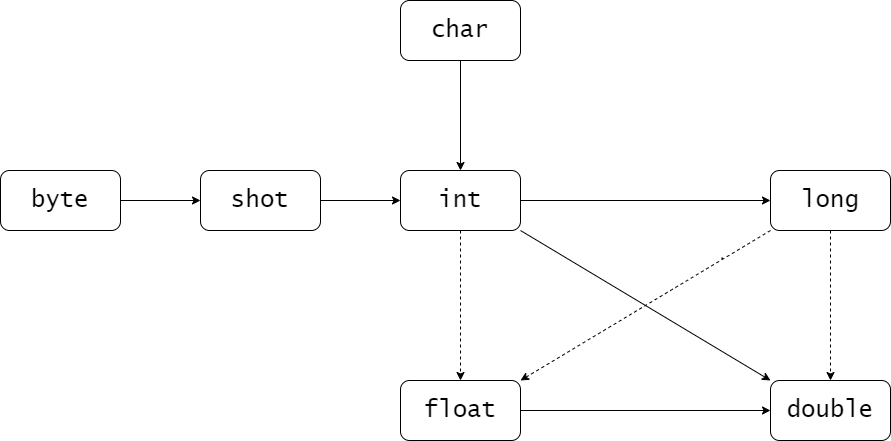
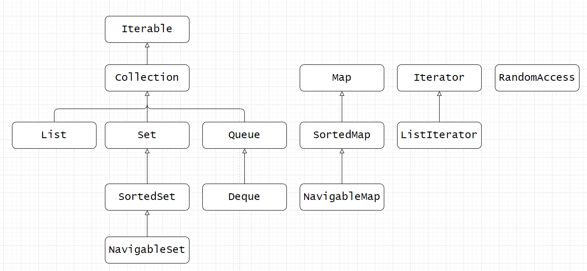
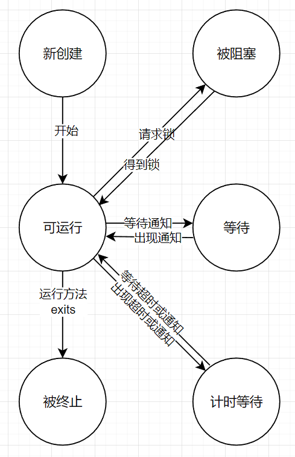

## 面向对象

> 特征 : 继承、多态、封装

## 配置开发环境

_以Java8为例_

- Windows
  - 下载jdk并安装
  - 新建系统变量,点击新建，变量名为`JAVA_HOME`，变量值为Java的安装路径。
  - 编辑环境变量Path,删除变量`C:\Program Files (x86)\Common Files\Oracle\Java\javapath`
    新增`%JAVA_HOME%\bin`和`%JAVA_HOME%\jre\bin`
  - 新建环境变量CLASSPATH，变量值为`.;%JAVA_HOME%\bin;%JAVA_HOME%\lib\dt.jar;%JAVA_HOME%\lib\tools.jar;`

- Linux
  - `sudo apt install openjdk-8-jdk`

## 命名

- 名字必须以字母开头，后面可以跟字母和数字的任意组合。长度基本上没有限制。
- 不能使用 Java 保留字作为类名
- 源代码的文件名必须与公共类的名字相同

**Java保留字**

| 关键字          | 含 义                                                                              |
|--------------|----------------------------------------------------------------------------------|
| abstract     | 抽象类或方法                                                                           |
| assert       | 用来查找内部程序错误                                                                       |
| boolean      | 布尔类型                                                                             |
| break        | 跳出一个 switch 或循环                                                                  |
| byte         | 8 位整数类型                                                                          |
| case         | switch 的一个分支                                                                     |
| catch        | 捕获异常的 try 块子句                                                                    |
| char         | Unicode 字符类型                                                                     |
| class        | 定义一个类类型                                                                          |
| const        | 未使用                                                                              |
| continue     | 在循环末尾继续                                                                          |
| default      | switch 的缺省子句                                                                     |
| do           | do/while 循环最前面的语句                                                                |
| double       | 双精度浮点数类型                                                                         |
| else         | if 语句的 else 子句                                                                   |
| enum         | 枚举类型                                                                             |
| extends      | 定义一个类的父类                                                                         |
| final        | 一个常量， 或不能覆盖的一个类或方法 ,final类不能被继承。final方法不能被重写。final修饰的变量叫常量，常量必须初始化，初始化之后值就不能被修改。 |
| finally      | try 块中总会执行的部分                                                                    |
| float        | 单精度浮点数类型                                                                         |
| for          | 一种循环类型                                                                           |
| goto         | 未使用                                                                              |
| if           | 一个条件语句                                                                           |
| implements   | 定义一个类实现的接口                                                                       |
| import       | 导入一个包                                                                            |
| instanceof   | 测试一个对象是否为一个类的实例                                                                  |
| int          | 32 位整数类型                                                                         |
| interface    | —种抽象类型， 其中包含可以由类实现的方法                                                            |
| long         | 64 位长整数类型                                                                        |
| native       | 由宿主系统实现的一个方法                                                                     |
| new          | 分配一个新对象或数组                                                                       |
| null         | 一个空引用（null 从技术上讲是一个直接量，而不是关键字）                                                   |
| package      | 包含类的一个包                                                                          |
| private      | 这个特性只能由该类的方法访问                                                                   |
| protected    | 这个特性只能由该类、 其子类以及同一个包中的其他类的方法访问                                                   |
| public       | 这个特性可以由所有类的方法访问                                                                  |
| return       | 从一个方法返回                                                                          |
| short        | 16 位整数类型                                                                         |
| static       | 这个特性是这个类特有的， 而不属于这个类的对象                                                          |
| strictfp     | 对浮点数计算使用严格的规则                                                                    |
| super        | 超类对象或构造函数                                                                        |
| switch       | 一个选择语句                                                                           |
| synchronized | 对线程而言是原子的方法或代码块                                                                  |
| this         | 当前类的一个方法或构造函数的隐含参数                                                               |
| throw        | 抛出一个异常                                                                           |
| throws       | 一个方法可能拋出的异常                                                                      |
| transient    | 标志非永久的数据                                                                         |
| try          | 捕获异常的代码块                                                                         |
| void         | 指示一个方法不返回任何值                                                                     |
| volatile     | 确保一个字段可以由多个线程访问                                                                  |
| while        | 一种循环                                                                             |

> 标准的命名规范为：类名是以大写字母开头的名词。如果名字由多个单词组成，每个单词的第一个字母都应该大写。

## 注释

### 行注释

从`//`开始到本行结束

### 块注释

`/*`到`*/`之间的内容都会被注释掉

`/*` `*/`不能嵌套使用

### 文档注释

注释应该放置在所描述特性的前面。 注释以 `/**` 开始， 并以 `*/` 结束。

每个 `/** . . . */` 文档注释在标记之后紧跟着自由格式文本（free-form text）。

标记由@开始， 如`@author` 或`@param`。

自由格式文本的第一句应该是一个概要性的句子。javadoc 实用程序自动地将这些句子抽取出来形成概要页。

在自由格式文本中，可以使用 HTML 修饰符，但不可使用 `<hl>` 或`<hr>`, 因为它们会与文档的格式产生冲突。若要键入等宽代码， 需使用
{@code ... } 而不是`<code>...</code>`——如此就不用对代码中的 `<` 字符转义了。

> **标记**
>
> - 可用于类注释
>
> `@author 姓名`
> 产生一个 author (作者）条目。可以使用多个@author 标记，每个@author 标记对应一个作者
>
> `@version`
> 产生一个 version（版本）条目。这里的文本可以是对当前版本的任何描述。
>
> - 可用于所有的文档注释
>
> `@since 文本`
> 产生一个“ since” （始于）条目。这里的 text 可以是对引入特性的版本描述。例如，`@since version 1.7.10`
>
> `@deprecated`
> 对类、 方法或变量添加一个不再使用的注释。 文本中给出了取代的建议。
> 例如:`@deprecated Use <code> setVIsible(true)</code> instead`
>
> 通过@see 和@link标记， 可以使用超级链接， 链接到 javadoc 文档的相关部分或外
> 部文档。
>
> `@see` 引用
> 增加一个超级链接。它可以用于类中，也可以用于方法中。引用可以为超链接或类、方法
>
> `@link` 引用 使用方法同`@see`

- 类注释

对类的文档注释，类注释必须放在 import 语句之后，类定义之前

- 方法注释

对方法的文档注释，每一个方法注释必须放在所描述的方法之前。除了通用标记之外， 还可以使用下面的标记：

**@param 变量描述**

对当前方法的“ param” （参数）部分添加一个条目。这个描述可以占据多行， 并可以使用 HTML 标记。一个方法的所有@param
标记必须放在一起。

**@return 描述**

对当前方法添加“ return” （返回）部分。这个描述可以跨越多行， 并可以 使用 HTML 标记。

**©throws 类描述**

添加用于表示这个方法有可能抛出异常的一个注释。

- 域注释

对公有域（通常为静态常量）的文档注释

- 包和概述注释

包注释需要在每一个包目录中添加一个单独的文件。有两种方法：

1. 提供一个以 package.html 命名的 HTML 文件。在标记 `<body>—</body>` 之间的所有
   文本都会被抽取出来。
2. 提供一个以 package-info.java 命名的 Java 文件。这个文件必须包含一个初始的以 `/**`和 `*/` 界定的 Javadoc 注释，
   跟随在一个包语句之后。它不应该包含更多的代码或注释。

还可以为所有的源文件提供一个概述性的注释。这个注释将被放置在一个名为 overview.html
的文件中，这个文件位于包含所有源文件的父目录中。标记 `<body>... </body>` 之间的所
有文本将被抽取出来。当用户从导航栏中选择 `Overview` 时，就会显示出这些注释内容。

> **注释的抽取**
>
> 假设 HTML 文件将被存放在目录 docDirectory 下。
>
> 执行以下步骤：
> 1. 切换到包含想要生成文档的源文件目录。
> 2. 如果是一个包，应该运行命令:`javadoc -d docDirectory nameOfPackage`或对于多个包生成文档，
     运行:`javadoc -d docDirectory nameOfPackage\ nameOfPackage . . .`
     如果文件在默认包中， 就应该运行：
     `javadoc -d docDirectory *. java`
     如果省略了 `-d docDirectory` 选项， 那 HTML 文件就会被提取到当前目录下。这样有可能
     会带来混乱，因此不提倡这种做法。
     可以使用多种形式的命令行选项对 javadoc 程序进行调整。例如， 可以使用`-author` 和
     `-version` 选项在文档中包含@author 和@version 标记（默认情况下， 这些标记会被省
     略 )。另一个很有用的选项是 -link, 用来为标准类添加超链接。
     如果使用`-linksource` 选项， 则每个源文件被转换为 HTML (不对代码着色，但包含行编号) 并且每个类和方法名将转变为指向源代码的超链接。
     有关其他的选项，参考[javadoc](http://docs.orade.eom/javase/8/docs/guides/javadoc)

## 数据类型

8种基本数据类型：

- 4种整型（byte，shot，int，long）
  - 整形表示没有小数的数值，可以为负
  - long数值需要后缀`L`或`l`
  - 十六进制需要前缀`0X`或`0x`
  - 八进制需要一个前缀`0`
  - 二进制需要前缀`0B`或`0b`
  - 可以在数字中添加下划线便于阅读，如：`123_456_789`
- 2种浮点型（double，float）
  - double的数值精度为float的两倍
  - double数值需要后缀`0D`或`0d`
  - float数值需要后缀`0F`或`0f`
  - 特殊数值：正无穷（`POSITIVE_INFINITY = 1.0 / 0.0`）、负无穷（`NEGATIVE_INFINITY = -1.0 / 0.0`）、NaN（not a
    number  `NaN = 0.0d / 0.0`）
  - 判断一个值是否为NaN使用`Double.isNaN(x)`方法
  - 由于二进制无法准确的表示`1/10`，所有浮点数会存在舍入误差
- 1种字符型（char）
  - 表示一个Unicode字符（`\u0000-\uFFFF`之间）
  - 使用单引号包围
  - 转义序列`\u`还可以出现在加引号的字符常量或字符串之外（其他所有转义序列不可以）

**特殊字符转义序列及Unicode值**

| 字符名 | 转义序列 | Unicode值 |
|-----|------|----------|
| 退格  | `\b` | `\u0008` |
| 制表  | `\t` | `\u0009` |
| 换行  | `\n` | `\u000a` |
| 回车  | `\r` | `\u000d` |
| 双引号 | `\"` | `\u0022` |
| 单引号 | `\'` | `\u0027` |
| 反斜杠 | `\\` | `\u005c` |

- 1种布尔型（boolean）

> _使用十进制的科学记数法：_
>
> 0.125=2<sup>-3</sup>可以表示成 125.0e<sup>-3</sup>。
> 使用 `e` 表示指数。
>
> _使用十六进制的科学记数法：_
>
> 0.125=2<sup>-3</sup>可以表示成 0x1.0p<sup>-3</sup>。
> 在十六进制表示法中，使用 `p` 表示指数。
> **注意，尾数采用十六进制，指数采用十进制。**

**所有数据类型的值范围**

| 类型      | 占位（byte 字节） | 数据范围                                                             |
|---------|-------------|------------------------------------------------------------------|
| byte    | 1           | [-128, 127]                                                      |
| short   | 2           | [-32768,32767]                                                   |
| int     | 4           | [-2^31, 2^31-1]                                                  |
| long    | 8           | [-2^63, 2^63-1]                                                  |
| float   | 4           | [2<sup>-149</sup>,(2-2<sup>-23</sup>)&middot;2<sup>127</sup>]    |
| double  | 8           | [2<sup>-1074</sup>.,(2-2<sup>-52</sup>)&middot;2<sup>1023</sup>] |
| char    | 2           | [\u0000,\uFFFF]                                                  |
| boolean | 1           | true,false                                                       |

## 变量

- 声明

变量的声明需要指定变量的类型，需要以分号结尾

变量命名限制详见[命名](#命名)

不要在命名中使用`$`

- 初始化

变量声明后需要使用赋值语句进行显式初始化

通过`=`进行变量赋值

**常量**

常量就是对变量添加`final`关键字

常量只能被赋值一次，且无法改变值

常量通常使用大写加下划线命名

## 运算符

- 算术运算符

| 运算符 | 含义 |
|-----|----|
| +   | 加  |
| -   | 减  | 
| *   | 乘  |
| /   | 除  | 

> 数值在进行算数运算时会发生数据类型转换
>
> 如果两个操作数中有一个是 double 类型， 另一个操作数就会转换为 double 类型。
> 否则， 如果其中一个操作数是 float 类型， 另一个操作数将会转换为 float 类型。
> 否则， 如果其中一个操作数是 long 类型， 另一个操作数将会转换为 long 类型。
> 否则， 两个操作数都将被转换为 int 类型

以下为合法数据类型转换，实线表示没有精度损失，虚线表示可能存在精度损失。**强制类型转换可能会导致信息丢失**


- 赋值和运算符结合 `+=`、`-=`、`*=`、`/=`

- 自增`++` 自减`--`

```java
public class Main {
    public static void main(String[] args) {
        int n = 1;
        n += 2;// 等效于n = n + 2; 
        System.out.println(n);
        int a = n++; //a = n; 先用后加
        System.out.println(a);
        int b = ++n; //b = n + 1; 先加后用
        System.out.println(b);
    }
}
```

- 比较运算符

| 运算符  | 含义   |
|------|------|
| `==` | 相等   |
| `!=` | 不相等  |
| `<`  | 小于   |
| `>`  | 大于   |
| `<=` | 小于等于 |
| `>=` | 大于等于 |

- 逻辑运算符

| 运算符            | 含义  |
|----------------|-----|
| `&&`           | 短路与 |
| `&#124;&#124;` | 短路或 |
| `!`            | 非   |

- 三元操作符 `?:`

`condition ? expression1 : expression2`条件condition为true值为expression1，否则为expression2

- 位运算符

| 运算符      | 含义          |
|----------|-------------|
| `&`      | 与           |
| `&#124;` | 或           |
| `^`      | 异或          |
| `~`      | 非           |
| `<<`     | 左移          |
| `>>`     | 右移          |
| `>>>`    | 右移，并使用0填充高位 |

## 字符串

- String
  详见[java.lang.String](/doc/javaLib.md#String)
- 字符串构建器
  - StringBuilder
  - StringBuffer

| StringBuilder | StringBuffer |
|---------------|--------------|
| 线程不安全         | 线程安全         |
| 速度快           | 速度慢          |

| 方法                                                   | 作用                                        |
|------------------------------------------------------|-------------------------------------------|
| `int length()`                                       | 返回构建器或缓冲器中的代码单元数量                         |
| `String Builder append(String str)`                  | 追加一个字符串并返回 this                           |
| `String Builder append(char c)`                      | 追加一个代码单元并返回 this                          |
| `String Builder appendCodePoint(int cp)`             | 追加一个代码点，并将其转换为一个或两个代码单元并返回 this           |
| `void setCharAt(int i ,char c)`                      | 将第 i 个代码单元设置为 c                           |
| `String Builder insert(int offset,String str)`       | 在 offset 位置插入一个字符串并返回 this                |
| `String Builder insert(int offset,Char c)`           | 在 offset 位置插入一个代码单元并返回 this               |
| `String Builder delete(int startIndex,int endIndex)` | 删除偏移量从startIndex到endIndex-1 的代码单元并返回 this |
| `String toString()`                                  | 返回一个与构建器或缓冲器内容相同的字符串                      |

StringBuilder与StringBuffer的方法基本相同

## 大数值

在有精度要求时可用java.math下的BigInteger和BigDecimal进行数值计算

通过valueOf方法将普通数值转为大数值

常用方法：

- [BigInteger](/doc/javaLib.md#BigInteger)
  - BigInteger add( BigInteger other) 加
  - BigInteger subtract(BigInteger other ) 减
  - BigInteger multiply(BigInteger other) 乘
  - BigInteger divide(BigInteger other) 除
  - BigInteger mod(BigInteger other) 取余
  - int compareTo(BigInteger other) 与other相等，返回 0；小于other，返回负数；否则，返回正数。
  - static BigInteger valueOf(long x ) 返回值等于 x 的大整数。
- [BigDecimal](/doc/javaLib.md#bigdecimal)
  - BigDecimal add(BigDecimal other)加
  - BigDecimal subtract(BigDecimal other )减
  - BigDecimal multiply(BigDecimal other )乘
  - BigDecimal divide(BigDecimal other) 除
  - BigDecimal divide(BigDecimal divisor, RoundingMode roundingMode) 除并指定舍入方式
  - int compareTo(BigDecimal other ) 与other相等，返回0；小于other，返回负数；否则，返回正数。
  - static BigDecimal valueOf( long x )

## 输入输出

- 输出

  - 输出后换行 `System.out.println()`
  - 格式化输出 `System.out.printf()`

| printf转换符 | 类 型        | 举 例      |
|-----------|------------|----------|
| d         | 十进制整数      | 159      |
| x         | 十六进制整数     | 9f       |
| o         | 八进制整数      | 237      |
| f         | 定点浮点数      | 15.9     |
| e         | 指数浮点数      | 1.59e+01 |
| g         | 通用浮点数      | —        |
| a         | 十六进制浮点数    | Ox1.fdp3 |
| s         | 字符串        | Hello    |
| c         | 字符         | H        |
| b         | 布尔         | True     |
| h         | 散列码        | 42628b2  |
| %         | 百分号        | %        |
| n         | 与平台有关的行分隔符 | —        |

| printf 的标志    | 目 的         |
|---------------|-------------|
| +             | 打印正数和负数的符号  | 
| 空格            | 在正数之前添加空格   |
| 0             | 数字前面补 0     |
| -             | 左对齐         |
| (             | 将负数括在括号内    |
| ,             | 添加分组分隔符     |
| #（对于 f格式）     | 包含小数点       |
| #（对于 X 或0 格式） | 添加前缀 0x 或 0 |
| $             | 给定被格式化的参数索引 |
| <             | 格式化前面说明的数值  |

- 输入
  - > Scanner，并与“标准输人流”System.in关联。`Scanner scanner = new Scanner(System.in);`
    >
    > `nextLine()` 获取下一行；
    >
    > `next()` 获取截止到空白字符的内容

  - > Console类，`Console console = System.console();`
    >
    >    `readPassword()` 读取用户输入的密码
    >
    > `readLine()` 读取用户输入内容

## 控制流程

### 块

在`{}`之间的内容为一个代码块，块可以嵌套，内层变量不能同外层变量相同

### 条件

格式：`if(condition) statement`

`else`与最近一个`if`构成一组

### 循环

- while

格式：`while(condition) statement`

先判断condition，当其为true时执行循环体，直到为false

- do ... while

格式：`do statement while(condition);`

先执行statement，然后判断condition，当其为true时继续执行，否则跳出循环

- for

格式：`for(定义变量;终止条件;每次循环操作) statement`

- 增强for

格式：`for(类型 变量 : 变量集合) statement`

- switch

格式：

```
switch(choice){
case 1: statement; break;
case 2: statement; break;
case 3: statement; break;
default: statement; break;
}
```

从与choice匹配的case中开始执行直到`break`或`return`，如果没有匹配的就执行default


> **break和continue**
>
> 都是中断循环，continue是终值当前循环进行下次循环，break是终止循环并跳出
>
> 都支持标签

## 数组

用以存储同一类型的数据的集合，可通过下标进行访问，下标超出数据长度时会出现`ArrayIndexOutOfBoundsException(数组越界)`的错误

声明方式：

- 类型[] 变量名 = new 类型[长度];
- 类型[] 变量名 = {元素};

获取数组内元素个数使用`.length()`方法

#### 数组拷贝

将一个数组直接赋值给另一个数组，实际上是两个数组都指向内存中同一个数组

可以通过`Arrays.copyOf()`方法进行数组的拷贝

#### 命令行参数

在通过命令行执行Java方法时，main方法接受一个字符串数组的命令行参数，参数以空白字符分割

#### 排序

使用`Arrays.sort()`方法进行排序，该方法使用了优化的快速排序算法

## 对象和类

类是构造对象的模板

**封装**：将数据和行为组合到一起，并隐藏数据的实现方式。
实现封装的关键是不直接访问类的属性，而是通过对象的方法进行访问操作，以提高重用性和可靠性

类之间的关系：

- 依赖
- 聚合
- 继承

对象变量仅仅是对对象的引用

对象都是在堆中构造的

可变对象的引用需要先克隆再返回

对象的重载：类中多个方法的名字相同，参数不同。一个方法的方法签名由方法名和参数类型组成

对象属性的初始化：未显式赋值时，对象会默认为null，布尔型默认为false，数值默认为0

初始化块：在调用构造器时会先执行初始化块

**类路径**：

使用`-classpath`指定类路径

包含基目录，当前目录，jar文件
当前目录用`.`表示

Windows下以分号分隔

Linux下以冒号分隔

**类的设计技巧**

1. 保证数据私有
2. 对数据初始化
3. 减少基本类型的使用
4. 不是所有的域都需要独立的域访问器和域更改器
5. 分解职责过多的类
6. 类和方法命名需要见名知意
7. 优先使用不可变类

## 继承

已存在的类为 超类、基类、父类，新类为子类、派生类、或孩子类

覆盖（override）方法：和父类方法定义相同，内部方法体不同，调用父类方法通过`super.`

通过final来标识类阻止继承，标识方法来阻止覆盖

强制类型转换：

- 只能在继承层次内进行类型转换
- 在强转前，应使用instanceof进行检查

**访问修饰符**

- `private`：仅本类
- `public`：所有类
- `protected`：本包和所有子类
- 无：本包

`...`表示可变个数参数，该参数需要放在最后

### Object

Object是所有类的始祖，在未明确指出父类时，可认为父类为Object

Java中出基本类型外都是对象

**equals方法：**
通过判断两个对象是否有相同的引用来检测两个对象是否相等
特点：

1. 自反性，x非null时，`x.equals(x)`总为true
2. 对称性，只有`x.equals(y)`为true时`y.equals(x)`才为true
3. 传递性，`x.equals(y)`、`y.equals(z)`均为true，则`x.equals(z)`为true
4. 一致性，反复调用equals应返回同样的结果
5. 对于任意非null对象x，`x.equals(null)`都应该为false

**覆写equals方法必须覆写hashCode方法**

toString()方法，默认是完整类名+@+hashCode的十六进制表示

### 枚举

枚举也是一个类

枚举比较使用`==`即可

### 反射

以便动态操纵代码

在java.lang.reflect包中有三个类Field、Method和Constructor分别用于描述类的域、方法和构造器

#### Class类

保存运行时的类型标志

通过newInstance()方法调用无参构造器来实例化类

Class类中的getFields、getMethods和getConstructors方法将分别返回类提供的public域、方法和构造器数组，其中包括超类的公有成员。Class类的getDeclareFields、getDeclareMethods和getDeclaredConstructors方法将分别返回类中声明的全部域、方法和构造器，其中包括私有和受保护成员，但不包括超类的成员。

通过invoke调用任意方法

**继承的设计技巧**

1. 将公共操作和域放在父类
2. 不使用protected
3. 使用继承实现"is-a"关系
4. 除非继承的所有方法都有意义，否则不要使用继承
5. 在覆写方法时，不改变预期行为
6. 使用多态而非类型信息
7. 减少反射的使用

## 接口

单继承，多实现

方法默认public，域默认public static final

接口可以声明变量，但不能被new实例化

默认方法冲突：超类优先，接口冲突必须覆写

## lambda

形式：`(入参)->{代码块;返回语句;}`

- 入参只有一个时可省略`()`
- 代码只有一句时可省略返回语句及`{}`

lambda中使用的外部变量需要为初始化后不再改变的变量

函数式接口：只有一个抽象方法的接口

**常用函数式接口：**

| 函数式接口               | 参数类型 | 返回类型    | 抽象方法名  | 描述               | 其他方法                       |
|---------------------|------|---------|--------|------------------|----------------------------|
| Runnable            | 无    | void    | run    | 作为无参数或返回值的动作运行   |
| Supplier<T>         | 无    | T       | get    | 提供一个 T 类型的值      |
| Consumer<T>         | T    | void    | accept | 处理一个 T 类型的值      | andThen                    |
| BiConsumer<T, U>    | T,U  | void    | accept | 处理 T 和 U 类型的值    | andThen                    |
| Function<T, R>      | T    | R       | apply  | 有一个 T 类型参数的函数    | compose, andThen, identity |
| BiFunction<T, U, R> | T,U  | R       | apply  | 有 T 和 U 类型 参数的函数 | andThen                    |
| UnaryOperator<T>    | T    | T       | apply  | 类型 T 上的一元操作符     | compose, andThen, identity |
| BinaryOperator<T>   | T,T  | T       | apply  | 类型 T 上的二元操作符     | andThen, maxBy, minBy      |
| Predicate<T>        | T    | boolean | test   | 布尔值函数            | and, or, negate, isEqual   |
| BiPredicate<T, U>   | T,U  | boolean | test   | 有两个参数的布尔值函数      | and, or, negate            |

**基本类型的函数式接口**
注： _p_, _q_ 为 int, long, double; _P_, _Q_ 为 Integer, Long, Double

| 函数式接口                 | 参数类型    | 返回类型    | 抽象方法名        |
|-----------------------|---------|---------|--------------|
| BooleanSupplier       | none    | boolean | getAsBoolean |
| *P*Supplier           | none    | _P_     | getAs*P*     |
| *P*Consumer           | _p_     | void    | accept       |
| Obj*P*Consumer<T>     | T,_p_   | void    | accept       |
| *P*Function<T>        | _p_     | T       | apply        |
| *P*To*Q*Function      | _p_     | _q_     | applyAs*Q*   |
| To*P*Function<T>      | T       | _p_     | applyAs*P*   |
| To*P*BiFunction<T, U> | T, U    | _p_     | applyAs*P*   |
| *P*UnaryOperator      | _p_     | _p_     | applyAs*P*   |
| *P*BinaryOperator     | _p_,_p_ | _p_     | applyAs*P*   |
| *P*Predicate          | _p_     | boolean | test         |

## 异常

异常对象都是由`Throwable`派生出来，两个子类为`Error`和`Exception`

`Error`类层次结构描述了Java运行时系统的内部错误和资源耗尽错误

`Exception`层次结构分为两个分支：一个分支派生于`RuntimeException`；另一个分支包含其他异常。划分两个分支的规则是：由
程序错误导致的异常属于`RuntimeException`；而程序本身没有问题，但由于像I/O错误这类
问题导致的异常属于其他异常

派生于`Error`类或`RuntimeException`类的所有异常称为非受查（unchecked）异常，所有其他的异常称为受查（checked）异常

应该抛出异常的情况：

1. 调用一个抛出受查异常的方法，例如，FileInputStream构造器
2. 程序运行过程中发现错误，并且利用throw语句抛出一个受查异常
3. 程序出现错误.例如，a[-1]=0会抛出一个ArraylndexOutOfBoundsException这样的非受查异常
4. Java 虚拟机和运行时库出现的内部错误

在 try 语句块中的任何代码抛出了一个在 catch 子句中说明的异常类， 那么

1. 程序将跳过 try 语句块的其余代码
2. 程序将执行 catch 子句中的处理器代码
3. 如果有finally且没有return，则最后会执行finally

使用异常机制的几个技巧：

1. 异常处理不能代替简单的测试
2. 不过分地细化异常
3. 利用异常层次结构
4. 不压制异常
5. 及早抛出异常
6. 传递异常

## 断言

断言的格式

- assert 条件;
- assert 条件 : 表达式;

断言由类加载器来启用或禁用，而不用重新编译

## 日志

Java自带的日志记录器java.util.logging.Logger

通过 -Djava.util.logging.config.file=configFile配置日志参数文件

Java提供的日志处理器FileHandler和SocketHandler

## 泛型

E表示集合的元素类型，
K和V分别表示表的关键字与值的类型，
T(或者U和S)表示任意类型

变量类型使用`< >`括起来放在类名后，多个用逗号隔开

变量类型的限定：如`public static <T extends Comparable> T min(T[] a) {}`，
将变量extends一个类，当有多个限定时用`&`隔开，如`T extends Comparable&Serializable`，且标签接口（没有方法的接口）在最后，以便提高效率

局限性：

1. 变量类型不能使用基本类型
2. 类型检查只适用于原始类型
3. 不能创建参数化类型数组
4. 可变参数警告，可以使用@SafeVarargs注解消除
5. 不能实例化类型变量，如new T()，T.class都是非法的
6. 不能构造泛型数组
7. 不能再静态域或方法中引用类型变量
8. 不能抛出或补货泛型类的实例
9. 可以消除对受查异常的检查
10. 类型擦除后的冲突

类型变量无论存在什么关系，当作为泛型时都没有关系

通配符：类型参数可用`?`作为通配符，如`PO<? extends PO1>`作为子类，`PO<? super PO1>`中作为父类

## 集合

**集合框架中的接口**


集合类的基本接口为`Collection`，基本方法如下

```java
//集合的基本接口
public interface Collection<E> {
    boolean add(E element);//用于添加元素，并返回是否添加成功

    Iterator<E> iterator();//返回一个可以依次访问集合中元素的迭代器
    //···
}
```

```java
//迭代器
public interface Iterator<E> {
    E next();//获取下一个元素，如果没有下一个 元素会抛出NoSuchElementException

    boolean hasNext();//判断是否有下一个元素

    void remove();//移除当前元素

    default void forEachRemaining(Consumer<? super E> action);//接受一个lambda表达式，并依次处理集合中的元素，元素顺序取决于集合类型
    //···
}
```

**集合类**

| 集合类型            | 描述                        |
|-----------------|---------------------------|
| ArrayList       | 可以动态增长和缩减的索引序列            |
| LinkedList      | 可以在任何位置进行高效地插入和删除操作的有序序列  |
| ArrayDeque      | 用循环数组实现的双端队列              |
| HashSet         | 没有重复元素的无序集合               |
| TreeSet         | 有序集                       |
| EnumSet         | 包含枚举类型值的集                 |
| LinkedHashSet   | 可以记住元素插入次序的集              |
| PriorityQueue   | 允许高效删除最小元素的集合             |
| HashMap         | 存储键 / 值关联的数据结构            |
| TreeMap         | 键值有序排列的映射表                |
| EnumMap         | 键值属于枚举类型的映射表              |
| LinkedHashMap   | 可以记住键 / 值项添加次序的映射表        |
| WeakHashMap     | 其值无用武之地后可以被垃圾回收器回收的映射表    |
| IdentityHashMap | 用`==`而不是用`equals`比较键值的映射表 |

**ArrayList和LinkedList**

| ArrayList           | LinkedList           |
|---------------------|----------------------|
| 在中间插入删除元素需要移动后面所有元素 | 中间插入删除元素只需要改变前后节点的引用 |
| 随机读取性能好             | 随机读取性能差              |

散列表：使用链表数组组成，每个列表被称为桶，桶满时会由链表变为平衡二叉树

映射：接口为Map，通用实现为HashMap和TreeMap

HashMap只对键进行散列，TreeMap使用键的整体顺序进行排序

## 并发

线程状态：

- New（新创建）
- Runnable（可运行）
- Blocked（被阻塞）
- Waiting（等待）
- Timed waiting（计时等待）
- Terminated（被终止）



如果向一个变量写入值，而这个变量接下来可能会被另一个线程读取，或者，从一个变量读值，而这个变量可能是之前被另一个线程写入的，此时必须使用同步

```java
public class Main {
    public static final Logger GLOBAL = Logger.getGlobal();
    public static final int NACCOUNTS = 100;
    public static final double INITIALBALANCE = 100;
    public static final double MAX_AMOUNT = 1000;
    public static final int DELAY = 10;

    public static void main(String[] args) {
        Bank bank = new Bank(NACCOUNTS, INITIALBALANCE);
        for (int i = 0; i < NACCOUNTS; i++) {
            int fromAccount = i;
            Runnable runnable = () -> {
                try {
                    while (true) {
                        int toAccount = (int) (bank.size() * Math.random());
                        bank.transfer(fromAccount, toAccount, 200);
                        Thread.sleep((long) (DELAY * Math.random()));
                    }
                } catch (InterruptedException e) {
                    throw new RuntimeException(e);
                }
            };
            new Thread(runnable).start();
        }
    }
}

class Bank {
    private final double[] accounts;

    public Bank(int n, double initialBalance) {
        accounts = new double[n];
        Arrays.fill(accounts, initialBalance);
    }

    public void transfer(int from, int to, double amount) {
        if (accounts[from] < amount) {
            return;
        }
        System.out.println(Thread.currentThread());
        accounts[from] -= amount;
        System.out.printf("%10.2f from %d to %d\n", amount, from, to);
        accounts[to] += amount;
        System.out.printf("Total Balance: %10.2f\n", getTotalBalance());

    }

    public double getTotalBalance() {
        double sum = 0;
        for (double account : accounts) {
            sum += account;
        }
        return sum;
    }

    public int size() {
        return accounts.length;
    }
}
```

## Stream

stream 顺序流
parallelStream 并行流

### 创建

- 通过Collection的stream方法
- 通过Stream.of方法
- 通过Array.stream(array,from,to)将数组中[from,to)的元素创建为流
- 通过Stream.empty创建空流
- 无限流
  - Stream.generate 通过指定函数生成数据
  - Stream.iterate 通过种子+函数生成

### 中间操作

- `filter` 过滤掉不符合规则的元素并返回流
- `map` 将元素按规则进行转换，参数为函数，该函数的返回值类型为流的泛型
- `flatMap` 参数为返回类型为流的函数，该返回类型的泛型为流的泛型
- `limit(n)` 抽取子流，返回n个元素的流
- `skip(n)` 丢弃前n个元素并返回流
- `concat(a,b)` 将两个流a和b连接起来，a不应该为无限流
- `distinct` 去重，不改变顺序
- `sorted` 排序，参数可接受排序函数
- `peek` 查看流中的元素，不改元素，没有终止操作时无作用

```java
class Test {
    public static void main(String[] args) {
        Stream<String> stream = Arrays.stream("hello world".split(" "));
        Stream<String[]> stream1 = stream.map(e -> e.split(""));//[["h","e","l","l","o"],["w","o","r","l","d"]]
        Stream<String> stream2 = stream1.flatMap(e -> Arrays.stream(e));//["h","e","l","l","o","w","o","r","l","d"]
    }
}
```

### 终结操作

- 约简操作
  - `count` 计算流中元素数量
  - `max` 返回最大值
  - `min` 返回最小值
  - `findFirst` 返回第一个元素
  - `findAny` 返回任一元素
  - `anyMatch` 存在任一元素匹配
  - `allMatch` 所有元素匹配
  - `noneMatch` 全不匹配
- 收集操作
  - `iterator` 返回一个流中元素的迭代器
  - `forEach` 遍历流中的元素
  - `toArray` 将流转为数组
  - `collect` 收集流中的元素

**收集器collector**

- `toList` 转为列表
- `toSet` 转为集
- `toCollection` 转为任意的集合
- `joining` 转为字符串，可指定分隔符、前后缀
- `summarizing[Int|Long|Double]` 返回[Int|Long|Double]SummaryStatistics对象，包括所有结果的个数、总和、均值、最大值、最小值
  > **[Int|Long|Double]SummaryStatistics**
  > - `getAverage` 返回均值
  > - `getCount` 返回数量
  > - `getMax` 返回最大值
  > - `getMin` 返回最小值
  > - `getSum` 返回和
- `toMap` 转为映射
- `toConcurrentMap` 转为并发映射
- `groupingBy` 按指定属性分组并转为映射
- `groupingByConcurrent` 按指定属性分组并转为并发映射
  > **下游收集器**
  > - `toSet` 转为集
  > - `counting` 计算元素个数
  > - `summing[Int|Long|Double]` 计算总和
  > - `maxBy和minBy`返回最大值和最小值
  > - `mapping` 将结果进行重新收集
- `partitioningBy` 按指定属性进行判断转为满足/不满足条件的映射
- `reduce` 返回经过操作后的最终结果

**IntStream、LongStream**

- `range(a,b)` 产生[a,b)之间元素的流
- `rangeClosed(a,b)` 产生[a,b]之间元素的流

**其他返回流的方法**

- `CharSequence.codePoints` 返回字符串所有Unicode码点的流
- `Random.ints 、 Random.longs 、 Random.doubles` 返回随机数流，可指定数量和边界（[a,b)）

**并行流**

- `parallel` 将流转为并行流
- `unordered` 将流转为无序流
- `parallelStream` 生成一个并行流

## Optional

包装器对象，包装了T对象或null

- `orElse(other)` 获取对象的值，null时获取other
- `orElseGet(other)` 获取对象的值，null时获取other的返回值
- `orElseThrow(exp)` 获取对象的值，null时抛出异常exp
- `ifPresent` 当对象不为null时，操作该值，无返回
- `map` 返回操作后的Optional结果，当对象为null时，返回一个空Optional
- `get` 返回对象的值，null时抛出异常NoSuchElementException
- `isPresent` 非null时返回true
- `empty` 返回一个空的Optional
- `of` 在对象不为null时，返回一个Optional对象，否则抛出NullPointerException
- `ofNullable` 在对象不为null时，返回一个Optional对象，否则返回Optional.empty
- `flatMap(mapper)` 在对象不为null时返回经mapper处理过的值，否则返回一个空的Optional

## 输入输出

InputStream和OutputStream基于byte值，按字节读写

Reader和Writer基于char值

DataInputStream和DataOutputStream按二进制格式读写

ZipInputStream和ZipOutputStream读写ZIP文件

## 笔记

1. ==和 equals
   `==` 对于基本类型来说是值比较，对于引用类型来说是比较的是引用；
   `equals` 默认情况下是引用比较，只是很多类重写了 equals 方法，比如 String、Integer 等把它变成了值比较，所以一般情况下 equals 比较的是值是否相等。

2. 两个对象的 hashCode()相同， equals()不一定 true,因为在散列表中，hashCode()相等即两个键值对的哈希值相等，然而哈希值相等，并不一定能得出键值对相等。
