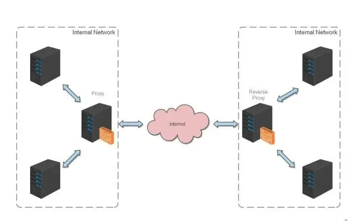

## 概述

什么是 Nginx?
Nginx (engine x) 是一款轻量级的 Web 服务器 、反向代理服务器及电子邮件（IMAP/POP3）代理服务器。

## 反向代理

反向代理（Reverse Proxy）方式是指以代理服务器来接受 internet 上的连接请求，然后将请求转发给内部网络上的服务器，并将从服务器上得到的结果返回给
internet 上请求连接的客户端，此时代理服务器对外就表现为一个反向代理服务器。


## 使用

常用命令如下：

| 命令                      | 作用                             |
|-------------------------|--------------------------------|
| `nginx -?/-h`           | 帮助                             |
| `nginx -c [file]`       | 指定配置文件                         |
| `nginx -e [file]`       | 指定日志存储文件                       |
| `nginx -g [directives]` | 指定全局配置指令                       |
| `nginx -s s`top         | 快速关闭Nginx，可能不保存相关信息，并迅速终止web服务 |
| `nginx -s q`uit         | 平稳关闭Nginx，保存相关信息，有安排的结束web服务   |
| `nginx -s r`eload       | 重新加载配置                         |
| `nginx -s r`eopen       | 重新打开日志文件                       |
| `nginx -t`              | 检查配置语法并尝试打开配置引用到的文件            |
| `nginx -T`              | 检查配置语法并输出配置内容                  |
| `nginx -v`              | 打印Nginx版本.                     |
| `nginx -V`              | 打印Nginx版本, 编译版本, 配置参数.         |

## 配置

## 负载均衡配置

上一个例子中，代理仅仅指向一个服务器。
但是，网站在实际运营过程中，多半都是有多台服务器运行着同样的 app，这时需要使用负载均衡来分流。
nginx 也可以实现简单的负载均衡功能。
假设这样一个应用场景：将应用部署在 192.168.1.11:80、192.168.1.12:80、192.168.1.13:80 三台 linux
环境的服务器上。网站域名叫 www.helloworld.com，公网 IP 为 192.168.1.11。在公网 IP 所在的服务器上部署 nginx，对所有请求做负载均衡处理。
nginx.conf 配置如下：

```
http {
    #设定mime类型,类型由mime.type文件定义
    include       /etc/nginx/mime.types;
    default_type  application/octet-stream;
    #设定日志格式
    access_log    /var/log/nginx/access.log;
        #设定负载均衡的服务器列表
    upstream load_balance_server {
    #weigth参数表示权值，权值越高被分配到的几率越大
    server 192.168.1.11:80   weight=5;
    server 192.168.1.12:80   weight=1;
    server 192.168.1.13:80   weight=6;
    }
    #HTTP服务器
    server {
        #侦听80端口
        listen       80;
                #定义使用www.xx.com访问
        server_name  www.helloworld.com;
                #对所有请求进行负载均衡请求
        location / {
            root        /root;
            #定义服务器的默认网站根目录位置
            index       index.html index.htm;
            #定义首页索引文件的名称
            proxy_pass  http://load_balance_server ;
            #请求转向load_balance_server 定义的服务器列表
            #以下是一些反向代理的配置(可选择性配置)
            #proxy_redirect off;
            proxy_set_header Host $host;
            proxy_set_header X-Real-IP $remote_addr;
            #后端的Web服务器可以通过X-Forwarded-For获取用户真实IP
            proxy_set_header X-Forwarded-For $remote_addr;
            proxy_connect_timeout 90;
            #nginx跟后端服务器连接超时时间(代理连接超时)
            proxy_send_timeout 90;
            #后端服务器数据回传时间(代理发送超时)
            proxy_read_timeout 90;
            #连接成功后，后端服务器响应时间(代理接收超时)
            proxy_buffer_size 4k;
            #设置代理服务器（nginx）保存用户头信息的缓冲区大小
            proxy_buffers 4 32k;
            #proxy_buffers缓冲区，网页平均在32k以下的话，这样设置
            proxy_busy_buffers_size 64k;
            #高负荷下缓冲大小（proxy_buffers*2）
            proxy_temp_file_write_size 64k;
            #设定缓存文件夹大小，大于这个值，将从upstream服务器传
            client_max_body_size 10m;
            #允许客户端请求的最大单文件字节数
            client_body_buffer_size 128k;
            #缓冲区代理缓冲用户端请求的最大字节数
        }
    }
}
```

## 网站有多个 webapp 的配置

当一个网站功能越来越丰富时，往往需要将一些功能相对独立的模块剥离出来，独立维护。这样的话，通常，会有多个 webapp。
举个例子：假如 www.helloworld.com 站点有好几个
webapp，finance（金融）、product（产品）、admin（用户中心）。访问这些应用的方式通过上下文(context)来进行区分:

- www.helloworld.com/finance/
- www.helloworld.com/product/
- www.helloworld.com/admin/

我们知道，http 的默认端口号是 80，如果在一台服务器上同时启动这 3 个 webapp 应用，都用 80 端口，肯定是不成的。所以，这三个应用需要分别绑定不同的端口号。
那么，问题来了，用户在实际访问 www.helloworld.com 站点时，访问不同 webapp，总不会还带着对应的端口号去访问吧。所以，你再次需要用到反向代理来做处理。
配置也不难，来看看怎么做吧：

```
http {
  #此处省略一些基本配置
  upstream product_server{
    server www.helloworld.com:8081;
  }
  upstream admin_server{
    server www.helloworld.com:8082;
  }
  upstream finance_server{
    server www.helloworld.com:8083;
  }
  server {
    #此处省略一些基本配置
    #默认指向product的server
    location / {
      proxy_pass http://product_server;
    }
    location /product/{
      proxy_pass http://product_server;
    }
    location /admin/ {
      proxy_pass http://admin_server;
    }
    location /finance/ {
      proxy_pass http://finance_server;
    }
  }
}
```

```
## https 反向代理配置
一些对安全性要求比较高的站点，可能会使用 HTTPS（一种使用 ssl 通信标准的安全 HTTP 协议）。
这里不科普 HTTP 协议和 SSL 标准。但是，使用 nginx 配置 https 需要知道几点：
- HTTPS 的固定端口号是 443，不同于 HTTP 的 80 端口
- SSL 标准需要引入安全证书，所以在 nginx.conf 中你需要指定证书和它对应的 key
  其他和 http 反向代理基本一样，只是在 Server 部分配置有些不同。
```

#HTTP 服务器 server { #监听 443 端口。443 为知名端口号，主要用于 HTTPS 协议
listen
443 ssl; #定义使用www.xx.com访问
server_name www.helloworld.com;
#ssl 证书文件位置(常见证书文件格式为：crt/pem)
ssl_certificate
cert.pem;
#ssl 证书 key 位置
ssl_certificate_key cert.key;
#ssl 配置参数（选择性配置）
ssl_session_cache
shared:SSL:1m;
ssl_session_timeout 5m; #数字签名，此处使用 MD5
ssl_ciphers HIGH:!aNULL:!MD5;
ssl_prefer_server_ciphers on;
location / {
root /root;
index index.html index.htm;
} }

```
## 静态站点配置
有时候，我们需要配置静态站点(即 html 文件和一堆静态资源)。
举例来说：如果所有的静态资源都放在了 /app/dist 目录下，我们只需要在 nginx.conf 中指定首页以及这个站点的 host 即可。
配置如下：
```

worker_processes 1;
events {
worker_connections 1024;
}
http {
include mime.types;
default_type application/octet-stream;
sendfile on;
keepalive_timeout 65;
gzip on;
gzip_types text/plain application/x-javascript text/css application/xml text/javascript application/javascript
image/jpeg image/gif image/png;
gzip_vary on;
server {
listen 80;
server_name static.zp.cn;
location / {
root /app/dist;
index index.html;
}
}
}

```
然后，添加 HOST：
127.0.0.1 static.zp.cn
此时，在本地浏览器访问 static.zp.cn ，就可以访问静态站点了。
## 搭建文件服务器
有时候，团队需要归档一些数据或资料，那么文件服务器必不可少。使用 Nginx 可以非常快速便捷的搭建一个简易的文件服务。
Nginx 中的配置要点：
- 将 autoindex 开启可以显示目录，默认不开启。
- 将 autoindex_exact_size 开启可以显示文件的大小。
- 将 autoindex_localtime 开启可以显示文件的修改时间。
- root 用来设置开放为文件服务的根路径。
- charset 设置为 charset utf-8,gbk;，可以避免中文乱码问题（windows
  服务器下设置后，依然乱码，本人暂时没有找到解决方法）。
  一个最简化的配置如下：
```

autoindex on;# 显示目录 autoindex*exact_size on;# 显示文件大小 autoindex_localtime on;# 显示文件时间
server { charset utf-8,gbk; # windows 服务器下设置后，依然乱码，暂时无解 listen 9050 default_server; listen [::]:9050
default_server; server_name *; root /share/fs;}

```
## 跨域解决方案
web 领域开发中，经常采用前后端分离模式。这种模式下，前端和后端分别是独立的 web 应用程序，例如：后端是 Java 程序，前端是 React 或 Vue 应用。
各自独立的 web app 在互相访问时，势必存在跨域问题。解决跨域问题一般有两种思路：
### CORS
在后端服务器设置 HTTP 响应头，把你需要运行访问的域名加入加入 Access-Control-Allow-Origin 中。
### jsonp
把后端根据请求，构造 json 数据，并返回，前端用 jsonp 跨域。
这两种思路，本文不展开讨论。
需要说明的是，nginx 根据第一种思路，也提供了一种解决跨域的解决方案。
举例：www.helloworld.com 网站是由一个前端 app ，一个后端 app 组成的。前端端口号为 9000， 后端端口号为 8080。
前端和后端如果使用 http 进行交互时，请求会被拒绝，因为存在跨域问题。来看看，nginx 是怎么解决的吧：
首先，在 enable-cors.conf 文件中设置 cors ：
```

# allow origin listset $ACAO '\*';

# set single origin

if ($http_origin ~* (www.helloworld.com)$) {
set $ACAO $http_origin;
}
if ($cors = "trueget") {
add_header 'Access-Control-Allow-Origin' "$http_origin";
add_header 'Access-Control-Allow-Credentials' 'true';
add_header 'Access-Control-Allow-Methods' 'GET, POST, OPTIONS';
add_header 'Access-Control-Allow-Headers' '
DNT,X-Mx-ReqToken,Keep-Alive,User-Agent,X-Requested-With,If-Modified-Since,Cache-Control,Content-Type';
}
if ($request_method = 'OPTIONS') {
set $cors "${cors}options";
}
if ($request_method = 'GET') {
set $cors "${cors}get";
}
if ($request_method = 'POST') {
set $cors "${cors}post";
}

```
接下来，在你的服务器中 include enable-cors.conf 来引入跨域配置：
```

# ----------------------------------------------------

# 此文件为项目 nginx 配置片段

# 可以直接在 nginx config 中 include（推荐）

# 或者 copy 到现有 nginx 中，自行配置

# www.helloworld.com 域名需配合 dns hosts 进行配置

# 其中，api 开启了 cors，需配合本目录下另一份配置文件

# ----------------------------------------------------

upstream front_server{
server www.helloworld.com:9000;
}
upstream api_server{
server www.helloworld.com:8080;
}
server {
listen 80;
server_name www.helloworld.com;
location ~ ^/api/ {
include enable-cors.conf;
proxy_pass http://api_server;
rewrite "^/api/(.\*)$" /$1 break;
}
location ~ ^/ {}
proxy_pass http://front_server;
}
}

```
到此，就完成了。
```

## Lvs

## Lua
