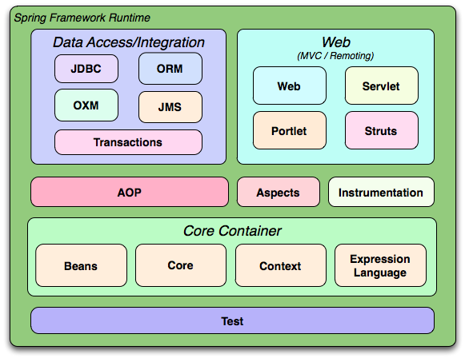

## 核心容器：包括 Core、Beans、Context、EL 模块

- Core 模块：封装了框架依赖的最底层部分，包括资源访问、类型转换及一些常用工具类。
- Beans 模块：提供了框架的基础部分，包括控制反转（IOC）和依赖注入（DI）。其中 BeanFactory 是容器核心，本质是“工厂设计模式”的实现，而且无需编程实现“单例设计模式”，单例完全由容器控制，而且提倡面向接口编程，而非面向实现编程。所有应用程序对象及对象间关系由框架管理，从而真正从程序逻辑中把维护对象之间的依赖关系提取出来，所有这些依赖关系都由 BeanFactory 来维护。
- Context 模块：以 Core 和 Beans 为基础，集成 Beans 模块功能并添加资源绑定、数据验证、国际化、Java EE 支持、容器生命周期、事件传播等。核心接口是 ApplicationContext。
- EL 模块：提供强大的表达式语言支持，支持访问和修改属性值，方法调用，支持访问及修改数组、容器和索引器，命名变量，支持算数和逻辑运算，支持从 Spring 容器获取 Bean，它也支持列表投影、选择和一般的列表聚合等。

## AOP、Aspects 模块

- AOP 模块：Spring AOP 模块提供了符合 AOP Alliance 规范的面向切面的编程（aspect-oriented programming）实现，提供比如日志记录、权限控制、性能统计等通用功能和业务逻辑分离的技术，并且能动态的把这些功能添加到需要的代码中，这样各专其职，降低业务逻辑和通用功能的耦合。
- Aspects 模块：提供了对 AspectJ 的集成，AspectJ 提供了比 Spring ASP 更强大的功能。
- 数据访问/集成模块：该模块包括了 JDBC、ORM、OXM、JMS 和事务管理。
- 事务模块：该模块用于 Spring 管理事务，只要是 Spring 管理对象都能得到 Spring 管理事务的好处，无需在代码中进行事务控制了，而且支持编程和声明性的事务管理。
- JDBC 模块：提供了一个 JDBC 的样例模板，使用这些模板能消除传统冗长的 JDBC 编码还有必须的事务控制，而且能享受到 Spring 管理事务的好处。
- ORM 模块：提供与流行的“对象-关系”映射框架的无缝集成，包括 Hibernate、JPA、MyBatis 等。而且可以使用 Spring 事务管理，无需额外控制事务。
- OXM 模块：提供了一个对 Object/XML 映射实现，将 java 对象映射成 XML 数据，或者将 XML 数据映射成 java 对象，Object/XML 映射实现包括 JAXB、Castor、XMLBeans 和 XStream。
- JMS 模块：用于 JMS（Java Messaging Service），提供一套“消息生产者、消息消费者”模板用于更加简单的使用 JMS。JMS 用于用于在两个应用程序之间，或分布式系统中发送消息，进行异步通信。
- Web/Remoting 模块：Web/Remoting 模块包含了 Web、Web-Servlet、Web-Struts、Web-Porlet 模块。
- Web 模块：提供了基础的 Web 功能。例如多文件上传、集成 IoC 容器、远程过程访问（RMI、Hessian、Burlap）以及 Web Service 支持，并提供一个 RestTemplate 类来提供方便的 Restful services 访问。
- Web-Servlet 模块：提供了一个 Spring MVC Web 框架实现。Spring MVC 框架提供了基于注解的请求资源注入、更简单的数据绑定、数据验证等及一套非常易用的 JSP 标签，完全无缝与 Spring 其他技术协作。
- Web-Struts 模块：提供了与 Struts 无缝集成，Struts 1.x 和 Struts 2.x 都支持。
- Test 模块：Spring 支持 Junit 和 TestNG 测试框架，而且还额外提供了一些基于 Spring 的测试功能，比如在测试 Web 框架时，模拟 Http 请求的功能。

## @Component

被此注解标注的类将被 Spring 容器自动识别，自动生成 Bean 定义

## @Controller

对应表现层的 Bean，也就是 Action。

## @Service

对应的是业务层 Bean。

## @Repository

对应数据访问层 Bean。

## @Autowired

@Autowired 可以用来装配 bean，都可以写在字段上，或者方法上。使用 @Autowired，首先要在在 applicationContext.xml 中加入 `<bean class = "org.springframework.beans.factory.annotation.AutowiredAnnotationBeanPostProcessor"/>`。@Autowired 默认按类型装配，默认情况下要求依赖对象必须存在，如果要允许 null 值，可以设置它的 required 属性为 false。

## @Configuration

通过使用注释 @Configuration 告诉 Spring，这个 Class 是 Spring 的核心配置文件，并且通过使用注解 @Bean 定义 bean

## @Component

表示一个自动扫描 component。

## @Repository

表示持久化层的 DAO component。

## @Service

表示业务逻辑层的 Service component。

## @Controller

表示表示层的 Controller component。

Bean 的作用域决定了从 Spring 容器中返回的 Bean 实例的类型。在 Spring 中，支持以下 5 种类型的作用域：

1. singleton — 单例模式，由 IOC 容器返回一个唯一的 bean 实例。
2. prototype — 原型模式，被请求时，每次返回一个新的 bean 实例。
3. request — 每个 HTTP Request 请求返回一个唯一的 Bean 实例。
4. session — 每个 HTTP Session 返回一个唯一的 Bean 实例。
5. globalSession — Http Session 全局 Bean 实例。

> 注：大多数情况下，你可能只需要处理 Spring 的核心作用域 — 单例模式（singleton）和原型模式（prototype），默认情况下，作用域是单例模式。
