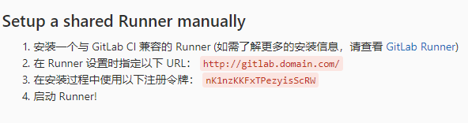

## 安装 gitlab

### 安装要求

|        |                                    |
|--------|------------------------------------| 
| 硬盘   | 取决于存储库，至少 50GB            |
| CPU    | 取决于用户数量，至少 2U            |
| 内存   | 取决于用户数量，至少 4G 可物理内存 |
| 交换区 | 与内存的总和至少为 8G              |

### 安装过程

_**安装并配置必需的依赖项**_

- 安装依赖

```bash
sudo yum install -y curl policycoreutils-python openssh-server
```

- 配置防火墙，启用 ssh、http、https

```bash
sudo systemctl enable sshd
sudo systemctl start sshd
sudo firewall-cmd --permanent --add-service=http
sudo firewall-cmd --permanent --add-service=https
sudo systemctl reload firewalld
```

_**安装 Gitlab**_

- 添加包存储库

> **centos/redhat**
>
>```bash
>curl https://packages.gitlab.com/install/repositories/gitlab/gitlab-ce/script.rpm.sh | sudo bash
>```

> **ubuntu**
>
> ```bash
> curl https://packages.gitlab.com/install/repositories/gitlab/gitlab-ce/script.deb.sh | sudo bash
> ```

- 安装，将命令中的 `https://gitlab.example.com` 改为服务器的访问地址（如http://192.168.32.21）

```bash
sudo EXTERNAL_URL="https://gitlab.example.com" yum install -y gitlab-ce
```

2.3 初次访问

通过浏览器访问 Gitlab 的访问地址`https://gitlab.example.com`

初始密码位于`/etc/gitlab/initial_root_password`中

通过使用用户名 root 和初始密码登录。

_**配置**_

- 设置 SMTP

打开 gitlab 的配置文件

```
sudo vim /etc/gitlab/gitlab.rb
```

修改如下内容

```
gitlab_rails['smtp_enable'] = true
gitlab_rails['smtp_address'] = "smtp.163.com"
gitlab_rails['smtp_port'] = 25
gitlab_rails['smtp_user_name'] = "xxuser@163.com"
gitlab_rails['smtp_password'] = "xxpassword"
gitlab_rails['smtp_domain'] = "163.com"
gitlab_rails['smtp_authentication'] = :login
gitlab_rails['smtp_enable_starttls_auto'] = true

gitlab_rails['gitlab_email_from'] = "xxuser@163.com"
gitlab_rails['gitlab_email_display_name'] = '版本管理系统'
user['git_user_name'] = "版本管理系统"
user["git_user_email"] = "xxuser@163.com"
```

其中xxuser@163.com为发送邮件所使用的邮箱，xxpassword 为发送邮件使用的邮箱的客户端授权码

完成后执行 ` sudo gitlab-ctl reconfigure`

- 配置外观

使用管理员用户登录到系统后，打开管理中心

点击左侧的外观，然后根据页面的提示信息进行系统的界面外观配置

## 备份

命令

```
gitlab-rake gitlab:backup:create
```

备份路径为 `/var/opt/gitlab/backups`

## GitLab-runner 安装、注册

### 1. 添加官方存储库：

- 对于 Debian/Ubuntu/Mint

```bash
curl -L https://packages.gitlab.com/install/repositories/runner/gitlab-runner/script.deb.sh | sudo bash
```

- 对于 RHEL/CentOS/Fedora

```bash
curl -L https://packages.gitlab.com/install/repositories/runner/gitlab-runner/script.rpm.sh | sudo bash
```

### 2. 安装

**注：Debian buster 用户应禁用 skel 以防止没有此类文件或目录作业失败**

- 安装最新版本
    - 对于 Debian/Ubuntu/Mint `export GITLAB_RUNNER_DISABLE_SKEL=true; sudo -E apt-get install gitlab-runner`
    - 对于 RHEL/CentOS/Fedora ` export GITLAB_RUNNER_DISABLE_SKEL=true; sudo -E yum install gitlab-runner`
- 安装指定版本
    - 对于 DEB based systems
    ```bash
    apt-cache madison gitlab-runner export GITLAB_RUNNER_DISABLE_SKEL=true; sudo -E apt-get install gitlab-runner=10.0.0
    ```
    - 对于 RPM based systems
    ```bash
     yum list gitlab-runner --showduplicates | sort -r
     export GITLAB_RUNNER_DISABLE_SKEL=true; sudo -E yum install gitlab-runner-10.0.0-1
    ```

### 3. 注册

向 GitLab-CI 注册一个 Runner 需要两样东西：GitLab 访问地址和 gitlab-ci token。

1. 注册

 ```bash
 # 在命令中指定GitLab访问地址和gitlab-ci token
 sudo gitlab-runner register --url <url> --registration-token <token>
 # 不指定GitLab访问地址和gitlab-ci token
 gitlab-runner register
 ```

2. 输入 `http://gitlab.domain.com`或`http://ip:port` 就是 GitLab 访问地址
3. Please enter the gitlab-ci token for this runner 要求输入 gitlab-ci token

4. 输入描述（可以留空）
5. 输入 tag（可以留空）
6. 选择当遇到没有打标签的提交时是否会执行，选 false
7. 是否锁定此 runner 到当前项目， 选 false
8. 选一个执行者 executor (ssh, docker+machine, docker-ssh+machine, kubernetes, docker, parallels, virtualbox, docker-ssh, shell)，选 docker（表示使用docker执行）
9. 在注册完之后，可以在 GitLab 获取 gitlab-ci token 的页面看到刚刚注册的这个 runner

**注意：**
gitlab-ci token在项目的 管理区域->runners 中可以找到 (这里注册的是 share 类型 runner)

