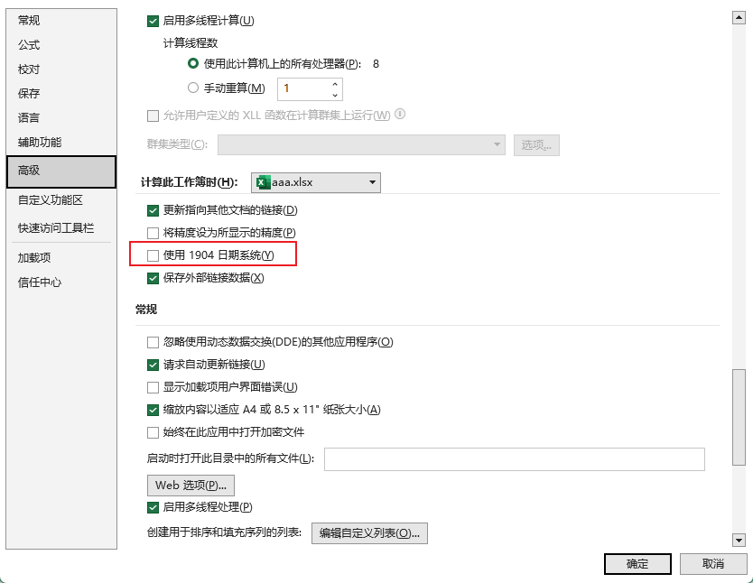

## 启动前端项目

### 问题

通过`npm run dev`启动项目后报错

错误的主要信息为：

```
  opensslErrorStack: [ 'error:03000086:digital envelope routines::initialization error' ],
  library: 'digital envelope routines',
  reason: 'unsupported',
  code: 'ERR_OSSL_EVP_UNSUPPORTED'
}

Node.js v18.16.0
ELIFECYCLE Command failed with exit code 1.
```

原因是 nodejs 版本过高

### 解决方案

在 package.json 中的 scripts 下的 dev 开头添加`set NODE_OPTIONS=--openssl-legacy-provider && `

```
"dev": "set NODE_OPTIONS=--openssl-legacy-provider && vue-cli-service serve",
```

## org.apache.catalina.session.StandardManager doLoad

tomcat 的 work 目录下面的东西删一遍。

## org.hibernate.MappingException

hibernate 映射文件错误

## java.lang.IllegalArgumentException:

`Can not find a java.io.InputStream with the name [downloadFile] in the invocation stack. Check the <param name="inputName"> tag specified for this action.`

action 中缺少相应的方法

## Linux 下 jar 运行正常，无报错，但是停止运行

通过`dmesg -T | grep java`发现为 OOM Killer 杀死程序

## Java 读取 Excel 日期格式数据得到一个数字格式的值

先通过Excel 文件>选项>高级 确定该文件的日期系统是否为1900日期系统(Excel默认为1900日期系统)

读取该数据是会得到一个数值，该数值为自1900-01-01(1900日期系统)起的天数，1900-01-01为1，由于历史原因导致excel将1900年当作闰年，导致存在1900-02-29，故计算1900-02-29之后的日期时需要多减一天。