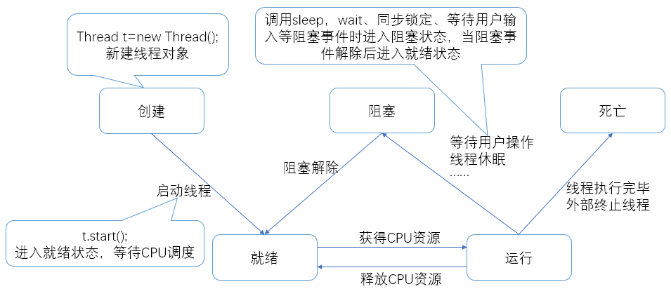

## 多线程

### 线程状态

### 实现方法

#### 继承 Thread 类

- 没有返回值
- 重写 run 方法
- 启动：通过 start()执行
- 单继承带有局限性

#### 实现 Runnable 接口

- 没有返回值
- 重写 run 方法
- 启动：通过 new Thread(对象).start()执行
- 便于一个对象被多个线程使用

#### 实现 Callable 接口

- 需要返回值
- 重写 call 方法
- 启动：通过 Executors.newFixedThreadPool(int nThreads)创建执行服务，然后通过 submit 执行
- 获取执行结果：get()
- 通过服务的 shutdownNow 关闭服务

> 注意：run()和 start()区别
>
> - 通过 run()，主线程会等待子线程执行完毕再继续
> - 通过 start()，主线程和子线程同时并行执行

### 方法

| 方法                           | 说明             |
|------------------------------|----------------|
| setPriority(int newPriority) | 更改线程优先级        |
| join()                       | 等待当前线程终止       |
| interrupt()                  | 中断线程（不建议）      |
| isAlive()                    | 测试线程是否处于活动状态   |
| Thread.sleep(long millis)    | 线程休眠 millis 毫秒 |
| Thread.yield()               | 暂停当前线程并执行其他线程  |
| setDeamon(bool on)           | 设置为守护线程        |

### 停止线程

- 通过执行次数
- 通过标志位
- 线程在死亡之后不能重新启动

### 线程休眠 sleep

- 指定当前线程阻塞的毫秒数
- 存在异常 InterruptedException
- 时间到达后线程进入就绪状态
- 可以模拟网络延时、倒计时等
- 每个对象都有一把锁，sleep 不会释放锁

### 线程礼让 yield

- 让当前线程暂停，但不阻塞
- 将线程从运行状态转为就绪状态
- 让 CPU 重新调度
- 礼让不一定成功

### 线程合并 join

- 线程进行 join 时会先执行该线程，执行完后再执行其他线程，其他线程阻塞
- 可以理解为插队

### 线程状态

- NEW 线程已创建但未启动
- RUNNABLE 正在 Java 虚拟机中执行，但它可能正在等待来自操作系统的其他资源(如处理器)。
- BLOCKED 线程阻塞等待监视器锁的线程状态。处于阻塞状态的线程正在等待监视器锁进入同步块/方法或调用后重新进入同步块/方法
- WAITING 线程由于调用而处于等待状态
- TIMED_WAITING 具有指定等待时间的等待线程的线程状态。
- TERMINATED 已终止线程的线程状态。 线程已完成执行。

### 线程优先级

- 线程调度器按优先级决定线程的调度
- 优先级用数字表示，范围 1~10

### 守护线程 daemon

- 线程分用户线程和守护线程
- 虚拟机必须确保用户线程执行完毕
- 虚拟机不用等守护线程执行完
- 后台记录日志，内存监控，垃圾回收……

### 线程同步

队列+锁

- 一个线程持有锁会导致其他需要此锁的线程挂起
- 加锁、释放会导致较多的上下文切换和调度延时，引起性能问题
- 高优先级的线程等待低优先级的线程释放锁会导致优先级倒置，引起性能问题

#### synchronized

- synchronized 方法

在方法上加上 synchronized 关键字

- synchronized 块

synchronized(Obj){}，Obj 是同步监视器（是一个改变的量）
每次线程访问会给 Obj 加锁

#### Lock

- 显示定义同步锁
- 每次只能有一个线程对 Lock 加锁，开始访问共享资源前应先获得 Lock 对象
- ReentrantLock（可重入锁）实现了 Lock，与 synchronized 有相同语义

| synchronized | Lock          |
|--------------|---------------|
| 隐式锁          | 显式锁           |
| 出作用域自动释放     | 手动开启关闭        |
| 用于代码块和方法     | 只能用于代码块       |
| 性能一般         | JVM 花费时间少，性能好 |
|              | 扩展性好          |

使用顺序：Lock>同步代码块>同步方法

### 线程通信

| 方法                 | 作用                             |
|--------------------|--------------------------------|
| wait()             | 线程一直等待，直到其他线程通知                |
| wait(long timeout) | 等待指定的毫秒数                       |
| notify()           | 唤醒一个处于等待状态的线程                  |
| notifyAll()        | 唤醒一个对象上所有调用 wait 的线程，优先级高的优先调度 |

生产者消费者问题：

- 管程法 通过缓冲区
- 信号灯法 通过标志位

### 线程池

- 提高响应速度
- 降低资源消耗
- 便于线程管理

    - corePoolSize 核心池大小
    - maximumPoolSize 最大线程数
    - keepAliveTime 线程没任务最多保留多长时间

- ExecutorService 线程池接口

    - void execute(Runnable command);无返回的执行
    - Future<?> submit(Runnable task);有返回的执行
    - void shutdown();关闭线程池

- Executors
  用于创建不同类型的线程池
