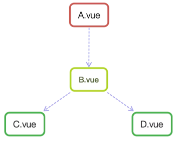
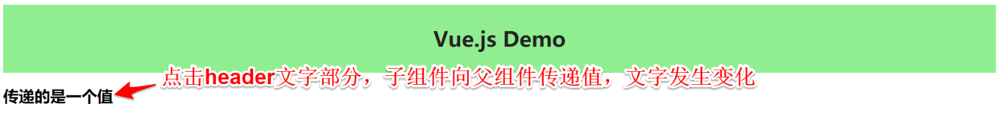
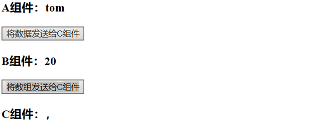
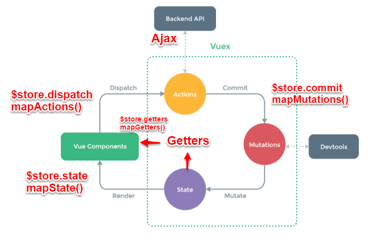
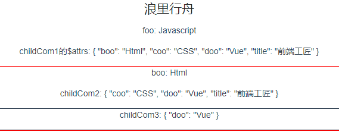
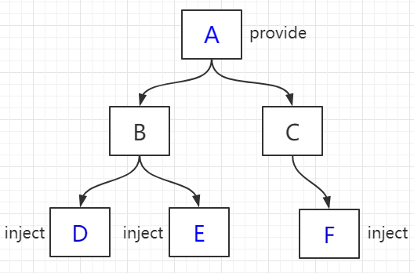

## Vue 生命周期


## Vue data 声明方式

```js
//方式一
let vue1 = new Vue({
  id: '#app',
  data: {},
})

//方式二
let vue2 = new Vue({
  id: '#app',
  data() {},
})
```

使用方式二可以防止变量污染，不影响其他

## Vue 事件修饰符

- `.stop` 阻止事件冒泡，防止触发父级事件
- `.prevent` 阻止默认事件
- `.capture` 从最外层开始提升事件优先级
- `.self` 只有点击其自身才可以有事件响应
- `.once` 只响应一次事件，无论是直接或者是间接
- `.passive`

## 全局配置

`Vue.config` 是一个对象，包含 Vue 的全局配置。可以在启动应用之前修改下列 property：

### silent

- **类型**：`boolean`

- **默认值**：`false`

- **用法**：

  ```javascript
  Vue.config.silent = true
  ```

  取消 Vue 所有的日志与警告。

### optionMergeStrategies

- **类型**：`{ key: string: Function }`

- **默认值**：`{}`

- **用法**：

  ```vue
  Vue.config.optionMergeStrategies._my_option = function (parent, child, vm) { return child + 1 } const Profile =
  Vue.extend({ _my_option: 1 }) // Profile.options._my_option = 2
  ```

  自定义合并策略的选项。

  合并策略选项分别接收在父实例和子实例上定义的该选项的值作为第一个和第二个参数，Vue 实例上下文被作为第三个参数传入。

- **参考**自定义选项的混入策略

### devtools

- **类型**：`boolean`

- **默认值**：`true` (生产版为 `false`)

- **用法**：

  ```vue
  // 务必在加载 Vue 之后，立即同步设置以下内容 Vue.config.devtools = true
  ```

  配置是否允许 vue-devtools(https://github.com/vuejs/vue-devtools) 检查代码。开发版本默认为 `true`，生产版本默认为 `false`
  。生产版本设为 `true` 可以启用检查。

### errorHandler

- **类型**：`Function`

- **默认值**：`undefined`

- **用法**：

  ```vue
  Vue.config.errorHandler = function (err, vm, info) { // handle error // `info` 是 Vue
  特定的错误信息，比如错误所在的生命周期钩子 // 只在 2.2.0+ 可用 }
  ```

  指定组件的渲染和观察期间未捕获错误的处理函数。这个处理函数被调用时，可获取错误信息和 Vue 实例。

  > 从 2.2.0 起，这个钩子也会捕获组件生命周期钩子里的错误。同样的，当这个钩子是 `undefined`
  时，被捕获的错误会通过 `console.error` 输出而避免应用崩溃。

  > 从 2.4.0 起，这个钩子也会捕获 Vue 自定义事件处理函数内部的错误了。

  > 从 2.6.0 起，这个钩子也会捕获 `v-on` DOM 监听器内部抛出的错误。另外，如果任何被覆盖的钩子或处理函数返回一个 Promise
  链 (例如 async 函数)，则来自其 Promise 链的错误也会被处理。

  > 错误追踪服务 Sentry(https://sentry.io/) 和 Bugsnag(https://docs.bugsnag.com/platforms/browsers/vue/) 都通过此选项提供了官方支持。

### warnHandler

> 2.4.0 新增

- **类型**：`Function`

- **默认值**：`undefined`

- **用法**：

  ```vue
  Vue.config.warnHandler = function (msg, vm, trace) { // `trace` 是组件的继承关系追踪 }
  ```

  为 Vue 的运行时警告赋予一个自定义处理函数。注意这只会在开发者环境下生效，在生产环境下它会被忽略。

### ignoredElements

- **类型**：`Array<string | RegExp>`

- **默认值**：``

- **用法**：

  ```vue
  Vue.config.ignoredElements = 'my-custom-web-component', 'another-web-component', // 用一个 `RegExp`
  忽略所有“ion-”开头的元素 // 仅在 2.5+ 支持 /^ion-/
  ```

  须使 Vue 忽略在 Vue 之外的自定义元素 (e.g. 使用了 Web Components APIs)
  。否则，它会假设你忘记注册全局组件或者拼错了组件名称，从而抛出一个关于 `Unknown custom element` 的警告。

### keyCodes

- **类型**：`{ key: string: number | Array<number> }`

- **默认值**：`{}`

- **用法**：

  ```vue
  Vue.config.keyCodes = { v: 86, f1: 112, // camelCase 不可用 mediaPlayPause: 179, // 取而代之的是 kebab-case
  且用双引号括起来 "media-play-pause": 179, up: 38, 87 }
  ```

  ```
  <input type="text" @keyup.media-play-pause="method">
  ```

  给 `v-on` 自定义键位别名。

### performance

> 2.2.0 新增

- **类型**：`boolean`

- **默认值**：`false (自 2.2.3 起)`

- **用法**：

  设置为 `true`
  以在浏览器开发工具的性能/时间线面板中启用对组件初始化、编译、渲染和打补丁的性能追踪。只适用于开发模式和支持 `performance.mark`(https://developer.mozilla.org/en-US/docs/Web/API/Performance/mark)
  API 的浏览器上。

### productionTip

> 2.2.0 新增

- **类型**：`boolean`

- **默认值**：`true`

- **用法**：

  设置为 `false` 以阻止 vue 在启动时生成生产提示。

## 全局 API

### Vue.extend( options )

- **参数**：

    - `{Object} options`

- **用法**：

  使用基础 Vue 构造器，创建一个“子类”。参数是一个包含组件选项的对象。

  `data` 选项是特例，需要注意 - 在 `Vue.extend()` 中它必须是函数

  ```
  <div id="mount-point"></div>
  ```

  ```
  // 创建构造器
  var Profile = Vue.extend({
    template: '<p>{{firstName}} {{lastName}} aka {{alias}}</p>',
    data: function () {
      return {
        firstName: 'Walter',
        lastName: 'White',
        alias: 'Heisenberg'
      }
    }
  })
  // 创建 Profile 实例，并挂载到一个元素上。
  new Profile().$mount('#mount-point')
  ```

  结果如下：

  ```
  <p>Walter White aka Heisenberg</p>
  ```

- **参考**：组件

### Vue.nextTick( callback, context\ )

- **参数**：

    - `{Function} callback`
    - `{Object} context`

- **用法**：

  在下次 DOM 更新循环结束之后执行延迟回调。在修改数据之后立即使用这个方法，获取更新后的 DOM。

  ```
  // 修改数据
  vm.msg = 'Hello'
  // DOM 还没有更新
  Vue.nextTick(function () {
    // DOM 更新了
  })

  // 作为一个 Promise 使用 (2.1.0 起新增，详见接下来的提示)
  Vue.nextTick()
    .then(function () {
      // DOM 更新了
    })
  ```

  > 2.1.0 起新增：如果没有提供回调且在支持 Promise 的环境中，则返回一个 Promise。请注意 Vue 不自带 Promise 的
  polyfill，所以如果你的目标浏览器不原生支持 Promise (IE：你们都看我干嘛)，你得自己提供 polyfill。

- **参考**：异步更新队列

### Vue.set( target, propertyName/index, value )

- **参数**：

    - `{Object | Array} target`
    - `{string | number} propertyName/index`
    - `{any} value`

- **返回值**：设置的值。

- **用法**：

  向响应式对象中添加一个 property，并确保这个新 property 同样是响应式的，且触发视图更新。它必须用于向响应式对象上添加新
  property，因为 Vue 无法探测普通的新增 property (比如 `this.myObject.newProperty = 'hi'`)

  注意对象不能是 Vue 实例，或者 Vue 实例的根数据对象。

### Vue.delete( target, propertyName/index )

- **参数**：

    - `{Object | Array} target`
    - `{string | number} propertyName/index`

  > 仅在 2.2.0+ 版本中支持 Array + index 用法。

- **用法**：

  删除对象的 property。如果对象是响应式的，确保删除能触发更新视图。这个方法主要用于避开 Vue 不能检测到 property
  被删除的限制，但是你应该很少会使用它。

  > 在 2.2.0+ 中同样支持在数组上工作。

  目标对象不能是一个 Vue 实例或 Vue 实例的根数据对象。

- **参考**：深入响应式原理

### Vue.directive( id, definition\ )

- **参数**：

    - `{string} id`
    - `{Function | Object} definition`

- **用法**：

  注册或获取全局指令。

  ```
  // 注册
  Vue.directive('my-directive', {
    bind: function () {},
    inserted: function () {},
    update: function () {},
    componentUpdated: function () {},
    unbind: function () {}
  })

  // 注册 (指令函数)
  Vue.directive('my-directive', function () {
    // 这里将会被 `bind` 和 `update` 调用
  })

  // getter，返回已注册的指令
  var myDirective = Vue.directive('my-directive')
  ```

- **参考**：自定义指令

### Vue.filter( id, definition\ )

- **参数**：

    - `{string} id`
    - `{Function} definition`

- **用法**：

  注册或获取全局过滤器。

  ```
  // 注册
  Vue.filter('my-filter', function (value) {
    // 返回处理后的值
  })

  // getter，返回已注册的过滤器
  var myFilter = Vue.filter('my-filter')
  ```

- **参考**：过滤器

### Vue.component( id, definition\ )

- **参数**：

    - `{string} id`
    - `{Function | Object} definition`

- **用法**：

  注册或获取全局组件。注册还会自动使用给定的 `id` 设置组件的名称

  ```
  // 注册组件，传入一个扩展过的构造器
  Vue.component('my-component', Vue.extend({ /* ... */ }))

  // 注册组件，传入一个选项对象 (自动调用 Vue.extend)
  Vue.component('my-component', { /* ... */ })

  // 获取注册的组件 (始终返回构造器)
  var MyComponent = Vue.component('my-component')
  ```

- **参考**：组件

### Vue.use( plugin )

- **参数**：

    - `{Object | Function} plugin`

- **用法**：

  安装 Vue.js 插件。如果插件是一个对象，必须提供 `install` 方法。如果插件是一个函数，它会被作为 install 方法。install
  方法调用时，会将 Vue 作为参数传入。

  该方法需要在调用 `new Vue()` 之前被调用。

  当 install 方法被同一个插件多次调用，插件将只会被安装一次。

- **参考**：插件

### Vue.mixin( mixin )

- **参数**：

    - `{Object} mixin`

- **用法**：

  全局注册一个混入，影响注册之后所有创建的每个 Vue 实例。插件作者可以使用混入，向组件注入自定义的行为。**不推荐在应用代码中使用
  **。

- **参考**：全局混入

### Vue.compile( template )

- **参数**：

    - `{string} template`

- **用法**：

  将一个模板字符串编译成 render 函数。**只在完整版时可用**。

  ```
  var res = Vue.compile('<div><span>{{ msg }}</span></div>')

  new Vue({
    data: {
      msg: 'hello'
    },
    render: res.render,
    staticRenderFns: res.staticRenderFns
  })
  ```

- **参考**：渲染函数

### Vue.observable( object )

> 2.6.0 新增

- **参数**：

    - `{Object} object`

- **用法**：

  让一个对象可响应。Vue 内部会用它来处理 `data` 函数返回的对象。

  返回的对象可以直接用于渲染函数和计算属性内，并且会在发生变更时触发相应的更新。也可以作为最小化的跨组件状态存储器，用于简单的场景：

  ```
  const state = Vue.observable({ count: 0 })

  const Demo = {
    render(h) {
      return h('button', {
        on: { click: () => { state.count++ }}
      }, `count is: ${state.count}`)
    }
  }
  ```

  在 Vue 2.x 中，被传入的对象会直接被 `Vue.observable` 变更，所以如这里展示的，它和被返回的对象是同一个对象。在 Vue 3.x
  中，则会返回一个可响应的代理，而对源对象直接进行变更仍然是不可响应的。因此，为了向前兼容，我们推荐始终操作使用 `Vue.observable`
  返回的对象，而不是传入源对象。

- **参考**：深入响应式原理

### Vue.version

- **细节**：提供字符串形式的 Vue 安装版本号。这对社区的插件和组件来说非常有用，你可以根据不同的版本号采取不同的策略。

- **用法**：

  ```
  var version = Number(Vue.version.split('.')0)

  if (version === 2) {
    // Vue v2.x.x
  } else if (version === 1) {
    // Vue v1.x.x
  } else {
    // Unsupported versions of Vue
  }
  ```

## 选项 / 数据

### data

- **类型**：`Object | Function`

- **限制**：组件的定义只接受 `function`。

- **详细**：

  Vue 实例的数据对象。Vue 将会递归将 data 的 property 转换为 getter/setter，从而让 data 的 property 能够响应数据变化。*
  *对象必须是纯粹的对象 (含有零个或多个的 key/value 对)**：浏览器 API 创建的原生对象，原型上的 property 会被忽略。大概来说，data
  应该只能是数据 - 不推荐观察拥有状态行为的对象。

  一旦观察过，你就无法在根数据对象上添加响应式 property。因此推荐在创建实例之前，就声明所有的根级响应式 property。

  实例创建之后，可以通过 `vm.$data` 访问原始数据对象。Vue 实例也代理了 data 对象上所有的 property，因此访问 `vm.a`
  等价于访问 `vm.$data.a`。

  以 `_` 或 `$` 开头的 property **不会**被 Vue 实例代理，因为它们可能和 Vue 内置的 property、API
  方法冲突。你可以使用例如 `vm.$data._property` 的方式访问这些 property。

  当一个**组件**被定义，`data` 必须声明为返回一个初始数据对象的函数，因为组件可能被用来创建多个实例。如果 `data`
  仍然是一个纯粹的对象，则所有的实例将**共享引用**同一个数据对象！通过提供 `data`
  函数，每次创建一个新实例后，我们能够调用 `data` 函数，从而返回初始数据的一个全新副本数据对象。

  如果需要，可以通过将 `vm.$data` 传入 `JSON.parse(JSON.stringify(...))` 得到深拷贝的原始数据对象。

- **示例**：

  ```
  var data = { a: 1 }

  // 直接创建一个实例
  var vm = new Vue({
    data: data
  })
  vm.a // => 1
  vm.$data === data // => true

  // Vue.extend() 中 data 必须是函数
  var Component = Vue.extend({
    data: function () {
      return { a: 1 }
    }
  })
  ```

  注意，如果你为 `data` property 使用了箭头函数，则 `this` 不会指向这个组件的实例，不过你仍然可以将其实例作为函数的第一个参数来访问。

  ```
  data: vm => ({ a: vm.myProp })
  ```

- **参考**：深入响应式原理

### props

- **类型**：`Array<string> | Object`

- **详细**：

  props 可以是数组或对象，用于接收来自父组件的数据。props 可以是简单的数组，或者使用对象作为替代，对象允许配置高级选项，如类型检测、自定义验证和设置默认值。

  你可以基于对象的语法使用以下选项：

    - `type`：可以是下列原生构造函数中的一种：`String`、`Number`、`Boolean`、`Array`、`Object`、`Date`、`Function`、`Symbol`
      、任何自定义构造函数、或上述内容组成的数组。会检查一个 prop 是否是给定的类型，否则抛出警告。Prop 类型的更多信息在此。
    - `default`：`any`
      为该 prop 指定一个默认值。如果该 prop 没有被传入，则换做用这个值。对象或数组的默认值必须从一个工厂函数返回。
    - `required`：`Boolean`
      定义该 prop 是否是必填项。在非生产环境中，如果这个值为 truthy 且该 prop 没有被传入的，则一个控制台警告将会被抛出。
    - `validator`：`Function`
      自定义验证函数会将该 prop 的值作为唯一的参数代入。在非生产环境下，如果该函数返回一个 falsy 的值 (也就是验证失败)
      ，一个控制台警告将会被抛出。你可以在这里查阅更多 prop 验证的相关信息。

- **示例**：

  ```
  // 简单语法
  Vue.component('props-demo-simple', {
    props: 'size', 'myMessage'
  })

  // 对象语法，提供验证
  Vue.component('props-demo-advanced', {
    props: {
      // 检测类型
      height: Number,
      // 检测类型 + 其他验证
      age: {
        type: Number,
        default: 0,
        required: true,
        validator: function (value) {
          return value >= 0
        }
      }
    }
  })
  ```

- **参考**：Props

### propsData

- **类型**：`{ key: string: any }`

- **限制**：只用于 `new` 创建的实例中。

- **详细**：

  创建实例时传递 props。主要作用是方便测试。

- **示例**：

  ```
  var Comp = Vue.extend({
    props: 'msg',
    template: '<div>{{ msg }}</div>'
  })

  var vm = new Comp({
    propsData: {
      msg: 'hello'
    }
  })
  ```

### computed

- **类型**：`{ key: string: Function | { get: Function, set: Function } }`

- **详细**：

  计算属性将被混入到 Vue 实例中。所有 getter 和 setter 的 this 上下文自动地绑定为 Vue 实例。

  注意如果你为一个计算属性使用了箭头函数，则 `this` 不会指向这个组件的实例，不过你仍然可以将其实例作为函数的第一个参数来访问。

  ```
  computed: {
    aDouble: vm => vm.a * 2
  }
  ```

  计算属性的结果会被缓存，除非依赖的响应式 property 变化才会重新计算。注意，如果某个依赖 (比如非响应式 property)
  在该实例范畴之外，则计算属性是**不会**被更新的。

- **示例**：

  ```
  var vm = new Vue({
    data: { a: 1 },
    computed: {
      // 仅读取
      aDouble: function () {
        return this.a * 2
      },
      // 读取和设置
      aPlus: {
        get: function () {
          return this.a + 1
        },
        set: function (v) {
          this.a = v - 1
        }
      }
    }
  })
  vm.aPlus   // => 2
  vm.aPlus = 3
  vm.a       // => 2
  vm.aDouble // => 4
  ```

- **参考**：计算属性

### methods

- **类型**：`{ key: string: Function }`

- **详细**：

  methods 将被混入到 Vue 实例中。可以直接通过 VM 实例访问这些方法，或者在指令表达式中使用。方法中的 `this` 自动绑定为 Vue
  实例。

  注意，**不应该使用箭头函数来定义 method 函数** (例如 `plus: () => this.a++`)
  。理由是箭头函数绑定了父级作用域的上下文，所以 `this` 将不会按照期望指向 Vue 实例，`this.a` 将是 undefined。

- **示例**：

  ```
  var vm = new Vue({
    data: { a: 1 },
    methods: {
      plus: function () {
        this.a++
      }
    }
  })
  vm.plus()
  vm.a // 2
  ```

- **参考**：事件处理器

### watch

- **类型**：`{ key: string: string | Function | Object | Array }`

- **详细**：

  一个对象，键是需要观察的表达式，值是对应回调函数。值也可以是方法名，或者包含选项的对象。Vue
  实例将会在实例化时调用 `$watch()`，遍历 watch 对象的每一个 property。

- **示例**：

  ```
  var vm = new Vue({
    data: {
      a: 1,
      b: 2,
      c: 3,
      d: 4,
      e: {
        f: {
          g: 5
        }
      }
    },
    watch: {
      a: function (val, oldVal) {
        console.log('new: %s, old: %s', val, oldVal)
      },
      // 方法名
      b: 'someMethod',
      // 该回调会在任何被侦听的对象的 property 改变时被调用，不论其被嵌套多深
      c: {
        handler: function (val, oldVal) { /* ... */ },
        deep: true
      },
      // 该回调将会在侦听开始之后被立即调用
      d: {
        handler: 'someMethod',
        immediate: true
      },
      // 你可以传入回调数组，它们会被逐一调用
      e:
        'handle1',
        function handle2 (val, oldVal) { /* ... */ },
        {
          handler: function handle3 (val, oldVal) { /* ... */ },
          /* ... */
        }
      ,
      // watch vm.e.f's value: {g: 5}
      'e.f': function (val, oldVal) { /* ... */ }
    }
  })
  vm.a = 2 // => new: 2, old: 1
  ```

  注意，**不应该使用箭头函数来定义 watcher 函数** (例如 `searchQuery: newValue => this.updateAutocomplete(newValue)`)
  。理由是箭头函数绑定了父级作用域的上下文，所以 `this` 将不会按照期望指向 Vue 实例，`this.updateAutocomplete` 将是
  undefined。

- **参考**：实例方法 / 数据 - vm.$watch

## 选项 / DOM

### el

- **类型**：`string | Element`

- **限制**：只在用 `new` 创建实例时生效。

- **详细**：

  提供一个在页面上已存在的 DOM 元素作为 Vue 实例的挂载目标。可以是 CSS 选择器，也可以是一个 HTMLElement 实例。

  在实例挂载之后，元素可以用 `vm.$el` 访问。

  如果在实例化时存在这个选项，实例将立即进入编译过程，否则，需要显式调用 `vm.$mount()` 手动开启编译。

  提供的元素只能作为挂载点。不同于 Vue 1.x，所有的挂载元素会被 Vue 生成的 DOM 替换。因此不推荐挂载 root
  实例到 `<html lang="zh">` 或者 `<body>` 上。

  如果 `render` 函数和 `template` property 都不存在，挂载 DOM 元素的 HTML 会被提取出来用作模板，此时，必须使用 Runtime +
  Compiler 构建的 Vue 库。

- **参考**：

    - 生命周期图示
    - 运行时 + 编译器 vs. 只包含运行时

### template

- **类型**：`string`

- **详细**：

  一个字符串模板作为 Vue 实例的标识使用。模板将会**替换**挂载的元素。挂载元素的内容都将被忽略，除非模板的内容有分发插槽。

  如果值以 `#` 开始，则它将被用作选择符，并使用匹配元素的 innerHTML 作为模板。常用的技巧是用 `<script type="x-template">`
  包含模板。

  出于安全考虑，你应该只使用你信任的 Vue 模板。避免使用其他人生成的内容作为你的模板。

  如果 Vue 选项中包含渲染函数，该模板将被忽略。

- **参考**：

    - 生命周期图示
    - 通过插槽分发内容

### render

- **类型**：`(createElement: () => VNode) => VNode`

- **详细**：

  字符串模板的代替方案，允许你发挥 JavaScript 最大的编程能力。该渲染函数接收一个 `createElement`
  方法作为第一个参数用来创建 `VNode`。

  如果组件是一个函数组件，渲染函数还会接收一个额外的 `context` 参数，为没有实例的函数组件提供上下文信息。

  Vue 选项中的 `render` 函数若存在，则 Vue 构造函数不会从 `template` 选项或通过 `el` 选项指定的挂载元素中提取出的 HTML
  模板编译渲染函数。

- **参考**：渲染函数

### renderError

> 2.2.0 新增

- **类型**：`(createElement: () => VNode, error: Error) => VNode`

- **详细**：

  **只在开发者环境下工作。**

  当 `render` 函数遭遇错误时，提供另外一种渲染输出。其错误将会作为第二个参数传递到 `renderError`。这个功能配合 hot-reload
  非常实用。

- **示例**：

  ```
  new Vue({
    render (h) {
      throw new Error('oops')
    },
    renderError (h, err) {
      return h('pre', { style: { color: 'red' }}, err.stack)
    }
  }).$mount('#app')
  ```

- **参考**：渲染函数

## 选项 / 生命周期钩子

所有的生命周期钩子自动绑定 `this` 上下文到实例中，因此你可以访问数据，对 property 和方法进行运算。这意味着*
*你不能使用箭头函数来定义一个生命周期方法** (例如 `created: () => this.fetchTodos()`)
。这是因为箭头函数绑定了父上下文，因此 `this` 与你期待的 Vue 实例不同，`this.fetchTodos` 的行为未定义。

### beforeCreate

- **类型**：`Function`

- **详细**：

  在实例初始化之后，数据观测 (data observer) 和 event/watcher 事件配置之前被调用。

- **参考**：生命周期图示

### created

- **类型**：`Function`

- **详细**：

  在实例创建完成后被立即调用。在这一步，实例已完成以下的配置：数据观测 (data observer)，property 和方法的运算，watch/event
  事件回调。然而，挂载阶段还没开始，`$el` property 目前尚不可用。

- **参考**：生命周期图示

### beforeMount

- **类型**：`Function`

- **详细**：

  在挂载开始之前被调用：相关的 `render` 函数首次被调用。

  **该钩子在服务器端渲染期间不被调用。**

- **参考**：生命周期图示

### mounted

- **类型**：`Function`

- **详细**：

  实例被挂载后调用，这时 `el` 被新创建的 `vm.$el` 替换了。如果根实例挂载到了一个文档内的元素上，当 `mounted`
  被调用时 `vm.$el` 也在文档内。

  注意 `mounted` **不会**保证所有的子组件也都一起被挂载。如果你希望等到整个视图都渲染完毕，可以在 `mounted` 内部使用
  vm.$nextTick：

  ```
  mounted: function () {
    this.$nextTick(function () {
      // Code that will run only after the
      // entire view has been rendered
    })
  }
  ```

  **该钩子在服务器端渲染期间不被调用。**

- **参考**：生命周期图示

### beforeUpdate

- **类型**：`Function`

- **详细**：

  数据更新时调用，发生在虚拟 DOM 打补丁之前。这里适合在更新之前访问现有的 DOM，比如手动移除已添加的事件监听器。

  **该钩子在服务器端渲染期间不被调用，因为只有初次渲染会在服务端进行。**

- **参考**：生命周期图示

### updated

- **类型**：`Function`

- **详细**：

  由于数据更改导致的虚拟 DOM 重新渲染和打补丁，在这之后会调用该钩子。

  当这个钩子被调用时，组件 DOM 已经更新，所以你现在可以执行依赖于 DOM 的操作。然而在大多数情况下，你应该避免在此期间更改状态。如果要相应状态改变，通常最好使用计算属性或
  watcher 取而代之。

  注意 `updated` **不会**保证所有的子组件也都一起被重绘。如果你希望等到整个视图都重绘完毕，可以在 `updated` 里使用
  vm.$nextTick：

  ```
  updated: function () {
    this.$nextTick(function () {
      // Code that will run only after the
      // entire view has been re-rendered
    })
  }
  ```

  **该钩子在服务器端渲染期间不被调用。**

- **参考**：生命周期图示

### activated

- **类型**：`Function`

- **详细**：

  被 keep-alive 缓存的组件激活时调用。

  **该钩子在服务器端渲染期间不被调用。**

- **参考**：

    - 构建组件 - keep-alive
    - 动态组件 - keep-alive

### deactivated

- **类型**：`Function`

- **详细**：

  被 keep-alive 缓存的组件停用时调用。

  **该钩子在服务器端渲染期间不被调用。**

- **参考**：

    - 构建组件 - keep-alive
    - 动态组件 - keep-alive

### beforeDestroy

- **类型**：`Function`

- **详细**：

  实例销毁之前调用。在这一步，实例仍然完全可用。

  **该钩子在服务器端渲染期间不被调用。**

- **参考**：生命周期图示

### destroyed

- **类型**：`Function`

- **详细**：

  实例销毁后调用。该钩子被调用后，对应 Vue 实例的所有指令都被解绑，所有的事件监听器被移除，所有的子实例也都被销毁。

  **该钩子在服务器端渲染期间不被调用。**

- **参考**：生命周期图示

### errorCaptured

> 2.5.0+ 新增

- **类型**：`(err: Error, vm: Component, info: string) => ?boolean`

- **详细**：

  当捕获一个来自子孙组件的错误时被调用。此钩子会收到三个参数：错误对象、发生错误的组件实例以及一个包含错误来源信息的字符串。此钩子可以返回 `false`
  以阻止该错误继续向上传播。

  你可以在此钩子中修改组件的状态。因此在捕获错误时，在模板或渲染函数中有一个条件判断来绕过其它内容就很重要；不然该组件可能会进入一个无限的渲染循环。

  **错误传播规则**

    - 默认情况下，如果全局的 `config.errorHandler` 被定义，所有的错误仍会发送它，因此这些错误仍然会向单一的分析服务的地方进行汇报。
    - 如果一个组件的继承或父级从属链路中存在多个 `errorCaptured` 钩子，则它们将会被相同的错误逐个唤起。
    - 如果此 `errorCaptured`
      钩子自身抛出了一个错误，则这个新错误和原本被捕获的错误都会发送给全局的 `config.errorHandler`。
    - 一个 `errorCaptured` 钩子能够返回 `false`
      以阻止错误继续向上传播。本质上是说“这个错误已经被搞定了且应该被忽略”。它会阻止其它任何会被这个错误唤起的 `errorCaptured`
      钩子和全局的 `config.errorHandler`。

## 选项 / 资源

### directives

- **类型**：`Object`
- **详细**：

包含 Vue 实例可用指令的哈希表。

- **参考**：自定义指令

### filters

- **类型**：`Object`
- **详细**：

包含 Vue 实例可用过滤器的哈希表。

- **参考**：`Vue.filter`

### components

- **类型**：`Object`
- **详细**：

包含 Vue 实例可用组件的哈希表。

- **参考**：组件

## 选项 / 组合

### parent

- **类型**：`Vue instance`

- **详细**：

  指定已创建的实例之父实例，在两者之间建立父子关系。子实例可以用 `this.$parent`
  访问父实例，子实例被推入父实例的 `$children` 数组中。

  节制地使用 `$parent` 和 `$children` - 它们的主要目的是作为访问组件的应急方法。更推荐用 props 和 events 实现父子组件通信

### mixins

- **类型**：`Array<Object>`

- **详细**：

  `mixins`
  选项接收一个混入对象的数组。这些混入对象可以像正常的实例对象一样包含实例选项，这些选项将会被合并到最终的选项中，使用的是和 `Vue.extend()`
  一样的选项合并逻辑。也就是说，如果你的混入包含一个 created 钩子，而创建组件本身也有一个，那么两个函数都会被调用。

  Mixin 钩子按照传入顺序依次调用，并在调用组件自身的钩子之前被调用。

- **示例**：

  ```
  var mixin = {
    created: function () { console.log(1) }
  }
  var vm = new Vue({
    created: function () { console.log(2) },
    mixins: mixin
  })
  // => 1
  // => 2
  ```

- **参考**：混入

### extends

- **类型**：`Object | Function`

- **详细**：

  允许声明扩展另一个组件 (可以是一个简单的选项对象或构造函数)，而无需使用 `Vue.extend`。这主要是为了便于扩展单文件组件。

  这和 `mixins` 类似。

- **示例**：

  ```
  var CompA = { ... }

  // 在没有调用 `Vue.extend` 时候继承 CompA
  var CompB = {
    extends: CompA,
    ...
  }
  ```

### provide / inject

> 2.2.0 新增

- **类型**：

    - **provide**：`Object | () => Object`
    - **inject**：`Array<string> | { key: string: string | Symbol | Object }`

- **详细**：

  `provide` 和 `inject` 主要在开发高阶插件/组件库时使用。并不推荐用于普通应用程序代码中。

  这对选项需要一起使用，以允许一个祖先组件向其所有子孙后代注入一个依赖，不论组件层次有多深，并在其上下游关系成立的时间里始终生效。如果你熟悉
  React，这与 React 的上下文特性很相似。

  `provide` 选项应该是一个对象或返回一个对象的函数。该对象包含可注入其子孙的 property。在该对象中你可以使用 ES2015 Symbols
  作为 key，但是只在原生支持 `Symbol` 和 `Reflect.ownKeys` 的环境下可工作。

  `inject` 选项应该是：

    - 一个字符串数组，或
    - 一个对象，对象的 key 是本地的绑定名，value 是：
        - 在可用的注入内容中搜索用的 key (字符串或 Symbol)，或
        - 一个对象，该对象的：
            - `from` property 是在可用的注入内容中搜索用的 key (字符串或 Symbol)
            - `default` property 是降级情况下使用的 value

  > 提示：`provide` 和 `inject` 绑定并不是可响应的。这是刻意为之的。然而，如果你传入了一个可监听的对象，那么其对象的 property
  还是可响应的。

- **示例**：

  ```
  // 父级组件提供 'foo'
  var Provider = {
    provide: {
      foo: 'bar'
    },
    // ...
  }

  // 子组件注入 'foo'
  var Child = {
    inject: 'foo',
    created () {
      console.log(this.foo) // => "bar"
    }
    // ...
  }
  ```

  利用 ES2015 Symbols、函数 `provide` 和对象 `inject`：

  ```
  const s = Symbol()

  const Provider = {
    provide () {
      return {
        s: 'foo'
      }
    }
  }

  const Child = {
    inject: { s },
    // ...
  }
  ```

  > 接下来 2 个例子只工作在 Vue 2.2.1 或更高版本。低于这个版本时，注入的值会在 `props` 和 `data` 初始化之后得到。

  使用一个注入的值作为一个 property 的默认值：

  ```
  const Child = {
    inject: 'foo',
    props: {
      bar: {
        default () {
          return this.foo
        }
      }
    }
  }
  ```

  使用一个注入的值作为数据入口：

  ```
  const Child = {
    inject: 'foo',
    data () {
      return {
        bar: this.foo
      }
    }
  }
  ```

  > 在 2.5.0+ 的注入可以通过设置默认值使其变成可选项：

  ```
  const Child = {
    inject: {
      foo: { default: 'foo' }
    }
  }
  ```

  如果它需要从一个不同名字的 property 注入，则使用 `from` 来表示其源 property：

  ```
  const Child = {
    inject: {
      foo: {
        from: 'bar',
        default: 'foo'
      }
    }
  }
  ```

  与 prop 的默认值类似，你需要对非原始值使用一个工厂方法：

  ```
  const Child = {
    inject: {
      foo: {
        from: 'bar',
        default: () => 1, 2, 3
      }
    }
  }
  ```

## 选项 / 其它

### name

- **类型**：`string`

- **限制**：只有作为组件选项时起作用。

- **详细**：

  允许组件模板递归地调用自身。注意，组件在全局用 `Vue.component()` 注册时，全局 ID 自动作为组件的 name。

  指定 `name` 选项的另一个好处是便于调试。有名字的组件有更友好的警告信息。另外，当在有
  vue-devtools(https://github.com/vuejs/vue-devtools)，未命名组件将显示成 `<AnonymousComponent>`
  ，这很没有语义。通过提供 `name` 选项，可以获得更有语义信息的组件树。

### delimiters

- **类型**：`Array<string>`

- **默认值**：`"{{", "}}"`

- **限制**：这个选项只在完整构建版本中的浏览器内编译时可用。

- **详细**：

  改变纯文本插入分隔符。

- **示例**：

  ```
  new Vue({
    delimiters: '${', '}'
  })

  // 分隔符变成了 ES6 模板字符串的风格
  ```

### functional

- **类型**：`boolean`

- **详细**：

  使组件无状态 (没有 `data`) 和无实例 (没有 `this` 上下文)。他们用一个简单的 `render` 函数返回虚拟节点使它们渲染的代价更小。

- **参考**：函数式组件

### model

> 2.2.0 新增

- **类型**：`{ prop?: string, event?: string }`

- **详细**：

  允许一个自定义组件在使用 `v-model` 时定制 prop 和 event。默认情况下，一个组件上的 `v-model` 会把 `value` 用作 prop
  且把 `input` 用作 event，但是一些输入类型比如单选框和复选框按钮可能想使用 `value` prop 来达到不同的目的。使用 `model`
  选项可以回避这些情况产生的冲突。

- **Example**：

  ```
  Vue.component('my-checkbox', {
    model: {
      prop: 'checked',
      event: 'change'
    },
    props: {
      // this allows using the `value` prop for a different purpose
      value: String,
      // use `checked` as the prop which take the place of `value`
      checked: {
        type: Number,
        default: 0
      }
    },
    // ...
  })
  ```

  ```
  <my-checkbox v-model="foo" value="some value"></my-checkbox>
  ```

  上述代码相当于：

  ```
  <my-checkbox
    :checked="foo"
    @change="val => { foo = val }"
    value="some value">
  </my-checkbox>
  ```

### inheritAttrs

> 2.4.0 新增

- **类型**：`boolean`

- **默认值**：`true`

- **详细**：

  默认情况下父作用域的不被认作 props 的 attribute 绑定 (attribute bindings) 将会“回退”且作为普通的 HTML attribute
  应用在子组件的根元素上。当撰写包裹一个目标元素或另一个组件的组件时，这可能不会总是符合预期行为。通过设置 `inheritAttrs`
  到 `false`，这些默认行为将会被去掉。而通过 (同样是 2.4 新增的) 实例 property `$attrs` 可以让这些 attribute
  生效，且可以通过 `v-bind` 显性的绑定到非根元素上。

  注意：这个选项**不影响** `class` 和 `style` 绑定。

### comments

> 2.4.0 新增

- **类型**：`boolean`

- **默认值**：`false`

- **限制**：这个选项只在完整构建版本中的浏览器内编译时可用。

- **详细**：

  当设为 `true` 时，将会保留且渲染模板中的 HTML 注释。默认行为是舍弃它们。

## 实例 property

### vm.$data

- **类型**：`Object`

- **详细**：

  Vue 实例观察的数据对象。Vue 实例代理了对其 data 对象 property 的访问。

- **参考**：选项 / 数据 - data

### vm.$props

> 2.2.0 新增

- **类型**：`Object`

- **详细**：

  当前组件接收到的 props 对象。Vue 实例代理了对其 props 对象 property 的访问。

### vm.$el

- **类型**：`Element`

- **只读**

- **详细**：

  Vue 实例使用的根 DOM 元素。

### vm.$options

- **类型**：`Object`

- **只读**

- **详细**：

  用于当前 Vue 实例的初始化选项。需要在选项中包含自定义 property 时会有用处：

  ```
  new Vue({
    customOption: 'foo',
    created: function () {
      console.log(this.$options.customOption) // => 'foo'
    }
  })
  ```

### vm.$parent

- **类型**：`Vue instance`

- **只读**

- **详细**：

  父实例，如果当前实例有的话。

### vm.$root

- **类型**：`Vue instance`

- **只读**

- **详细**：

  当前组件树的根 Vue 实例。如果当前实例没有父实例，此实例将会是其自己。

### vm.$children

- **类型**：`Array<Vue instance>`

- **只读**

- **详细**：

  当前实例的直接子组件。**需要注意 `$children` 并不保证顺序，也不是响应式的。**如果你发现自己正在尝试使用 `$children`
  来进行数据绑定，考虑使用一个数组配合 `v-for` 来生成子组件，并且使用 Array 作为真正的来源。

### vm.$slots

- **类型**：`{ name: string: ?Array<VNode> }`

- **只读**

- **响应性**：否

- **详细**：

  用来访问被插槽分发的内容。每个具名插槽有其相应的 property (例如：`v-slot:foo` 中的内容将会在 `vm.$slots.foo`
  中被找到)。`default` property 包括了所有没有被包含在具名插槽中的节点，或 `v-slot:default` 的内容。

  请注意插槽**不是**响应性的。如果你需要一个组件可以在被传入的数据发生变化时重渲染，我们建议改变策略，依赖诸如 `props`
  或 `data` 等响应性实例选项。

  **注意：**`v-slot:foo` 在 2.6 以上的版本才支持。对于之前的版本，你可以使用废弃了的语法。

  在使用渲染函数书写一个组件时，访问 `vm.$slots` 最有帮助。

- **示例**：

  ```
  <blog-post>
    <template v-slot:header>
      <h1>About Me</h1>
    </template>

    <p>Here's some page content, which will be included in vm.$slots.default, because it's not inside a named slot.</p>

    <template v-slot:footer>
      <p>Copyright 2016 Evan You</p>
    </template>

    <p>If I have some content down here, it will also be included in vm.$slots.default.</p>.
  </blog-post>
  ```

  ```
  Vue.component('blog-post', {
    render: function (createElement) {
      var header = this.$slots.header
      var body   = this.$slots.default
      var footer = this.$slots.footer
      return createElement('div',
        createElement('header', header),
        createElement('main', body),
        createElement('footer', footer)
      )
    }
  })
  ```

- **参考**：

    - `` 组件
    - 通过插槽分发内容
    - 渲染函数 - 插槽

### vm.$scopedSlots

> 2.1.0 新增

- **类型**：`{ name: string: props => Array<VNode> | undefined }`

- **只读**

- **详细**：

  用来访问作用域插槽。对于包括 `默认 slot` 在内的每一个插槽，该对象都包含一个返回相应 VNode 的函数。

  `vm.$scopedSlots` 在使用渲染函数开发一个组件时特别有用。

  **注意**：从 2.6.0 开始，这个 property 有两个变化：

    1. 作用域插槽函数现在保证返回一个 VNode 数组，除非在返回值无效的情况下返回 `undefined`。
    2. 所有的 `$slots` 现在都会作为函数暴露在 `$scopedSlots`
       中。如果你在使用渲染函数，不论当前插槽是否带有作用域，我们都推荐始终通过 `$scopedSlots`
       访问它们。这不仅仅使得在未来添加作用域变得简单，也可以让你最终轻松迁移到所有插槽都是函数的 Vue 3。

- **参考**：

    - `` 组件
    - 作用域插槽
    - 渲染函数 - 插槽

### vm.$refs

- **类型**：`Object`

- **只读**

- **详细**：

  一个对象，持有注册过 `ref` attribute 的所有 DOM 元素和组件实例。

- **参考**：

    - 子组件 ref
    - 特殊 attribute - ref

### vm.$isServer

- **类型**：`boolean`

- **只读**

- **详细**：

  当前 Vue 实例是否运行于服务器。

- **参考**：服务端渲染

### vm.$attrs

> 2.4.0 新增

- **类型**：`{ key: string: string }`

- **只读**

- **详细**：

  包含了父作用域中不作为 prop 被识别 (且获取) 的 attribute 绑定 (`class` 和 `style` 除外)。当一个组件没有声明任何 prop
  时，这里会包含所有父作用域的绑定 (`class` 和 `style` 除外)，并且可以通过 `v-bind="$attrs"` 传入内部组件——在创建高级别的组件时非常有用。

### vm.$listeners

> 2.4.0 新增

- **类型**：`{ key: string: Function | Array<Function> }`

- **只读**

- **详细**：

  包含了父作用域中的 (不含 `.native` 修饰器的) `v-on` 事件监听器。它可以通过 `v-on="$listeners"` 传入内部组件——在创建更高层次的组件时非常有用。

## 实例方法 / 数据

### vm.$watch( expOrFn, callback, options\ )

- **参数**：

    - `{string | Function} expOrFn`

    - `{Function | Object} callback`

    - ```
  {Object} options
    ```

        - `{boolean} deep`
        - `{boolean} immediate`

- **返回值**：`{Function} unwatch`

- **用法**：

  观察 Vue 实例上的一个表达式或者一个函数计算结果的变化。回调函数得到的参数为新值和旧值。表达式只接受简单的键路径。对于更复杂的表达式，用一个函数取代。

  注意：在变更 (不是替换) 对象或数组时，旧值将与新值相同，因为它们的引用指向同一个对象/数组。Vue 不会保留变更之前值的副本。

- **示例**：

  ```
  // 键路径
  vm.$watch('a.b.c', function (newVal, oldVal) {
    // 做点什么
  })

  // 函数
  vm.$watch(
    function () {
      // 表达式 `this.a + this.b` 每次得出一个不同的结果时
      // 处理函数都会被调用。
      // 这就像监听一个未被定义的计算属性
      return this.a + this.b
    },
    function (newVal, oldVal) {
      // 做点什么
    }
  )
  ```

  `vm.$watch` 返回一个取消观察函数，用来停止触发回调：

  ```
  var unwatch = vm.$watch('a', cb)
  // 之后取消观察
  unwatch()
  ```

- **选项：deep**

  为了发现对象内部值的变化，可以在选项参数中指定 `deep: true`。注意监听数组的变更不需要这么做。

  ```
  vm.$watch('someObject', callback, {
    deep: true
  })
  vm.someObject.nestedValue = 123
  // callback is fired
  ```

- **选项：immediate**

  在选项参数中指定 `immediate: true` 将立即以表达式的当前值触发回调：

  ```
  vm.$watch('a', callback, {
    immediate: true
  })
  // 立即以 `a` 的当前值触发回调
  ```

  注意在带有 `immediate` 选项时，你不能在第一次回调时取消侦听给定的 property。

  ```
  // 这会导致报错
  var unwatch = vm.$watch(
    'value',
    function () {
      doSomething()
      unwatch()
    },
    { immediate: true }
  )
  ```

  如果你仍然希望在回调内部调用一个取消侦听的函数，你应该先检查其函数的可用性：

  ```
  var unwatch = vm.$watch(
    'value',
    function () {
      doSomething()
      if (unwatch) {
        unwatch()
      }
    },
    { immediate: true }
  )
  ```

### vm.$set( target, propertyName/index, value )

- **参数**：

    - `{Object | Array} target`
    - `{string | number} propertyName/index`
    - `{any} value`

- **返回值**：设置的值。

- **用法**：

  这是全局 `Vue.set` 的**别名**。

- **参考**：Vue.set

### vm.$delete( target, propertyName/index )

- **参数**：

    - `{Object | Array} target`
    - `{string | number} propertyName/index`

- **用法**：

  这是全局 `Vue.delete` 的**别名**。

- **参考**：Vue.delete

## 实例方法 / 事件

### vm.$on( event, callback )

- **参数**：

    - `{string | Array<string>} event` (数组只在 2.2.0+ 中支持)
    - `{Function} callback`

- **用法**：

  监听当前实例上的自定义事件。事件可以由 `vm.$emit` 触发。回调函数会接收所有传入事件触发函数的额外参数。

- **示例**：

  ```
  vm.$on('test', function (msg) {
    console.log(msg)
  })
  vm.$emit('test', 'hi')
  // => "hi"
  ```

### vm.$once( event, callback )

- **参数**：

    - `{string} event`
    - `{Function} callback`

- **用法**：

  监听一个自定义事件，但是只触发一次。一旦触发之后，监听器就会被移除。

### vm.$off( event, callback\ )

- **参数**：

    - `{string | Array<string>} event` (只在 2.2.2+ 支持数组)
    - `{Function} callback`

- **用法**：

  移除自定义事件监听器。

    - 如果没有提供参数，则移除所有的事件监听器；
    - 如果只提供了事件，则移除该事件所有的监听器；
    - 如果同时提供了事件与回调，则只移除这个回调的监听器。

### vm.$emit( eventName, …args\ )

- **参数**：

    - `{string} eventName`
    - `...args`

  触发当前实例上的事件。附加参数都会传给监听器回调。

- **示例：**

  只配合一个事件名使用 `$emit`：

  ```
  Vue.component('welcome-button', {
    template: `
      <button v-on:click="$emit('welcome')">
        Click me to be welcomed
      </button>
    `
  })
  ```

  ```
  <div id="emit-example-simple">
    <welcome-button v-on:welcome="sayHi"></welcome-button>
  </div>
  ```

  ```
  new Vue({
    el: '#emit-example-simple',
    methods: {
      sayHi: function () {
        alert('Hi!')
      }
    }
  })
  ```

  Click me to be welcomed

  配合额外的参数使用 `$emit`：

  ```
  Vue.component('magic-eight-ball', {
    data: function () {
      return {
        possibleAdvice: 'Yes', 'No', 'Maybe'
      }
    },
    methods: {
      giveAdvice: function () {
        var randomAdviceIndex = Math.floor(Math.random() * this.possibleAdvice.length)
        this.$emit('give-advice', this.possibleAdvicerandomAdviceIndex)
      }
    },
    template: `
      <button v-on:click="giveAdvice">
        Click me for advice
      </button>
    `
  })
  ```

  ```
  <div id="emit-example-argument">
    <magic-eight-ball v-on:give-advice="showAdvice"></magic-eight-ball>
  </div>
  ```

  ```
  new Vue({
    el: '#emit-example-argument',
    methods: {
      showAdvice: function (advice) {
        alert(advice)
      }
    }
  })
  ```

  Click me for advice

## 实例方法 / 生命周期

### vm.$mount( elementOrSelector\ )

- **参数**：

    - `{Element | string} elementOrSelector`
    - `{boolean} hydrating`

- **返回值**：`vm` - 实例自身

- **用法**：

  如果 Vue 实例在实例化时没有收到 el 选项，则它处于“未挂载”状态，没有关联的 DOM 元素。可以使用 `vm.$mount()` 手动地挂载一个未挂载的实例。

  如果没有提供 `elementOrSelector` 参数，模板将被渲染为文档之外的的元素，并且你必须使用原生 DOM API 把它插入文档中。

  这个方法返回实例自身，因而可以链式调用其它实例方法。

- **示例**：

  ```
  var MyComponent = Vue.extend({
    template: '<div>Hello!</div>'
  })

  // 创建并挂载到 #app (会替换 #app)
  new MyComponent().$mount('#app')

  // 同上
  new MyComponent({ el: '#app' })

  // 或者，在文档之外渲染并且随后挂载
  var component = new MyComponent().$mount()
  document.getElementById('app').appendChild(component.$el)
  ```

- **参考**：

    - 生命周期图示
    - 服务端渲染

### vm.$forceUpdate()

- **示例**：

  迫使 Vue 实例重新渲染。注意它仅仅影响实例本身和插入插槽内容的子组件，而不是所有子组件。

### vm.$nextTick( callback\ )

- **参数**：

    - `{Function} callback`

- **用法**：

  将回调延迟到下次 DOM 更新循环之后执行。在修改数据之后立即使用它，然后等待 DOM 更新。它跟全局方法 `Vue.nextTick`
  一样，不同的是回调的 `this` 自动绑定到调用它的实例上。

  > 2.1.0 起新增：如果没有提供回调且在支持 Promise 的环境中，则返回一个 Promise。请注意 Vue 不自带 Promise 的
  polyfill，所以如果你的目标浏览器不是原生支持 Promise (IE：你们都看我干嘛)，你得自行 polyfill。

- **示例**：

  ```
  new Vue({
    // ...
    methods: {
      // ...
      example: function () {
        // 修改数据
        this.message = 'changed'
        // DOM 还没有更新
        this.$nextTick(function () {
          // DOM 现在更新了
          // `this` 绑定到当前实例
          this.doSomethingElse()
        })
      }
    }
  })
  ```

- **参考**

    - Vue.nextTick
    - 异步更新队列

### vm.$destroy()

- **用法**：

  完全销毁一个实例。清理它与其它实例的连接，解绑它的全部指令及事件监听器。

  触发 `beforeDestroy` 和 `destroyed` 的钩子。

  在大多数场景中你不应该调用这个方法。最好使用 `v-if` 和 `v-for` 指令以数据驱动的方式控制子组件的生命周期。

- **参考**：生命周期图示

## 指令

### v-text

- **预期**：`string`

- **详细**：

  更新元素的 `textContent`。如果要更新部分的 `textContent`，需要使用 `{{ Mustache }}` 插值。

- **示例**：

  ```
  <span v-text="msg"></span>
  <!-- 和下面的一样 -->
  <span>{{msg}}</span>
  ```

- **参考**：数据绑定语法 - 插值

### v-html

- **预期**：`string`

- **详细**：

  更新元素的 `innerHTML`。**注意：内容按普通 HTML 插入 - 不会作为 Vue 模板进行编译**。如果试图使用 `v-html`
  组合模板，可以重新考虑是否通过使用组件来替代。

  在网站上动态渲染任意 HTML 是非常危险的，因为容易导致 XSS 攻击(https://en.wikipedia.org/wiki/Cross-site_scripting)
  。只在可信内容上使用 `v-html`，**永不**用在用户提交的内容上。

  在单文件组件里，`scoped` 的样式不会应用在 `v-html` 内部，因为那部分 HTML 没有被 Vue
  的模板编译器处理。如果你希望针对 `v-html` 的内容设置带作用域的 CSS，你可以替换为 CSS
  Modules(https://vue-loader.vuejs.org/en/features/css-modules.html) 或用一个额外的全局 `<style>` 元素手动设置类似 BEM
  的作用域策略。

- **示例**：

  ```
  <div v-html="html"></div>
  ```

- **参考**：数据绑定语法 - 插值

### v-show

- **预期**：`any`

- **用法**：

  根据表达式之真假值，切换元素的 `display` CSS property。

  当条件变化时该指令触发过渡效果。

- **参考**：条件渲染 - v-show

### v-if

- **预期**：`any`

- **用法**：

  根据表达式的值的 truthiness(https://developer.mozilla.org/zh-CN/docs/Glossary/Truthy)
  来有条件地渲染元素。在切换时元素及它的数据绑定 / 组件被销毁并重建。如果元素是 `<template>`，将提出它的内容作为条件块。

  当条件变化时该指令触发过渡效果。

  当和 `v-if` 一起使用时，`v-for` 的优先级比 `v-if` 更高。详见列表渲染教程

- **参考**：条件渲染 - v-if

### v-else

- **不需要表达式**

- **限制**：前一兄弟元素必须有 `v-if` 或 `v-else-if`。

- **用法**：

  为 `v-if` 或者 `v-else-if` 添加“else 块”。

  ```
  <div v-if="Math.random() > 0.5">
    Now you see me
  </div>
  <div v-else>
    Now you don't
  </div>
  ```

- **参考**：条件渲染 - v-else

### v-else-if

> 2.1.0 新增

- **类型**：`any`

- **限制**：前一兄弟元素必须有 `v-if` 或 `v-else-if`。

- **用法**：

  表示 `v-if` 的“else if 块”。可以链式调用。

  ```
  <div v-if="type === 'A'">
    A
  </div>
  <div v-else-if="type === 'B'">
    B
  </div>
  <div v-else-if="type === 'C'">
    C
  </div>
  <div v-else>
    Not A/B/C
  </div>
  ```

- **参考**：条件渲染 - v-else-if

### v-for

- **预期**：`Array | Object | number | string | Iterable (2.6 新增)`

- **用法**：

  基于源数据多次渲染元素或模板块。此指令之值，必须使用特定语法 `alias in expression`，为当前遍历的元素提供别名：

  ```
  <div v-for="item in items">
    {{ item.text }}
  </div>
  ```

  另外也可以为数组索引指定别名 (或者用于对象的键)：

  ```
  <div v-for="(item, index) in items"></div>
  <div v-for="(val, key) in object"></div>
  <div v-for="(val, name, index) in object"></div>
  ```

  `v-for` 的默认行为会尝试原地修改元素而不是移动它们。要强制其重新排序元素，你需要用特殊 attribute `key` 来提供一个排序提示：

  ```
  <div v-for="item in items" :key="item.id">
    {{ item.text }}
  </div>
  ```

  从 2.6 起，`v-for`
  也可以在实现了可迭代协议(https://developer.mozilla.org/zh-CN/docs/Web/JavaScript/Reference/Iteration_protocols#可迭代协议)
  的值上使用，包括原生的 `Map` 和 `Set`。不过应该注意的是 Vue 2.x 目前并不支持可响应的 `Map` 和 `Set` 值，所以无法自动探测变更。

  当和 `v-if` 一起使用时，`v-for` 的优先级比 `v-if` 更高。详见列表渲染教程

  `v-for` 的详细用法可以通过以下链接查看教程详细说明。

- **参考**：

    - 列表渲染
    - key

### v-on

- **缩写**：`@`

- **预期**：`Function | Inline Statement | Object`

- **参数**：`event`

- **修饰符**：

    - `.stop` - 调用 `event.stopPropagation()`。
    - `.prevent` - 调用 `event.preventDefault()`。
    - `.capture` - 添加事件侦听器时使用 capture 模式。
    - `.self` - 只当事件是从侦听器绑定的元素本身触发时才触发回调。
    - `.{keyCode | keyAlias}` - 只当事件是从特定键触发时才触发回调。
    - `.native` - 监听组件根元素的原生事件。
    - `.once` - 只触发一次回调。
    - `.left` - (2.2.0) 只当点击鼠标左键时触发。
    - `.right` - (2.2.0) 只当点击鼠标右键时触发。
    - `.middle` - (2.2.0) 只当点击鼠标中键时触发。
    - `.passive` - (2.3.0) 以 `{ passive: true }` 模式添加侦听器

- **用法**：

  绑定事件监听器。事件类型由参数指定。表达式可以是一个方法的名字或一个内联语句，如果没有修饰符也可以省略。

  用在普通元素上时，只能监听**原生 DOM 事件**(https://developer.mozilla.org/zh-CN/docs/Web/Events)
  。用在自定义元素组件上时，也可以监听子组件触发的**自定义事件**。

  在监听原生 DOM 事件时，方法以事件为唯一的参数。如果使用内联语句，语句可以访问一个 `$event`
  property：`v-on:click="handle('ok', $event)"`。

  从 `2.4.0` 开始，`v-on` 同样支持不带参数绑定一个事件/监听器键值对的对象。注意当使用对象语法时，是不支持任何修饰器的。

- **示例**：

  ```
  <!-- 方法处理器 -->
  <button v-on:click="doThis"></button>

  <!-- 动态事件 (2.6.0+) -->
  <button v-on:event="doThis"></button>

  <!-- 内联语句 -->
  <button v-on:click="doThat('hello', $event)"></button>

  <!-- 缩写 -->
  <button @click="doThis"></button>

  <!-- 动态事件缩写 (2.6.0+) -->
  <button @event="doThis"></button>

  <!-- 停止冒泡 -->
  <button @click.stop="doThis"></button>

  <!-- 阻止默认行为 -->
  <button @click.prevent="doThis"></button>

  <!-- 阻止默认行为，没有表达式 -->
  <form @submit.prevent></form>

  <!--  串联修饰符 -->
  <button @click.stop.prevent="doThis"></button>

  <!-- 键修饰符，键别名 -->
  <input @keyup.enter="onEnter">

  <!-- 键修饰符，键代码 -->
  <input @keyup.13="onEnter">

  <!-- 点击回调只会触发一次 -->
  <button v-on:click.once="doThis"></button>

  <!-- 对象语法 (2.4.0+) -->
  <button v-on="{ mousedown: doThis, mouseup: doThat }"></button>
  ```

  在子组件上监听自定义事件 (当子组件触发“my-event”时将调用事件处理器)：

  ```
  <my-component @my-event="handleThis"></my-component>

  <!-- 内联语句 -->
  <my-component @my-event="handleThis(123, $event)"></my-component>

  <!-- 组件中的原生事件 -->
  <my-component @click.native="onClick"></my-component>
  ```

- **参考**：

    - 事件处理器
    - 组件 - 自定义事件

### v-bind

- **缩写**：`:`

- **预期**：`any (with argument) | Object (without argument)`

- **参数**：`attrOrProp (optional)`

- **修饰符**：

    - `.prop` - 作为一个 DOM property 绑定而不是作为 attribute 绑定。(
      差别在哪里？(https://stackoverflow.com/questions/6003819/properties-and-attributes-in-html#answer-6004028))
    - `.camel` - (2.1.0+) 将 kebab-case attribute 名转换为 camelCase。(从 2.1.0 开始支持)
    - `.sync` (2.3.0+) 语法糖，会扩展成一个更新父组件绑定值的 `v-on` 侦听器。

- **用法**：

  动态地绑定一个或多个 attribute，或一个组件 prop 到表达式。

  在绑定 `class` 或 `style` attribute 时，支持其它类型的值，如数组或对象。可以通过下面的教程链接查看详情。

  在绑定 prop 时，prop 必须在子组件中声明。可以用修饰符指定不同的绑定类型。

  没有参数时，可以绑定到一个包含键值对的对象。注意此时 `class` 和 `style` 绑定不支持数组和对象。

- **示例**：

  ```
  <!-- 绑定一个 attribute -->
  

  <!-- 动态 attribute 名 (2.6.0+) -->
  <button v-bind:key="value"></button>

  <!-- 缩写 -->
  

  <!-- 动态 attribute 名缩写 (2.6.0+) -->
  <button :key="value"></button>

  <!-- 内联字符串拼接 -->
  

  <!-- class 绑定 -->
  <div :class="{ red: isRed }"></div>
  <div :class="classA, classB"></div>
  <div :class="classA, { classB: isB, classC: isC }">

  <!-- style 绑定 -->
  <div :style="{ fontSize: size + 'px' }"></div>
  <div :style="styleObjectA, styleObjectB"></div>

  <!-- 绑定一个全是 attribute 的对象 -->
  <div v-bind="{ id: someProp, 'other-attr': otherProp }"></div>

  <!-- 通过 prop 修饰符绑定 DOM attribute -->
  <div v-bind:text-content.prop="text"></div>

  <!-- prop 绑定。“prop”必须在 my-component 中声明。-->
  <my-component :prop="someThing"></my-component>

  <!-- 通过 $props 将父组件的 props 一起传给子组件 -->
  <child-component v-bind="$props"></child-component>

  <!-- XLink -->
  <svg><a :xlink:special="foo"></a></svg>
  ```

  `.camel` 修饰符允许在使用 DOM 模板时将 `v-bind` property 名称驼峰化，例如 SVG 的 `viewBox` property：

  ```
  <svg :view-box.camel="viewBox"></svg>
  ```

  在使用字符串模板或通过 `vue-loader`/`vueify` 编译时，无需使用 `.camel`。

- **参考**：

    - Class 与 Style 绑定
    - 组件 - Props
    - 组件 - `.sync` 修饰符

### v-model

- **预期**：随表单控件类型不同而不同。

- **限制**：

    - `<input>`
    - `<select>`
    - `<textarea>`
    - components

- **修饰符**：

    - `.lazy` - 取代 `input` 监听 `change` 事件
    - `.number` - 输入字符串转为有效的数字
    - `.trim` - 输入首尾空格过滤

- **用法**：

  在表单控件或者组件上创建双向绑定。细节请看下面的教程链接。

- **参考**：

    - 表单控件绑定
    - 组件 - 在输入组件上使用自定义事件

### v-slot

- **缩写**：`#`

- **预期**：可放置在函数参数位置的 JavaScript 表达式 (在支持的环境下可使用解构)。可选，即只需要在为插槽传入 prop 的时候使用。

- **参数**：插槽名 (可选，默认值是 `default`)

- **限用于**

    - `<template>`
    - 组件 (对于一个单独的带 prop 的默认插槽)

- **用法**：

  提供具名插槽或需要接收 prop 的插槽。

- **示例**：

  ```
  <!-- 具名插槽 -->
  <base-layout>
    <template v-slot:header>
      Header content
    </template>

    Default slot content

    <template v-slot:footer>
      Footer content
    </template>
  </base-layout>

  <!-- 接收 prop 的具名插槽 -->
  <infinite-scroll>
    <template v-slot:item="slotProps">
      <div class="item">
        {{ slotProps.item.text }}
      </div>
    </template>
  </infinite-scroll>

  <!-- 接收 prop 的默认插槽，使用了解构 -->
  <mouse-position v-slot="{ x, y }">
    Mouse position: {{ x }}, {{ y }}
  </mouse-position>
  ```

  更多细节请查阅以下链接。

- **参考**：

    - 组件 - 插槽
    - RFC-0001(https://github.com/vuejs/rfcs/blob/master/active-rfcs/0001-new-slot-syntax.md)

### v-pre

- **不需要表达式**

- **用法**：

  跳过这个元素和它的子元素的编译过程。可以用来显示原始 Mustache 标签。跳过大量没有指令的节点会加快编译。

- **示例**：

  ```
  <span v-pre>{{ 'this will not be compiled.' }}</span>
  ```

### v-cloak

- **不需要表达式**

- **用法**：

  这个指令保持在元素上直到关联实例结束编译。和 CSS 规则如 `v-cloak { display: none }` 一起用时，这个指令可以隐藏未编译的
  Mustache 标签直到实例准备完毕。

- **示例**：

  ```
  v-cloak {
    display: none;
  }
  ```

  ```
  <div v-cloak>
    {{ message }}
  </div>
  ```

  不会显示，直到编译结束。

### v-once

- **不需要表达式**

- **详细**：

  只渲染元素和组件**一次**。随后的重新渲染，元素/组件及其所有的子节点将被视为静态内容并跳过。这可以用于优化更新性能。

  ```
  <!-- 单个元素 -->
  <span v-once>This will never change: {{msg}}</span>
  <!-- 有子元素 -->
  <div v-once>
    <h1>comment</h1>
    <p>{{msg}}</p>
  </div>
  <!-- 组件 -->
  <my-component v-once :comment="msg"></my-component>
  <!-- `v-for` 指令-->
  <ul>
    <li v-for="i in list" v-once>{{i}}</li>
  </ul>
  ```

- **参考**：

    - 数据绑定语法- 插值
    - 组件 - 对低开销的静态组件使用 `v-once`

## 特殊 attribute

### key

- **预期**：`number | string | boolean (2.4.2 新增) | symbol (2.5.12 新增)`

  `key` 的特殊 attribute 主要用在 Vue 的虚拟 DOM 算法，在新旧 nodes 对比时辨识 VNodes。如果不使用 key，Vue
  会使用一种最大限度减少动态元素并且尽可能的尝试就地修改/复用相同类型元素的算法。而使用 key 时，它会基于 key
  的变化重新排列元素顺序，并且会移除 key 不存在的元素。

  有相同父元素的子元素必须有**独特的 key**。重复的 key 会造成渲染错误。

  最常见的用例是结合 `v-for`：

  ```
  <ul>
    <li v-for="item in items" :key="item.id">...</li>
  </ul>
  ```

  它也可以用于强制替换元素/组件而不是重复使用它。当你遇到如下场景时它可能会很有用：

    - 完整地触发组件的生命周期钩子
    - 触发过渡

  例如：

  ```
  <transition>
    <span :key="text">{{ text }}</span>
  </transition>
  ```

  当 `text` 发生改变时，`<span>` 总是会被替换而不是被修改，因此会触发过渡。

### ref

- **预期**：`string`

  `ref` 被用来给元素或子组件注册引用信息。引用信息将会注册在父组件的 `$refs` 对象上。如果在普通的 DOM 元素上使用，引用指向的就是
  DOM 元素；如果用在子组件上，引用就指向组件实例：

  ```
  <!-- `vm.$refs.p` will be the DOM node -->
  <p ref="p">hello</p>

  <!-- `vm.$refs.child` will be the child component instance -->
  <child-component ref="child"></child-component>
  ```

  当 `v-for` 用于元素或组件的时候，引用信息将是包含 DOM 节点或组件实例的数组。

  关于 ref 注册时间的重要说明：因为 ref 本身是作为渲染结果被创建的，在初始渲染的时候你不能访问它们 - 它们还不存在！`$refs`
  也不是响应式的，因此你不应该试图用它在模板中做数据绑定。

- **参考**：子组件 ref

### is

- **预期**：`string | Object (组件的选项对象)`

  用于动态组件且基于 DOM 内模板的限制来工作。

  示例：

  ```
  <!-- 当 `currentView` 改变时，组件也跟着改变 -->
  <component v-bind:is="currentView"></component>

  <!-- 这样做是有必要的，因为 `<my-row>` 放在一个 -->
  <!-- `<table>` 内可能无效且被放置到外面 -->
  <table>
    <tr is="my-row"></tr>
  </table>
  ```

  更多的使用细节，请移步至下面的链接。

- **See also**：

    - 动态组件
    - DOM 模板解析说明

### slot 废弃

**推荐 2.6.0 新增的 v-slot。**

- **预期**：`string`

  用于标记往哪个具名插槽中插入子组件内容。

- **参考**：具名插槽

### slot-scope 废弃

**推荐 2.6.0 新增的 v-slot。**

- **预期**：`function argument expression`

- **用法**：

  用于将元素或组件表示为作用域插槽。attribute 的值应该是可以出现在函数签名的参数位置的合法的 JavaScript
  表达式。这意味着在支持的环境中，你还可以在表达式中使用 ES2015 解构。它在 2.5.0+ 中替代了 `scope`。

  此 attribute 不支持动态绑定。

- **参考**：作用域插槽

### scope 移除

**被 2.5.0 新增的 slot-scope 取代。推荐 2.6.0 新增的 v-slot。**

用于表示一个作为带作用域的插槽的 `<template>` 元素，它在 2.5.0+ 中被 `slot-scope` 替代。

- **用法：**

  除了 `scope` 只可以用于 `<template>` 元素，其它和 `slot-scope` 都相同。

## 内置的组件

### component

- **Props**：

    - `is` - string | ComponentDefinition | ComponentConstructor
    - `inline-template` - boolean

- **用法**：

  渲染一个“元组件”为动态组件。依 `is` 的值，来决定哪个组件被渲染。

  ```
  <!-- 动态组件由 vm 实例的 `componentId` property 控制 -->
  <component :is="componentId"></component>

  <!-- 也能够渲染注册过的组件或 prop 传入的组件 -->
  <component :is="$options.components.child"></component>
  ```

- **参考**：动态组件

### transition

- **Props**：

    - `name` - string，用于自动生成 CSS 过渡类名。例如：`name: 'fade'` 将自动拓展为 `.fade-enter`，`.fade-enter-active`
      等。默认类名为 `"v"`
    - `appear` - boolean，是否在初始渲染时使用过渡。默认为 `false`。
    - `css` - boolean，是否使用 CSS 过渡类。默认为 `true`。如果设置为 `false`，将只通过组件事件触发注册的 JavaScript 钩子。
    - `type` - string，指定过渡事件类型，侦听过渡何时结束。有效值为 `"transition"` 和 `"animation"`。默认 Vue.js
      将自动检测出持续时间长的为过渡事件类型。
    - `mode` - string，控制离开/进入过渡的时间序列。有效的模式有 `"out-in"` 和 `"in-out"`；默认同时进行。
    - `duration` - number | { `enter`: number, `leave`: number } 指定过渡的持续时间。默认情况下，Vue
      会等待过渡所在根元素的第一个 `transitionend` 或 `animationend` 事件。
    - `enter-class` - string
    - `leave-class` - string
    - `appear-class` - string
    - `enter-to-class` - string
    - `leave-to-class` - string
    - `appear-to-class` - string
    - `enter-active-class` - string
    - `leave-active-class` - string
    - `appear-active-class` - string

- **事件**：

    - `before-enter`
    - `before-leave`
    - `before-appear`
    - `enter`
    - `leave`
    - `appear`
    - `after-enter`
    - `after-leave`
    - `after-appear`
    - `enter-cancelled`
    - `leave-cancelled` (`v-show` only)
    - `appear-cancelled`

- **用法**：

  `<transition>` 元素作为**单个**元素/组件的过渡效果。`<transition>` 只会把过渡效果应用到其包裹的内容上，而不会额外渲染
  DOM 元素，也不会出现在可被检查的组件层级中。

  ```
  <!-- 简单元素 -->
  <transition>
    <div v-if="ok">toggled content</div>
  </transition>

  <!-- 动态组件 -->
  <transition name="fade" mode="out-in" appear>
    <component :is="view"></component>
  </transition>

  <!-- 事件钩子 -->
  <div id="transition-demo">
    <transition @after-enter="transitionComplete">
      <div v-show="ok">toggled content</div>
    </transition>
  </div>
  ```

  ```
  new Vue({
    ...
    methods: {
      transitionComplete: function (el) {
        // 传入 'el' 这个 DOM 元素作为参数。
      }
    }
    ...
  }).$mount('#transition-demo')
  ```

- **参考**：过渡：进入，离开和列表

### transition-group

- **Props**：

    - `tag` - string，默认为 `span`
    - `move-class` - 覆盖移动过渡期间应用的 CSS 类。
    - 除了 `mode`，其他 attribute 和 `<transition>` 相同。

- **事件**：

    - 事件和 `<transition>` 相同。

- **用法**：

  `<transition-group>` 元素作为多个元素/组件的过渡效果。`<transition-group>` 渲染一个真实的 DOM 元素。默认渲染 `<span>`
  ，可以通过 `tag` attribute 配置哪个元素应该被渲染。

  注意，每个 `<transition-group>` 的子节点必须有**独立的 key**，动画才能正常工作

  `<transition-group>` 支持通过 CSS transform 过渡移动。当一个子节点被更新，从屏幕上的位置发生变化，它会被应用一个移动中的
  CSS 类 (通过 `name` attribute 或配置 `move-class` attribute 自动生成)。如果 CSS `transform` property
  是“可过渡”property，当应用移动类时，将会使用 FLIP 技术(https://aerotwist.com/blog/flip-your-animations/)使元素流畅地到达动画终点。

  ```
  <transition-group tag="ul" name="slide">
    <li v-for="item in items" :key="item.id">
      {{ item.text }}
    </li>
  </transition-group>
  ```

- **参考**：过渡：进入，离开和列表

### keep-alive

- **Props**：

    - `include` - 字符串或正则表达式。只有名称匹配的组件会被缓存。
    - `exclude` - 字符串或正则表达式。任何名称匹配的组件都不会被缓存。
    - `max` - 数字。最多可以缓存多少组件实例。

- **用法**：

  `<keep-alive>` 包裹动态组件时，会缓存不活动的组件实例，而不是销毁它们。和 `<transition>` 相似，`<keep-alive>`
  是一个抽象组件：它自身不会渲染一个 DOM 元素，也不会出现在组件的父组件链中。

  当组件在 `<keep-alive>` 内被切换，它的 `activated` 和 `deactivated` 这两个生命周期钩子函数将会被对应执行。

  > 在 2.2.0 及其更高版本中，`activated` 和 `deactivated` 将会在 `<keep-alive>` 树内的所有嵌套组件中触发。

  主要用于保留组件状态或避免重新渲染。

  ```vue
  <!-- 基本 -->
  <keep-alive>
    <component :is="view"></component>
  </keep-alive>

  <!-- 多个条件判断的子组件 -->
  <keep-alive>
    <comp-a v-if="a > 1"></comp-a>
    <comp-b v-else></comp-b>
  </keep-alive>

  <!-- 和 `<transition>` 一起使用 -->
  <transition>
    <keep-alive>
      <component :is="view"></component>
    </keep-alive>
  </transition>
  ```

  注意，`<keep-alive>` 是用在其一个直属的子组件被开关的情形。如果你在其中有 `v-for`
  则不会工作。如果有上述的多个条件性的子元素，`<keep-alive>` 要求同时只有一个子元素被渲染。

- **`include` and `exclude`**

  > 2.1.0 新增

  `include` 和 `exclude` prop 允许组件有条件地缓存。二者都可以用逗号分隔字符串、正则表达式或一个数组来表示：

  ```vue
  <!-- 逗号分隔字符串 -->
  <keep-alive include="a,b">
    <component :is="view"></component>
  </keep-alive>

  <!-- 正则表达式 (使用 `v-bind`) -->
  <keep-alive :include="/a|b/">
    <component :is="view"></component>
  </keep-alive>

  <!-- 数组 (使用 `v-bind`) -->
  <keep-alive :include="('a', 'b')">
    <component :is="view"></component>
  </keep-alive>
  ```

  匹配首先检查组件自身的 `name` 选项，如果 `name` 选项不可用，则匹配它的局部注册名称 (父组件 `components` 选项的键值)
  。匿名组件不能被匹配。

- **`max`**

  > 2.5.0 新增

  最多可以缓存多少组件实例。一旦这个数字达到了，在新实例被创建之前，已缓存组件中最久没有被访问的实例会被销毁掉。

  ```vue
  <keep-alive :max="10">
    <component :is="view"></component>
  </keep-alive>
  ```

  `<keep-alive>` 不会在函数式组件中正常工作，因为它们没有缓存实例。

- **参考**：动态组件 - keep-alive

### slot

- **Props**：

    - `name` - string，用于命名插槽。

- **Usage**：

  `<slot>` 元素作为组件模板之中的内容分发插槽。`<slot>` 元素自身将被替换。

  详细用法，请参考下面教程的链接。

- **参考**：通过插槽分发内容

## 组件通信

组件是 vue.js 最强大的功能之一，而组件实例的作用域是相互独立的，这就意味着不同组件之间的数据无法相互引用。一般来说，组件可以有以下几种关系：


如上图所示，A 和 B、B 和 C、B 和 D 都是父子关系，C 和 D 是兄弟关系，A 和 C 是隔代关系（可能隔多代）。

针对不同的使用场景，如何选择行之有效的通信方式？这是我们所要探讨的主题。本文总结了 vue 组件间通信的几种方式，如
props、`$emit`/`$on`、vuex、`$parent` / `$children`、`$attrs`/`$listeners`和
provide/inject，以通俗易懂的实例讲述这其中的差别及使用场景，希望对小伙伴有些许帮助。

本文的代码请猛戳[github 博客](https://github.com/ljianshu/Blog/tree/master/vue2.0学习)，纸上得来终觉浅，大家动手多敲敲代码！

### `props`/`$emit`

父组件 A 通过 props 的方式向子组件 B 传递，B to A 通过在 B 组件中 $emit, A 组件中 v-on 的方式实现。

#### 1.父组件向子组件传值

接下来我们通过一个例子，说明父组件如何向子组件传递值：在子组件 Users.vue 中如何获取父组件 App.vue
中的数据 `users:["Henry","Bucky","Emily"]`

```html
//App.vue父组件
<template>
  <div id="app">
    <users v-bind:users="users"></users>
    //前者自定义名称便于子组件调用，后者要传递数据名
  </div>
</template>
<script>
  import Users from './components/Users'
  export default {
    name: 'App',
    data() {
      return {
        users: ['Henry', 'Bucky', 'Emily'],
      }
    },
    components: {
      users: Users,
    },
  }
</script>
//users子组件
<template>
  <div class="hello">
    <ul>
      <li v-for="user in users">{{user}}</li>
      //遍历传递过来的值，然后呈现到页面
    </ul>
  </div>
</template>
<script>
  export default {
    name: 'HelloWorld',
    props: {
      users: {
        //这个就是父组件中子标签自定义名字
        type: Array,
        required: true,
      },
    },
  }
</script>
```

**总结：父组件通过 props 向下传递数据给子组件。注：组件中的数据共有三种形式：data、props、computed**

#### 2.子组件向父组件传值（通过事件形式）

接下来我们通过一个例子，说明子组件如何向父组件传递值：当我们点击“Vue.js
Demo”后，子组件向父组件传递值，文字由原来的“传递的是一个值”变成“子向父组件传值”，实现子组件向父组件值的传递。



```html
// 子组件
<template>
  <header>
    <h1 @click="changeTitle">{{title}}</h1>
    //绑定一个点击事件
  </header>
</template>
<script>
  export default {
    name: 'app-header',
    data() {
      return {
        title: 'Vue.js Demo',
      }
    },
    methods: {
      changeTitle() {
        this.$emit('titleChanged', '子向父组件传值') //自定义事件  传递值“子向父组件传值”
      },
    },
  }
</script>
// 父组件
<template>
  <div id="app">
    <app-header @titleChanged="updateTitle"></app-header>
    //与子组件titleChanged自定义事件保持一致 // updateTitle($event)接受传递过来的文字
    <h2>{{title}}</h2>
  </div>
</template>
<script>
  import Header from './components/Header'
  export default {
    name: 'App',
    data() {
      return {
        title: '传递的是一个值',
      }
    },
    methods: {
      updateTitle(e) {
        //声明这个函数
        this.title = e
      },
    },
    components: {
      'app-header': Header,
    },
  }
</script>
```

**总结：子组件通过 events 给父组件发送消息，实际上就是子组件把自己的数据发送到父组件。**

### `$emit`/`$on`

**这种方法通过一个空的 Vue 实例作为中央事件总线（事件中心），用它来触发事件和监听事件,巧妙而轻量地实现了任何组件间的通信，包括父子、兄弟、跨级
**。当我们的项目比较大时，可以选择更好的状态管理解决方案 vuex。

##### 1.具体实现方式：

```javaScript
    var Event=new Vue();
    Event.$emit(事件名,数据);
    Event.$on(事件名,data => {});
```

##### 2.举个例子

假设兄弟组件有三个，分别是 A、B、C 组件，C 组件如何获取 A 或者 B 组件的数据

```html
<div id="itany">
  <my-a></my-a>
  <my-b></my-b>
  <my-c></my-c>
</div>
<template id="a">
  <div>
    <h3>A组件：{{name}}</h3>
    <button @click="send">将数据发送给C组件</button>
  </div>
</template>
<template id="b">
  <div>
    <h3>B组件：{{age}}</h3>
    <button @click="send">将数组发送给C组件</button>
  </div>
</template>
<template id="c">
  <div>
    <h3>C组件：{{name}}，{{age}}</h3>
  </div>
</template>
<script>
  var Event = new Vue() //定义一个空的Vue实例
  var A = {
    template: '#a',
    data() {
      return {
        name: 'tom',
      }
    },
    methods: {
      send() {
        Event.$emit('data-a', this.name)
      },
    },
  }
  var B = {
    template: '#b',
    data() {
      return {
        age: 20,
      }
    },
    methods: {
      send() {
        Event.$emit('data-b', this.age)
      },
    },
  }
  var C = {
    template: '#c',
    data() {
      return {
        name: '',
        age: '',
      }
    },
    mounted() {
      //在模板编译完成后执行
      Event.$on('data-a', name => {
        this.name = name //箭头函数内部不会产生新的this，这边如果不用=>,this指代Event
      })
      Event.$on('data-b', age => {
        this.age = age
      })
    },
  }
  var vm = new Vue({
    el: '#itany',
    components: {
      'my-a': A,
      'my-b': B,
      'my-c': C,
    },
  })
</script>
```


`$on` 监听了自定义事件 data-a 和 data-b，因为有时不确定何时会触发事件，一般会在 mounted 或 created 钩子中来监听。

### vuex



#### 1.简要介绍 Vuex 原理

Vuex 实现了一个单向数据流，在全局拥有一个 State 存放数据，当组件要更改 State 中的数据时，必须通过 Mutation 进行，Mutation
同时提供了订阅者模式供外部插件调用获取 State 数据的更新。而当所有异步操作(常见于调用后端接口异步获取更新数据)或批量的同步操作需要走
Action，但 Action 也是无法直接修改 State 的，还是需要通过 Mutation 来修改 State 的数据。最后，根据 State 的变化，渲染到视图上。

#### 2.简要介绍各模块在流程中的功能：

- Vue Components：Vue 组件。HTML 页面上，负责接收用户操作等交互行为，执行 dispatch 方法触发对应 action 进行回应。
- dispatch：操作行为触发方法，是唯一能执行 action 的方法。
- actions：**操作行为处理模块,由组件中的`$store.dispatch('action 名称', data1)`来触发。然后由 commit()来触发 mutation
  的调用 , 间接更新 state**。负责处理 Vue Components 接收到的所有交互行为。包含同步/异步操作，支持多个同名方法，按照注册的顺序依次触发。向后台
  API 请求的操作就在这个模块中进行，包括触发其他 action 以及提交 mutation 的操作。该模块提供了 Promise 的封装，以支持
  action 的链式触发。
- commit：状态改变提交操作方法。对 mutation 进行提交，是唯一能执行 mutation 的方法。
- mutations：**状态改变操作方法，由 actions 中的`commit('mutation 名称')`来触发**。是 Vuex 修改 state
  的唯一推荐方法。该方法只能进行同步操作，且方法名只能全局唯一。操作之中会有一些 hook 暴露出来，以进行 state 的监控等。
- state：页面状态管理容器对象。集中存储 Vue components 中 data 对象的零散数据，全局唯一，以进行统一的状态管理。页面显示所需的数据从该对象中进行读取，利用
  Vue 的细粒度数据响应机制来进行高效的状态更新。
- getters：state 对象读取方法。图中没有单独列出该模块，应该被包含在了 render 中，Vue Components 通过该方法读取全局 state 对象。

#### 3.Vuex 与 localStorage

vuex 是 vue 的状态管理器，存储的数据是响应式的。但是并不会保存起来，刷新之后就回到了初始状态，**具体做法应该在 vuex
里数据改变的时候把数据拷贝一份保存到 localStorage 里面，刷新之后，如果 localStorage 里有保存的数据，取出来再替换 store 里的
state。**

```javaScript
let defaultCity = "上海"
try {   // 用户关闭了本地存储功能，此时在外层加个try...catch
  if (!defaultCity){
    defaultCity = JSON.parse(window.localStorage.getItem('defaultCity'))
  }
}catch(e){}
export default new Vuex.Store({
  state: {
    city: defaultCity
  },
  mutations: {
    changeCity(state, city) {
      state.city = city
      try {
      window.localStorage.setItem('defaultCity', JSON.stringify(state.city));
      // 数据改变的时候把数据拷贝一份保存到localStorage里面
      } catch (e) {}
    }
  }
})
```

这里需要注意的是：由于 vuex 里，我们保存的状态，都是数组，而 localStorage 只支持字符串，所以需要用 JSON 转换：

```javaScript
JSON.stringify(state.subscribeList);   // array -> string
JSON.parse(window.localStorage.getItem("subscribeList"));    // string -> array
```

### `$attrs`/`$listeners`

##### 1.简介

多级组件嵌套需要传递数据时，通常使用的方法是通过 vuex。但如果仅仅是传递数据，而不做中间处理，使用 vuex 处理，未免有点大材小用。为此
Vue2.4 版本提供了另一种方法----`$attrs`/`$listeners`

- `$attrs`：包含了父作用域中不被 prop 所识别 (且获取) 的特性绑定 (class 和 style 除外)。当一个组件没有声明任何 prop
  时，这里会包含所有父作用域的绑定 (class 和 style 除外)，并且可以通过 v-bind="$attrs" 传入内部组件。通常配合 interitAttrs
  选项一起使用。
- `$listeners`：包含了父作用域中的 (不含 .native 修饰器的) v-on 事件监听器。它可以通过 v-on="$listeners" 传入内部组件

接下来我们看个跨级通信的例子：

```html
// index.vue
<template>
  <div>
    <h2>浪里行舟</h2>
    <child-com1 :foo="foo" :boo="boo" :coo="coo" :doo="doo" title="前端工匠"></child-com1>
  </div>
</template>
<script>
  const childCom1 = () => import('./childCom1.vue')
  export default {
    components: { childCom1 },
    data() {
      return {
        foo: 'Javascript',
        boo: 'Html',
        coo: 'CSS',
        doo: 'Vue',
      }
    },
  }
</script>
// childCom1.vue
<template class="border">
  <div>
    <p>foo: {{ foo }}</p>
    <p>childCom1的$attrs: {{ $attrs }}</p>
    <child-com2 v-bind="$attrs"></child-com2>
  </div>
</template>
<script>
  const childCom2 = () => import('./childCom2.vue')
  export default {
    components: {
      childCom2,
    },
    inheritAttrs: false, // 可以关闭自动挂载到组件根元素上的没有在props声明的属性
    props: {
      foo: String, // foo作为props属性绑定
    },
    created() {
      console.log(this.$attrs) // { "boo": "Html", "coo": "CSS", "doo": "Vue", "title": "前端工匠" }
    },
  }
</script>
// childCom2.vue
<template>
  <div class="border">
    <p>boo: {{ boo }}</p>
    <p>childCom2: {{ $attrs }}</p>
    <child-com3 v-bind="$attrs"></child-com3>
  </div>
</template>
<script>
  const childCom3 = () => import('./childCom3.vue')
  export default {
    components: {
      childCom3,
    },
    inheritAttrs: false,
    props: {
      boo: String,
    },
    created() {
      console.log(this.$attrs) // {"coo": "CSS", "doo": "Vue", "title": "前端工匠" }
    },
  }
</script>
// childCom3.vue
<template>
  <div class="border">
    <p>childCom3: {{ $attrs }}</p>
  </div>
</template>
<script>
  export default {
    props: {
      coo: String,
      title: String,
    },
  }
</script>
```


如上图所示`$attrs`表示没有继承数据的对象，格式为{属性名：属性值}。Vue2.4 提供了`$attrs` , `$listeners`
来传递数据与事件，跨级组件之间的通讯变得更简单。

简单来说：`$attrs`与`$listeners` 是两个对象，`$attrs` 里存放的是父组件中绑定的非 Props 属性，`$listeners`里存放的是父组件中绑定的非原生事件。

### provide/inject

##### 1.简介

Vue2.2.0 新增 API,这对选项需要一起使用，**以允许一个祖先组件向其所有子孙后代注入一个依赖，不论组件层次有多深，并在起上下游关系成立的时间里始终生效
**。一言而蔽之：祖先组件中通过 provider 来提供变量，然后在子孙组件中通过 inject 来注入变量。
**provide / inject API 主要解决了跨级组件间的通信问题，不过它的使用场景，主要是子组件获取上级组件的状态，跨级组件间建立了一种主动提供与依赖注入的关系
**。

##### 2.举个例子

假设有两个组件： A.vue 和 B.vue，B 是 A 的子组件

```javaScript
// A.vue
export default {
  provide: {
    name: '浪里行舟'
  }
}
// B.vue
export default {
  inject: ['name'],
  mounted () {
    console.log(this.name);  // 浪里行舟
  }
}
```

可以看到，在 A.vue 里，我们设置了一个 **provide: name**，值为 浪里行舟，它的作用就是将 **name** 这个变量提供给它的所有子组件。而在
B.vue 中，通过 `inject` 注入了从 A 组件中提供的 **name** 变量，那么在组件 B 中，就可以直接通过 **this.name** 访问这个变量了，它的值也是
浪里行舟。这就是 provide / inject API 最核心的用法。

需要注意的是：**provide 和 inject 绑定并不是可响应的。这是刻意为之的。然而，如果你传入了一个可监听的对象，那么其对象的属性还是可响应的
**----vue 官方文档
所以，上面 A.vue 的 name 如果改变了，B.vue 的 this.name 是不会改变的，仍然是 浪里行舟。

##### 3.provide 与 inject 怎么实现数据响应式

一般来说，有两种办法：

- provide 祖先组件的实例，然后在子孙组件中注入依赖，这样就可以在子孙组件中直接修改祖先组件的实例的属性，不过这种方法有个缺点就是这个实例上挂载很多没有必要的东西比如
  props，methods
- 使用 2.6 最新 API Vue.observable 优化响应式 provide(推荐)

我们来看个例子：孙组件 D、E 和 F 获取 A 组件传递过来的 color 值，并能实现数据响应式变化，即 A 组件的 color 变化后，组件 D、E、F
会跟着变（核心代码如下：）



```html
// A 组件
<div>
  <h1>A 组件</h1>
  <button @click="() => changeColor()">改变color</button>
  <ChildrenB />
  <ChildrenC />
</div>
...... data() { return { color: "blue" }; }, // provide() { // return { // theme: { // color: this.color
//这种方式绑定的数据并不是可响应的 // } // 即A组件的color变化后，组件D、E、F不会跟着变 // }; // }, provide() { return {
theme: this//方法一：提供祖先组件的实例 }; }, methods: { changeColor(color) { if (color) { this.color = color; } else {
this.color = this.color === "blue" ? "red" : "blue"; } } } // 方法二:使用2.6最新API Vue.observable 优化响应式 provide //
provide() { // this.theme = Vue.observable({ // color: "blue" // }); // return { // theme: this.theme // }; // }, //
methods: { // changeColor(color) { // if (color) { // this.theme.color = color; // } else { // this.theme.color =
this.theme.color === "blue" ? "red" : "blue"; // } // } // } // F 组件
<template functional>
  <div class="border2">
    <h3 :style="{ color: injections.theme.color }">F 组件</h3>
  </div>
</template>
<script>
  export default {
    inject: {
      theme: {
        //函数式组件取值不一样
        default: () => ({}),
      },
    },
  }
</script>
```

虽说 provide 和 inject 主要为高阶插件/组件库提供用例，但如果你能在业务中熟练运用，可以达到事半功倍的效果！

### `$parent` / `$children`与 `ref`

- `ref`：如果在普通的 DOM 元素上使用，引用指向的就是 DOM 元素；如果用在子组件上，引用就指向组件实例
- `$parent` / `$children`：访问父 / 子实例

需要注意的是：这两种都是直接得到组件实例，使用后可以直接调用组件的方法或访问数据。我们先来看个用 `ref`来访问组件的例子：

```javaScript
// component-a 子组件
export default {
  data () {
    return {
      title: 'Vue.js'
    }
  },
  methods: {
    sayHello () {
      window.alert('Hello');
    }
  }
}
// 父组件
<template>
  <component-a ref="comA"></component-a>
</template>
<script>
  export default {
    mounted () {
      const comA = this.$refs.comA;
      console.log(comA.title);  // Vue.js
      comA.sayHello();  // 弹窗
    }
  }
</script>
```

不过，**这两种方法的弊端是，无法在跨级或兄弟间通信**。

```html
// parent.vue
<component-a></component-a>
<component-b></component-b>
<component-b></component-b>
```

我们想在 component-a 中，访问到引用它的页面中（这里就是 parent.vue）的两个 component-b 组件，那这种情况下，就得配置额外的插件或工具了，比如
Vuex 和 Bus 的解决方案。

### 总结

常见使用场景可以分为三类：

- 父子通信：

父向子传递数据是通过 props，子向父是通过 events（`$emit`）；通过父链 / 子链也可以通信（`$parent` / `$children`）；ref
也可以访问组件实例；provide / inject API；`$attrs/$listeners`

- 兄弟通信：

Bus；Vuex

- 跨级通信：

Bus；Vuex；provide / inject API、`$attrs/$listeners`
