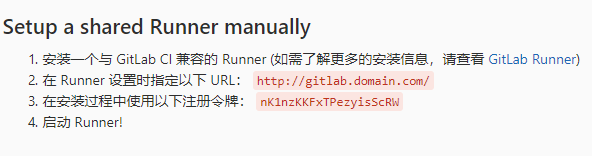

## 安装gitlab

1 安装要求

| 操作系统 | CentOS7           |
| ---- | ----------------- |
| 硬盘   | 取决于存储库，至少50GB     |
| CPU  | 取决于用户数量，至少2U      |
| 内存   | 取决于用户数量，至少4G可物理内存 |
| 交换区  | 与内存的总和至少为8G       |

2 安装过程

2.1 安装并配置必需的依赖项

l 安装依赖

```
sudo yum install -y curl policycoreutils-python openssh-server
```

l 配置防火墙，启用ssh、http、https

```
sudo systemctl enable sshd
sudo systemctl start sshd
sudo firewall-cmd --permanent --add-service=http
sudo firewall-cmd --permanent --add-service=https
sudo systemctl reload firewalld
```

2.2 安装Gitlab

l 添加Gitlab包存储库

centos/redhat

```
curl https://packages.gitlab.com/install/repositories/gitlab/gitlab-ce/script.rpm.sh | sudo bash
```

ubuntu

```
curl https://packages.gitlab.com/install/repositories/gitlab/gitlab-ce/script.deb.sh | sudo bash
```

l 安装Gitlab，将命令中的 `https://gitlab.example.com` 改为服务器的访问地址（如http://192.168.32.21）

```
sudo EXTERNAL_URL="https://gitlab.example.com" yum install -y gitlab-ce
```

对于`https://`URL，GitLab将自动使用Let's Encrypt请求证书，该证书需要入站HTTP访问和有效的主机名。您也可以使用自己的证书或只使用http://。

2.3 初次访问

通过浏览器访问Gitlab的访问地址`https://gitlab.example.com` ，首先需要设置密码，改密码为初始管理员root的密码。在修改密码之后后自动转到登录界面，通过使用用户名root和设置的密码登录。

3 系统配置

3.1 设置SMTP

打开gitlab的配置文件

```
sudo vim /etc/gitlab/gitlab.rb
```

修改如下内容（以163邮箱为例）

```
gitlab_rails['smtp_enable'] = true
gitlab_rails['smtp_address'] = "smtp.163.com"
gitlab_rails['smtp_port'] = 25
gitlab_rails['smtp_user_name'] = "xxuser@163.com" 
gitlab_rails['smtp_password'] = "xxpassword"
gitlab_rails['smtp_domain'] = "163.com"
gitlab_rails['smtp_authentication'] = :login
gitlab_rails['smtp_enable_starttls_auto'] = true

gitlab_rails['gitlab_email_from'] = "xxuser@163.com"
gitlab_rails['gitlab_email_display_name'] = '版本管理'
user['git_user_name'] = "版本管理系统"
user["git_user_email"] = "xxuser@163.com"
```

其中xxuser@163.com为发送邮件所使用的邮箱，xxpassword为发送邮件使用的邮箱的客户端授权码

完成后执行 ` sudo gitlab-ctl reconfigure` 

3.2 外观配置

使用管理员用户登录到系统后，打开管理中心

点击左侧的外观，然后根据页面的提示信息进行系统的界面外观配置

其他更多配置参见[GitLab文档](https://docs.gitlab.com/12.2/ce/README.html)

## 安装gitlab-runner

1、添加 GitLab 的官方存储库：

- For Debian/Ubuntu/Mint

curl -L https://packages.gitlab.com/install/repositories/runner/gitlab-runner/script.deb.sh | sudo bash

- For RHEL/CentOS/Fedora

curl -L https://packages.gitlab.com/install/repositories/runner/gitlab-runner/script.rpm.sh | sudo bash

注：Debian用户应该使用APT固定。

2、安装最新版本的 GitLab 运行程序，或跳到下一步以安装特定版本：

注：Debian buster 用户应禁用 skel以防止没有此类文件或目录作业失败

- For Debian/Ubuntu/Mint

export GITLAB_RUNNER_DISABLE_SKEL=true; sudo -E apt-get install gitlab-runner

- For RHEL/CentOS/Fedora

export GITLAB_RUNNER_DISABLE_SKEL=true; sudo -E yum install gitlab-runner

2.1、要安装特定版本的 GitLab 运行程序：

- for DEB based systems

apt-cache madison gitlab-runner

export GITLAB_RUNNER_DISABLE_SKEL=true; sudo -E apt-get install gitlab-runner=10.0.0

- for RPM based systems

yum list gitlab-runner --showduplicates | sort -r

export GITLAB_RUNNER_DISABLE_SKEL=true; sudo -E yum install gitlab-runner-10.0.0-1

3、注册运行程序

CentOs中GitLab-Runner的安装与使用

（1）、添加yum源

```
curl -L https://packages.gitlab.com/install/repositories/runner/gitlab-ci-multi-runner/script.rpm.sh | sudo bash
```

（2）、安装runner

```
yum install gitlab-ci-multi-runner
• 1
```

（3）、向GitLab-CI注册runner

```
gitlab-ci-multi-runner register
• 1
```

 向GitLab-CI注册一个Runner需要两样东西：GitLab-CI的url和注册token。

 其中，token是为了确定你这个Runner是所有工程都能够使用的Shared Runner还是具体某一个工程才能使用的Specific Runner。

 如果要注册Shared Runner，你需要到管理界面的Runners页面里面去找注册token。如下图所示：

**1、注册gitlab-runner**

docker exec -it gitlab-runner gitlab-runner register

2. 我们会输入 http://gitlab.domain.com或http://ip:port 也就是我们安装在本地的GitLab

3. Please enter the gitlab-ci token for this runner 要求输入 gitlab-ci token

在项目的 管理区域->runners中可以找到(这里注册的是share类型runner)



4. 输入描述,如：test

5. 输入tag（留空也可以，之后可以进行编辑 ）

6. 选择当遇到没有打标签的提交时是否会执行，我们选 true

7. 是否锁定此runner 到当前项目， 我们选 false

8. 选一个执行者 executor

这一步比较重要 (ssh, docker+machine, docker-ssh+machine, kubernetes, docker, parallels, virtualbox, docker-ssh, shell)

我们选docker

9. 选择默认使用的镜像： docker:stable

在注册完之后，我们可以在GitLab获取gitlab-ci token 的页面看到我们刚刚注册的这个 runner

## gitlab备份

命令

```
gitlab-rake gitlab:backup:create
```

备份路径  `/var/opt/gitlab/backups` 