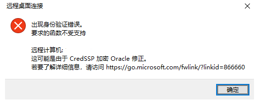

## 重置网络

netsh winsock reset 将 winsock 目录重置为默认设置或清除状态，重置程序通过操作系统链接网络的入口点。

`netsh int tcp reset`要重置 TCP / IP，请在 cmd 中使用命令

## 远程桌面出错

- 运行 gpedit.msc

本地组策略：

计算机配置>管理模板>系统>凭据分配>加密 Oracle 修正

选择启用并选择易受攻击。

- 修改注册表：

HKLM\Software\Microsoft\Windows\CurrentVersion\Policies\System\CredSSP\Parameters

AllowEncryptionOracle 32 位、DWORD 值 2

