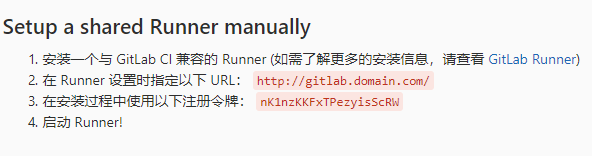

## 安装

1、添加 GitLab 的官方存储库：

- For Debian/Ubuntu/Mint

curl -L https://packages.gitlab.com/install/repositories/runner/gitlab-runner/script.deb.sh | sudo bash

- For RHEL/CentOS/Fedora

curl -L https://packages.gitlab.com/install/repositories/runner/gitlab-runner/script.rpm.sh | sudo bash

注：Debian 用户应该使用 APT 固定。

2、安装最新版本的 GitLab 运行程序，或跳到下一步以安装特定版本：

注：Debian buster 用户应禁用 skel 以防止没有此类文件或目录作业失败

- For Debian/Ubuntu/Mint

export GITLAB_RUNNER_DISABLE_SKEL=true; sudo -E apt-get install gitlab-runner

- For RHEL/CentOS/Fedora

export GITLAB_RUNNER_DISABLE_SKEL=true; sudo -E yum install gitlab-runner

2.1、要安装特定版本的 GitLab 运行程序：

- for DEB based systems

apt-cache madison gitlab-runner

export GITLAB_RUNNER_DISABLE_SKEL=true; sudo -E apt-get install gitlab-runner=10.0.0

- for RPM based systems

yum list gitlab-runner --showduplicates | sort -r

export GITLAB_RUNNER_DISABLE_SKEL=true; sudo -E yum install gitlab-runner-10.0.0-1

3、注册运行程序

CentOs 中 GitLab-Runner 的安装与使用

（1）、添加 yum 源

```
curl -L https://packages.gitlab.com/install/repositories/runner/gitlab-ci-multi-runner/script.rpm.sh | sudo bash
```

（2）、安装 runner

```
yum install gitlab-ci-multi-runner
• 1
```

（3）、向 GitLab-CI 注册 runner

```
gitlab-ci-multi-runner register
• 1
```

向 GitLab-CI 注册一个 Runner 需要两样东西：GitLab-CI 的 url 和注册 token。

其中，token 是为了确定你这个 Runner 是所有工程都能够使用的 Shared Runner 还是具体某一个工程才能使用的 Specific Runner。

如果要注册 Shared Runner，你需要到管理界面的 Runners 页面里面去找注册 token。如下图所示：

**1、注册 gitlab-runner**

docker exec -it gitlab-runner gitlab-runner register

2. 我们会输入 http://gitlab.domain.com或http://ip:port 也就是我们安装在本地的 GitLab

3. Please enter the gitlab-ci token for this runner 要求输入 gitlab-ci token

在项目的 管理区域->runners 中可以找到(这里注册的是 share 类型 runner)



4. 输入描述,如：test

5. 输入 tag（留空也可以，之后可以进行编辑 ）

6. 选择当遇到没有打标签的提交时是否会执行，我们选 true

7. 是否锁定此 runner 到当前项目， 我们选 false

8. 选一个执行者 executor

这一步比较重要 (ssh, docker+machine, docker-ssh+machine, kubernetes, docker, parallels, virtualbox, docker-ssh, shell)

我们选 docker

9. 选择默认使用的镜像： docker:stable

在注册完之后，我们可以在 GitLab 获取 gitlab-ci token 的页面看到我们刚刚注册的这个 runner

安装 gitlab-runner

# 下载

wget -O /usr/local/bin/gitlab-runner https://gitlab-runner-downloads.s3.amazonaws.com/latest/binaries/gitlab-runner-linux-amd64

# 分配运行权限

chmod +x /usr/local/bin/ gitlab-runner

# 创建用户

useradd --comment 'GitLab Runner' --create-home gitlab-runner --shell /bin/bash

# 安装

gitlab-runner install --user=gitlab-runner --working-directory=/home/gitlab-runner

# 运行

gitlab-runner start
新建 runner

# 注册 runner

gitlab-runner register

# 输入 gitlab 的访问地址

http://192.168.26.139:1874

# 输入 runner token，把开 http://192.168.26.139:1874/admin/runners 页面查看

63AyFAthj7s7sNy3JDwu

# runner 描述，随便填

测试 webpack-vue 项目部署

# runner tag

webpack-vue-cicd

# 输入（选择） shell

shell
注册完成后，就可以在 http://192.168.26.139:1874/admin/runners 里面看到创建的 runner。
