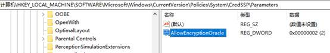

## 重置网络

netsh winsock reset 将 winsock 目录重置为默认设置或清除状态，重置程序通过操作系统链接网络的入口点。

`netsh int tcp reset`要重置 TCP / IP，请在 cmd 中使用命令

## 远程桌面出错

- 运行 gpedit.msc

本地组策略：

计算机配置>管理模板>系统>凭据分配>加密 Oracle 修正

选择启用并选择易受攻击。

- 修改注册表：

HKLM\Software\Microsoft\Windows\CurrentVersion\Policies\System\CredSSP\Parameters

AllowEncryptionOracle 32 位、DWORD 值 2

## 删除 3D Object 等文件夹

在注册表编辑器中转到以下路径`算机\HKEY_LOCAL_MACHINE\SOFTWARE\Microsoft\Windows\CurrentVersion\Explorer\MyComputer\NameSpace`，删除以下相应的数据

[下载] 088e3905-0323-4b02-9826-5d99428e115f}

[3D 对象] {0DB7E03F-FC29-4DC6-9020-FF41B59E513A}

[图片] {24ad3ad4-a569-4530-98e1-ab02f9417aa8}

[音乐] {3dfdf296-dbec-4fb4-81d1-6a3438bcf4de}

[桌面] {B4BFCC3A-DB2C-424C-B029-7FE99A87C641}

[文档] {d3162b92-9365-467a-956b-92703aca08af}

[视频] {f86fa3ab-70d2-4fc7-9c99-fcbf05467f3a}
