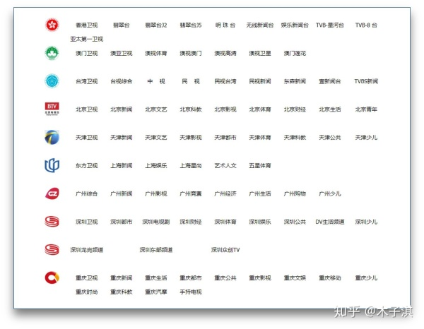
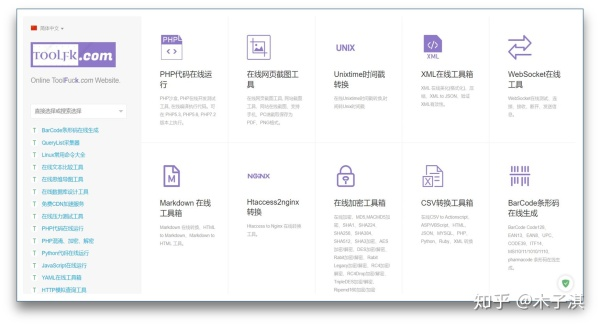
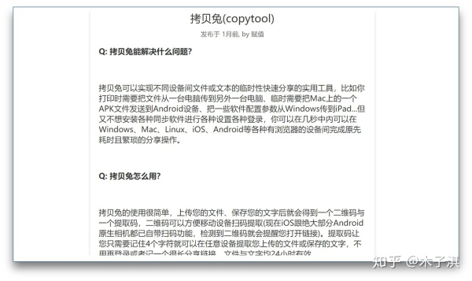
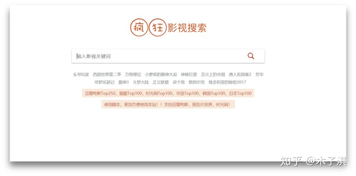

1. 鸠摩搜书
   网址：www.jiumodiary.com/
2. 智奇搜书
   网址：https://www.zqbook.top/
3. ePUBw
   网址：https://epubw.com/
4. 周读
   网址：http://www.ireadweek.com/ 
5. PDF之家
   网址：https://www.pdfzj.com/
6. ePUBee电子书库
   网址：http://cn.epubee.com/books/
7. 好读
   网址：http://haodoo.net/
8. 子午书简
   网址：https://5kindle.com/
9. E书联盟
   网址：http://www.book118.com/
10. 云海电子图书馆
    网址：http://www.pdfbook.cn/
11. 书语者
    网址：https://book.shuyuzhe.com/
12. 科塔学术
    网址：https://site.sciping.com/
13. 西林街
    网址：https://xilinjie.cc/
14. 万千合集站
    网址：http://www.hejizhan.com/bbs/
15. 搬书匠
    网址：http://www.banshujiang.cn/

**1：全国电视直播**

[http://bddn.cn/zb.htm](http://link.zhihu.com/?target=http%3A//bddn.cn/zb.htm)

全国电视直播是最近发现的一个非常良心的电视直播网站；它支持几百个电视直播的网站，包括：**港澳台卫视；**网站界面简洁，没有任何广告，并且播放速度和加载速度非常之快，画质也是十分高清；总体体验非常不错的一个网站。

**网站最好手机打开，电脑打开可能会播放失败。**

 

**2：wikihow**

[https://zh.wikihow.com](http://link.zhihu.com/?target=https%3A//zh.wikihow.com/)

*wikihow是一个综合技能搜索网站，不管生活中，工作中，遇到不会的东西，你都可以利用这个网站搜索。*

*它上面还免费提供了很多生活，工作小技巧，并且包含不同的专业，不同的方面；总之，各种不会的技能，先用这个网站搜索。*

**例如：如何将图片转换成PDF，如何清洁电脑显示器，如何给iPhone添加铃声，如何在忘记密码的情况下打开电脑，如何在Excel中制作工资表等等技巧；这个网站全部提供。**

 

 

**3：Toolfk在线工具箱**

[https://www.toolfk.com/](http://link.zhihu.com/?target=https%3A//www.toolfk.com/)

Toolfk在线工具箱是一款程序员工具箱，包含几十个实用的工具。

它包括的工具有：在线生成二维码Qrcode，Linux常用命令大全，在线思维导图工具，在线数据库设计工具，PHP代码在线运行，Python代码在线运行，JavaScript在线工具箱，CSS在线工具箱，JSON在线工具箱，Markdown 在线工具箱，在线SQL转换工具，在线加密工具箱，进制在线转换等等。

 

**4：拷贝兔**

[https://cp.ifval.com/](http://link.zhihu.com/?target=https%3A//cp.ifval.com/)

拷贝兔是一款跨平台文件传输工具，支持Windows、Mac、Linux、iOS、Android平台互传；在线使用，用完即走。

它可以实现不同设备间文件或文本的临时性快速分享，你可以在几秒中内可以在Windows、Mac、Linux、iOS、Android等各种有浏览器的设备间完成原先耗时且繁琐的分享操作。

 

**5：疯狂影视搜索**

[http://ifkdy.com](http://link.zhihu.com/?target=http%3A//ifkdy.com/)

疯狂影视搜索是一个界面简洁但是功能强大的电影搜索网站。

它首先界面也是十分简洁，十分清新，只有一些热门的影视推荐；但是它的功能十分强大；直接输入你要搜索的影视的名字，它会出来很多不同的搜索结果，然后你点击任意结果，它会跳转到不同的影视网站直接观看或者下载；这样子，你就轻松的找到了你需要的影视。

 

**6：临时邮箱**

[http://24mail.chacuo.net/](http://link.zhihu.com/?target=http%3A//24mail.chacuo.net/)

临时邮箱是一款帮助我们解决某些网站需要使用到我们自己的真实邮箱，但是我们又不想暴露我们的邮箱的工具。

它不需要注册，并且它的邮箱持续24小时，比十分钟邮箱保持时间更长，可以任意设置邮箱名，随时更换邮箱；一款个人认为十分实用的工具。