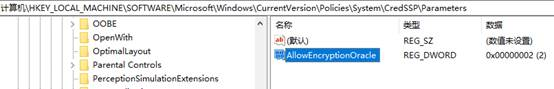

# 错误解决

## 远程桌面出错


- 运行 gpedit.msc

本地组策略：

计算机配置>管理模板>系统>凭据分配>加密Oracle修正

选择启用并选择易受攻击。

- 修改注册表：

HKLM\Software\Microsoft\Windows\CurrentVersion\Policies\System\CredSSP\Parameters

AllowEncryptionOracle 32 位、DWORD 值2




## eclipse 卡顿

```bash
mkdir disabled
mkdir disabled\features 
mkdir disabled\plugins

move plugins\org.eclipse.jpt.* disabled\plugins
move features\org.eclipse.jpt.* disabled\features
```


## URL传参

```
信息: Error parsing HTTP request header
 Note: further occurrences of HTTP header parsing errors will be logged at DEBUG level.
java.lang.IllegalArgumentException: Invalid character found in the request target. The valid characters are defined in RFC 7230 and RFC 3986
    at org.apache.coyote.http11.InternalAprInputBuffer.parseRequestLine(InternalAprInputBuffer.java:238)
    at org.apache.coyote.http11.AbstractHttp11Processor.process(AbstractHttp11Processor.java:1028)
    at org.apache.coyote.AbstractProtocol$AbstractConnectionHandler.process(AbstractProtocol.java:637)
    at org.apache.tomcat.util.net.AprEndpoint$SocketProcessor.doRun(AprEndpoint.java:2555)
    at org.apache.tomcat.util.net.AprEndpoint$SocketProcessor.run(AprEndpoint.java:2544)
    at java.util.concurrent.ThreadPoolExecutor.runWorker(ThreadPoolExecutor.java:1145)
    at java.util.concurrent.ThreadPoolExecutor$Worker.run(ThreadPoolExecutor.java:615)
    at org.apache.tomcat.util.threads.TaskThread$WrappingRunnable.run(TaskThread.java:61)
    at java.lang.Thread.run(Thread.java:745)
```


RFC3986(RFC7230是RFC3986的补充完善)中的一下规定：

1、reserved   = gen-delims / sub-delims

gen-delims = **: / ? # [ ] @**

sub-delims = **! $ & ' ( ) \* + , ; =** 

保留字符包含gen-decimal和sub-decimal，gen-delims包含 **:****/****?#{}@** 7个，sub-decimal包含 **!$&'()\*+,;=** 11个。

2、Characters that are allowed in a URI but do not have a reserved purpose are called unreserved.These include uppercase and lowercase letters, decimal digits, hyphen, period, underscore, and tilde.

unreserved  = **ALPHA DIGIT - . _ ~**

URI中允许但没有保留的字符，被称为无保留。这些包括**大写和小写字母(a-zA-Z)，十进制数字(0-9)，连字符，句点，下划线和波形符号(- _ . ~)** 

不安全字符是指那些在URL中没有特殊含义，但在URL所在的上下文中可能具有特殊意义的字符 **空格、引号、< > # % { } | \ ^ [ ] ` ~** 其中的这些不安全字符一般都需要编码

**+**得用encodeURIComponent()转码


## Java

1. org.apache.catalina.session.StandardManager doLoad

tomcat的work目录下面的东西删一遍。

1. java.lang.IllegalStateException
2. org.hibernate.MappingException

hibernate映射文件错误

1. java.lang.RuntimeException:

运行时异常，所有jvm异常的父类

1. java.lang.IllegalArgumentException:
   `Can not find a java.io.InputStream with the name [downloadFile] in the invocation stack. Check the <param name="inputName"> tag specified for this action.`

action中缺少相应的方法


## JavaScript

1. Uncaught TypeError: Cannot read property
   常见于在渲染UI组件时对于状态的初始化操作不当
2. (unknown): Script error
   被浏览器的跨域策略限制时，会产生这类的脚本错误
3. TypeError: ‘undefined' is not a function
   调用未定义的函数时
4. Uncaught RangeError: Maximum call stack
   调用一个不终止的递归函数;js库冲突
5. TypeError: Cannot read property ‘length'
   读取未定义变量的长度属性
6. Uncaught TypeError: Cannot set property
   获取或设置一个未定义变量的任何未定义的属性
7. ReferenceError: event is not defined
   访问未定义的变量或超出当前范围的变量
8. Uncaught SyntaxError: Unexpected identifier
   语法错误，缺少符号
9. Uncaught SyntaxError: Unexpected token ILLEGAL
   语法错误，引号不匹配
10. Uncaught SyntaxError: Unexpected token o
    JSON.parse(s)中的s不是字符串


## Status

### HTTP Status 404-There is no Action mapped for namespace[/] and action name [ActionName] associated with context path [/status]

- 未定义action;或拼写错误;或大小写不一致
- 多个status配置文件中的包名或命名空间冲突
- struts.xml文件名错误。一定要注意拼写问题；
- struts.xml文件放置路径错误。一定要将此文件放置在src目录下。编译成功后，要确认是否编译到classes目录中；
- struts.xml文件内容错误；
- 删掉struts.xml的namespace。


## Tomcat

### Request Entity Too Large

请求体过大，多见于文件上传时触发，设置connector的maxPostSize为大点的值即可，单位byte，默认值：2097152 (2 megabytes)。若想将其设为无限制，则将其设置为负数即可。

```
<Connector connectionTimeout="20000" port="8080" protocol="HTTP/1.1" redirectPort="8443" maxPostSize="209715200"/>
```

### Request header is too large

从字面意思可知，是请求头过大，设置connector的maxHttpHeaderSize为大点的值即可，单位byte，默认值：8192 (8 KB)

设置maxHttpHeaderSize限制为16KB，可根据需求适当加到更大

```
<Connector connectionTimeout="20000" port="8080" protocol="HTTP/1.1" redirectPort="8443" maxHttpHeaderSize="16384"/>
```

该值设置过大，容易造成内存溢出的问题。
